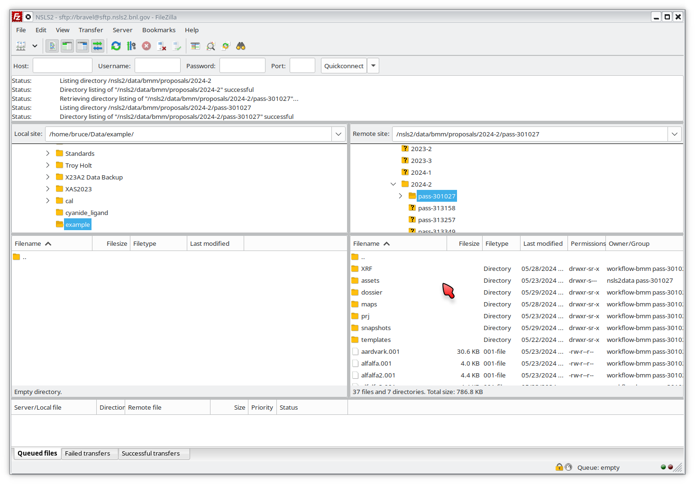

..
   This document was developed primarily by a NIST employee. Pursuant
   to title 17 United States Code Section 105, works of NIST employees
   are not subject to copyright protection in the United States. Thus
   this repository may not be licensed under the same terms as Bluesky
   itself.

   See the LICENSE file for details.

.. _data:

Data access
===========

In May 2024, data security policies were implemented at BMM.  This has
impact on user operations and data access.

Data is now written to a secure location on central storage.  Access
to your data now requires authentication using your BNL domain
account, your password, and two-factor authentication with DUO or a
Yubi key.

The beamline operator account does not have access to user's data.

This section of the beamline manual explains how to access your data
during and after your experiment.

Downloading data
----------------

SFTP Client
~~~~~~~~~~~

You will need an sftp client.  

+ **Cross-platform:** `FileZilla <https://filezilla-project.org/>`__.
  This is a free program available for Windows, Apple, and Linux.  The
  explanation below will be made using FileZilla.

+ **Windows users:** A popular option is `WinSCP
  <https://winscp.net/eng/index.php>`__. Be careful at the WinSCP
  website.  You will see multiple pop-up adds with download links to
  other software packages.  Be careful to click on the link to the
  WinSCP package.

+ **Mac users:** Other options are `Termius
  <https://termius.com/download/macos>`__
  and `Flow <http://fivedetails.com/flow/>`__.

+ **Linux users:** Your desktop file manager likely has an sftp client
  built in.  Try typing
  ``sftp://<username>@sftp.nsls2.bnl.gov`` into your file
  manager or creat a new network drive using ``ssh`` and
  ``sftp.nsls2.bnl.gov``.

  `sshfs <https://github.com/libfuse/sshfs>`__ is an
  excellent solution.  ``sshfs`` allows you to easily
  mount the remote sftp site to a local mount point,
  allowing you to browse the remote site as if it were a
  local folder.  For example, I do the following to mount
  the data folder locally on my laptop:

  .. code-block:: bash
		  
     sshfs bravel@sftp.nsls2.bnl.gov:/nsls2/data/bmm ~/mnt/bmm -o follow_symlinks

  and this to unmount the data folder

  .. code-block:: bash

     fusermount -u mnt/bmm  

The Short Version
~~~~~~~~~~~~~~~~~

.. admonition:: Executive Summary

   #. Connect to sftp.nsls2.bnl.gov in your sftp client
   #. Authenticate using your BNL username/password and DUO two-factor
      authentication
   #. Navigate to ``/nsls2/data/bmm/proposals/``, then to the cycle
      folder corresponding to the date of your experiment, then to the
      folder with your proposal number.  So, something like 
      ``/nsls2/data/bmm/proposals/2024-2/pass-333333``.
   #. Transfer your data to your local computer.

If you preserve the folder structure from the remote host, the
:numref:`the dossier files (Section %s) <dossier>` will work as
expected.

The ``assets`` folder contains raw image and HDF5 from your
experiment.  Those files will have database-friendly but
user-unfriendly names.  The HDF5 files are rather large and will take
some time to download.  The can skip downloading the ``assets`` folder
if you do not plan on using the HDF5 files directly.

A Guide with Pictures
~~~~~~~~~~~~~~~~~~~~~

What follows is a guide with screenshots of using FileZilla to connect
to the SFTP download site and begin downloading data.

To begin, open your sftp client.  Here is FileZilla at startup.  For
FileZilla, click on the File menu, then click on Site Manager.

.. _fig-fz-startup:
.. figure:: _images/filezilla_startup.png
   :target: _images/filezilla_startup.png
   :width: 50%
   :align: center

   FileZilla startup.  Go to the Site Manager to establish a new
   location.

In the site manager, click on the "New site" button and fill in the
details as shown below.  Select the SFTP protocol, enter
``sftp.nsls2.bnl.gov`` as the Host.  The correct port number is 22,
but you can usually leave that blank.  22 is the default port for the
sftp protocol.  

Finally, select "Interactive" as the logon type.  That will tell
FileZilla to prompt you for both user name and two-factor authentication.

.. _fig-fz-site_manager:
.. figure:: _images/filezilla_site_manager.png
   :target: _images/filezilla_site_manager.png
   :width: 50%
   :align: center

   Fill in the site manager with the location and logon type for the
   NSLS2 data center.

Click OK to finish this configuration, then connect to the host.

.. _fig-fz-connect:
.. figure:: _images/filezilla_connect.png
   :target: _images/filezilla_connect.png
   :width: 50%
   :align: center

   Select the NSLS2 host from the drop-down list and click to connect.

Connecting to the NSLS2 SFTP host will open up the password entry dialog.

.. _fig-fz-password:
.. figure:: _images/filezilla_password.png
   :target: _images/filezilla_password.png
   :width: 50%
   :align: center

   Enter your BNL password and click OK.

After entering your password, you will be prompted for two factor
authentication.  In the "Password" box, type ``1`` and hit OK.  Then
go to your phone and accept the DUO push.  

If you use a Yubikey, click on the "Password" box and touch the button
on your Yubikey.

Once you have completed the DUO push, you will be able to navigate on
the remote site.  Click your way to ``/nsls2/data/bmm/`` as shown below.

.. _fig-fz-remote:
.. figure:: _images/filezilla_remote.png
   :target: _images/filezilla_remote.png
   :width: 50%
   :align: center

   Navigate down to the BMM proposals area on the SFTP server.

Click into ``proposals`` then into the folder for the cycle in which
your experiment happened, then into the folder for your proposal
number:

.. _fig-fz-folder:

   Navigate into the folder for your proposal and the cycle in which
   it ran.

Now select the data files you want to transfer.  You may select
multiple files or even entire folders.

.. _fig-fz-queue:
.. figure:: _images/filezilla_queue.png
   :target: _images/filezilla_queue.png
   :width: 50%
   :align: center

   Select some or all of your data and add it to the queue.

Click on the transfer button at the top of the screen to initiate the
transfer.  At the beginning of the transfer, you will have to
re-authenticate yourself.

.. _fig-fz-transfer:
.. figure:: _images/filezilla_transfer.png
   :target: _images/filezilla_transfer.png
   :width: 50%
   :align: center

   Click the transfer button to download your data.  You may need to
   re-authenticate at the start of transfer.

Your data is now on your computer.  Yay!

Using the VDI virtual Desktop
-----------------------------

.. todo:: Details needed

Accessing data from the beamline computers
------------------------------------------

Under the new data security regime, the beamline computer does not
have normal access to your data.  This is because all users run their
experiment as the beamline operator.  If the beamline operator |nd|
``xf06bm`` |nd| could see data, than any could look at anyone's data.

Instead, data are stored on central storage with read permission
granted to everyone named on the user proposal.  In this way, data are
secured from other users and access to the data requires
authentication.

To look at your data while at the beamline, do the following

+ Open a terminal window.  Normally a terminal window with a white
  background is open on screen and intended for this purpose.
  ``bsui`` is typically run from a window with a black background, so
  the white background is meant as a visual cue indicating that it is
  the place for data access.

+ In that terminal window type

  .. code-block:: bash

     ``su - <username>``

  replacing ``<username>`` with your actual user name. Enter your
  password and respond to DUO push.

+ ``cd`` to ``/nsls2/data3/bmm/proposals/2024-2/pass-123456``, replacing
  ``2024-2`` with the cycle of your visit and ``123456`` with your
  proposal number.

Athena can be launched from the command line.  The best way to do this
is to type

.. code-block:: bash

   dathena 2&>1 &

at the command line.  That incantation will suppress spurious screen
messages and put Athena into the background so you can continue using
the command line.  From there, simply use `Athena's File menu
<https://bruceravel.github.io/demeter/documents/Athena/import/index.html>`__
to load data from your proposal folder.

Accessing data via Tiled
------------------------

.. todo:: Details needed

Accessing data via Jupyter
--------------------------

.. todo:: Details needed
