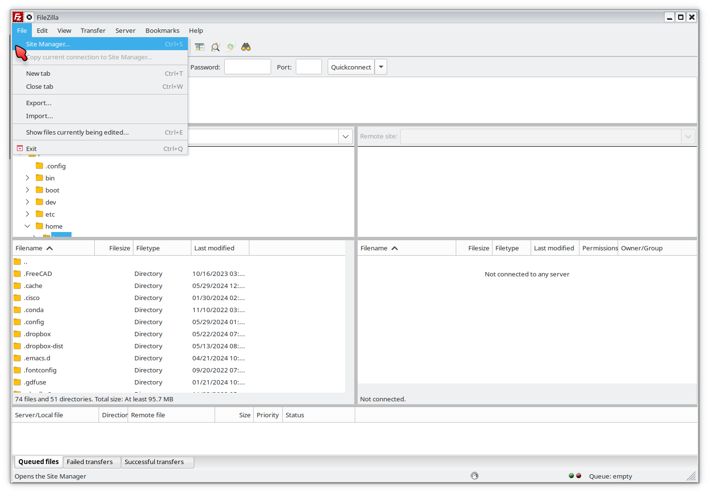
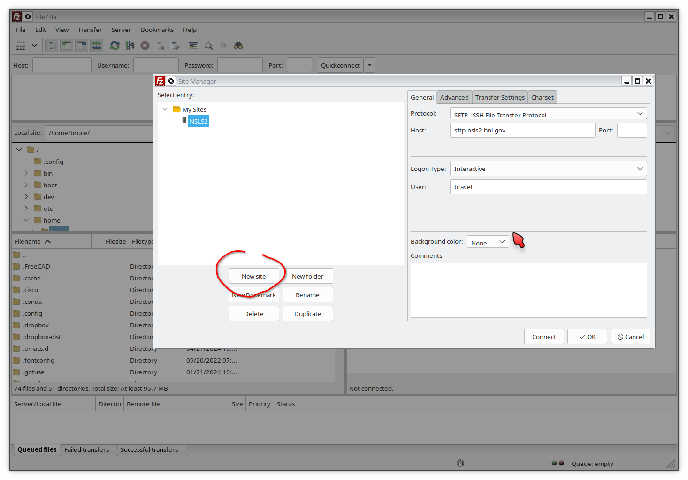
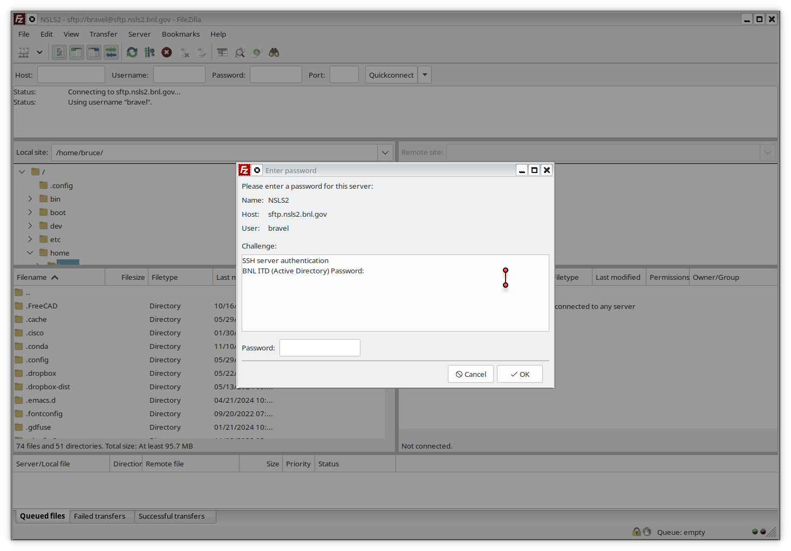
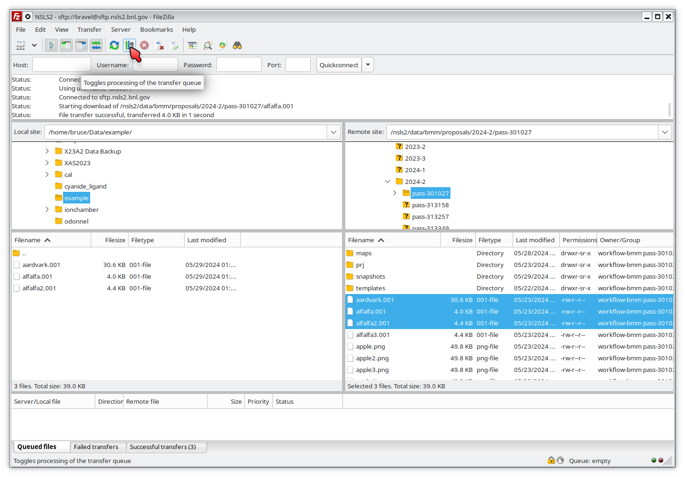

..
   This document was developed primarily by a NIST employee. Pursuant
   to title 17 United States Code Section 105, works of NIST employees
   are not subject to copyright protection in the United States. Thus
   this repository may not be licensed under the same terms as Bluesky
   itself.

   See the LICENSE file for details.

.. _data:

Data access
===========

In May 2024, data security policies were implemented at BMM.  This has
impact on user operations and data access.

Data is now written to a secure location on central storage.  Access
to your data now requires authentication using your BNL domain
account, your password, and two-factor authentication with DUO or a
Yubi key.

The beamline operator account does not have access to user's data.

This section of the beamline manual explains how to access your data
during and after your experiment.

Downloading data
----------------

SFTP Client
~~~~~~~~~~~

You will need an sftp client.  

+ **Cross-platform:** `FileZilla <https://filezilla-project.org/>`__.
  This is a free program available for Windows, Apple, and Linux.  The
  explanation below will be made using FileZilla.

+ **Windows users:** A popular option is `WinSCP
  <https://winscp.net/eng/index.php>`__. Be careful at the WinSCP
  website.  You will see multiple pop-up adds with download links to
  other software packages.  Be careful to click on the link to the
  WinSCP package.

+ **Mac users:** Other options are `Termius
  <https://termius.com/download/macos>`__
  and `Flow <http://fivedetails.com/flow/>`__.

+ **Linux users:** Your desktop file manager likely has an sftp client
  built in.  Try typing
  ``sftp://<username>@sftp.nsls2.bnl.gov`` into your file
  manager or create a new network drive using ``ssh`` and
  ``sftp.nsls2.bnl.gov``.

  `sshfs <https://github.com/libfuse/sshfs>`__ is an
  excellent solution.  ``sshfs`` allows you to easily
  mount the remote sftp site to a local mount point,
  allowing you to browse the remote site as if it were a
  local folder.  For example, I do the following to mount
  the data folder locally on my laptop:

  .. code-block:: bash
		  
     sshfs bravel@sftp.nsls2.bnl.gov:/nsls2/data/bmm ~/mnt/bmm -o follow_symlinks

  and this to unmount the data folder

  .. code-block:: bash

     fusermount -u mnt/bmm  

The Short Version
~~~~~~~~~~~~~~~~~

.. admonition:: Executive Summary

   #. Connect to sftp.nsls2.bnl.gov in your sftp client
   #. Authenticate using your BNL username/password and DUO two-factor
      authentication
   #. Navigate to ``/nsls2/data/bmm/proposals/``, then to the cycle
      folder corresponding to the date of your experiment, then to the
      folder with your proposal number.  So, something like 
      ``/nsls2/data/bmm/proposals/2024-2/pass-333333``.
   #. Transfer your data to your local computer.

If you preserve the folder structure from the remote host, the
:numref:`the dossier files (Section %s) <dossier>` will work as
expected.

The ``assets`` folder contains raw image and HDF5 from your
experiment.  Those files will have database-friendly but
user-unfriendly names.  The HDF5 files are rather large and will take
some time to download.  The can skip downloading the ``assets`` folder
if you do not plan on using the HDF5 files directly.

A Guide with Pictures
~~~~~~~~~~~~~~~~~~~~~

What follows is a guide with screenshots of using FileZilla to connect
to the SFTP download site and begin downloading data.

To begin, open your sftp client.  Here is FileZilla at startup.  For
FileZilla, click on the File menu, then click on Site Manager.

.. _fig-fz-startup:

   FileZilla startup.  Go to the Site Manager to establish a new
   location.

In the site manager, click on the "New site" button and fill in the
details as shown below.  Select the SFTP protocol, enter
``sftp.nsls2.bnl.gov`` as the Host.  The correct port number is 22,
but you can usually leave that blank.  22 is the default port for the
sftp protocol.  

Finally, select "Interactive" as the logon type.  That will tell
FileZilla to prompt you for both user name and two-factor authentication.

.. _fig-fz-site_manager:

   Fill in the site manager with the location and logon type for the
   NSLS2 data center.

Click OK to finish this configuration, then connect to the host.

.. _fig-fz-connect:
.. figure:: _images/filezilla/filezilla_connect.png
   :target: _images/filezilla_connect.png
   :width: 50%
   :align: center

   Select the NSLS2 host from the drop-down list and click to connect.

Connecting to the NSLS2 SFTP host will open up the password entry dialog.

.. _fig-fz-password:

   Enter your BNL password and click OK.

After entering your password, you will be prompted for two factor
authentication.  In the "Password" box, type ``1`` and hit OK.  Then
go to your phone and accept the DUO push.  

If you use a Yubikey, click on the "Password" box and touch the button
on your Yubikey.

Once you have completed the DUO push, you will be able to navigate on
the remote site.  Click your way to ``/nsls2/data/bmm/`` as shown below.

.. _fig-fz-remote:
.. figure:: _images/filezilla/filezilla_remote.png
   :target: _images/filezilla_remote.png
   :width: 50%
   :align: center

   Navigate down to the BMM proposals area on the SFTP server.

Click into ``proposals`` then into the folder for the cycle in which
your experiment happened, then into the folder for your proposal
number:

.. _fig-fz-folder:

   Navigate into the folder for your proposal and the cycle in which
   it ran.

Now select the data files you want to transfer.  You may select
multiple files or even entire folders.

.. _fig-fz-queue:
.. figure:: _images/filezilla/filezilla_queue.png
   :target: _images/filezilla_queue.png
   :width: 50%
   :align: center

   Select some or all of your data and add it to the queue.

Click on the transfer button at the top of the screen to initiate the
transfer.  At the beginning of the transfer, you will have to
re-authenticate yourself.

.. _fig-fz-transfer:

   Click the transfer button to download your data.  You may need to
   re-authenticate at the start of transfer.

Your data is now on your computer.  Yay!

Accessing data with Globus
--------------------------

Data volumes at BMM are such that sftp is usually easier and more
efficient than using `Globus <https://www.globus.rog>`__.  We
recommend that you use sftp to access your data.  However,
Globus is an option.

To use Globus, you must transfer data to a Globus endpoint at your
institution to which you have access.  

Alternately, you can run `Globus Connect Personal (GCP)
<https://app.globus.org/collections/gcp>`__ on your own computer.
Follow the download and installation instructions and start an
instance of GCP on your computer.

Once you have identified either an institutional endpoint or you have
GCP running, point your web browser at http://globus.nsls2.bnl.gov/.

In the remote panel on the left side of the page, navigate to your
proposal directory, which will be something like
``/nsls2/data/bmm/proposals/2024-3/pass-123456``, where you would
replace ``2024-3`` with the operations cycle of your visit to BMM and
replace ``123456`` with the proposal number of your experiment.

In the local panel on the right side of the page, navigate to the
location to which you want to download your data.

Select the data (or data folder) you wish to download and hit the
start button above the remote folder.

Accessing data from the beamline computers
------------------------------------------

Under the new data security regime, the beamline computer does not
have normal access to your data.  This is because all users run their
experiment as the beamline operator.  If the beamline operator |nd|
``xf06bm`` |nd| could see data, than any user could look at any other
user's data.

Instead, data are stored on central storage with read permission
granted to everyone named on the user proposal.  In this way, data are
secured from other users and access to the data requires
authentication.

To look at your data while at the beamline, do the following

+ Open a terminal window.  Normally a terminal window with a white
  background is open on screen and intended for this purpose.
  |bsui| is typically run from a window with a black background, so
  the white background is meant as a visual cue indicating that it is
  the place for data access.

+ In that terminal window type

  .. code-block:: bash

     su - <username>

  replacing ``<username>`` with your actual user name. Enter your
  password and respond to DUO push.

+ ``cd`` to ``/nsls2/data3/bmm/proposals/2024-2/pass-123456``, replacing
  ``2024-2`` with the cycle of your visit and ``123456`` with your
  proposal number.

|athena| can be launched from the command line.  The best way to do this
is to type

.. code-block:: bash

   dathena > /dev/null 2&>1 &

at the command line.  That incantation will suppress spurious screen
messages and put |athena| into the background so you can continue using
the command line.  From there, simply use |athena|'s `File menu
<https://bruceravel.github.io/demeter/documents/Athena/import/index.html>`__
to load data from your proposal folder.

.. _using_vdi:

Using the VDI virtual Desktop
-----------------------------

.. todo:: Details needed

Outline:

+ Point your browser at https://vdi.nsls2.bnl.gov/
+ Either download the client app or use the browser.  These are the
  two choices offered on the landing page.
+ Open an N2SN linux desktop
+ In terminal or with file browser, can navigate to
  ``/nsls2/data/bmm/proposals/<cycle>/pass-123456``.

Issues:

+ Need to give advice on navigating linux desktop
+ Seems to be no Athena

Accessing data via Tiled
------------------------

First off, here is the `Tiled documentation
<https://blueskyproject.io/tiled/index.html>`__ .

To start, you must first `install Tiled
<https://blueskyproject.io/tiled/tutorials/installation.html>`__ on
your computer:

.. code-block:: shell

   python3 -m pip install "tiled[all]"

To upgrade from an earlier version of Tiled:

.. code-block:: shell

   python3 -m pip install --upgrade "tiled[all]"

In a python program, jupyter notebook, or ipython session, do this:

.. code-block:: python

   from tiled.client import from_uri
   client = from_uri('https://tiled.nsls2.bnl.gov/api/v1/metadata/bmm/raw')

You will be prompted for your BNL username and password.  A DUO push
will be sent to your phone (the DUO push may happen silently ... if
things appear to be hung, check your phone to see if a DUO push has
arrived). 

At this point you have access to data from BMM.  To interact with the
data, you will need scan UIDs.  For example:

.. code-block:: text

   In [8]: client['5b3b526c-f3d4-4bac-86a5-394835fe06a7']['primary']['data']
   Out[8]: <DatasetClient ['time', 'It', 'dcm_energy', 
		'dcm_energy_setpoint', 'I0', 
		'7-element SDD_channel01_xrf', 'Hf1', 
		'7-element SDD_channel02_xrf', 'Hf2', 
		'7-element SDD_channel03_xrf', 'Hf3',
		'7-element SDD_channel04_xrf', 'Hf4',
		'7-element SDD_channel05_xrf', 'Hf5',
		'7-element SDD_channel06_xrf', 'Hf6',
		'7-element SDD_channel07_xrf', 'Hf7',
		'dwti_dwell_time', 'dwti_dwell_time_setpoint', 'Ir']>

The measurement in this example was fluorescence XAS using the
7-element detector.  So |mu|\ (E) data can be plotted like so:

.. code-block:: python

   import matplotlib.pyplot as plt
   uid = '5b3b526c-f3d4-4bac-86a5-394835fe06a7'
   dataset = client[uid]['primary']['data']
   energy = dataset['dcm_energy']
   i0 = dataset['I0']
   ifluo = (dataset['Hf1'] + dataset['Hf2'] + dataset['Hf3'] +
            dataset['Hf4'] + dataset['Hf5'] + dataset['Hf6'] + dataset['Hf7'])
   plt.plot(energy, ifluo/i0)

The ion chamber signals will always be called ``I0``, ``It``, and
``Ir``.  The fluorescence signals will always be the one- or
two-letter symbol of the element being measured followed by the
detector channel number.

You can know the element being measured in any XAS record by checking
the metadata:

.. code-block:: python

   client[uid].metadata['start']['XDI']['Element']['symbol']

You can find the UID of a scan by examining the header of an
:numref:`XAS data file (see Section %s) <xdiexample>`.  Look for
the line that starts ``# Scan.uid:``.

.. Admonition:: Searching

   #. Need an explanation of doing datetime searches to get data
      from a specific experiment.

   #. Need an example of searching for a specific GUP or SAF to
      get data from a specific experiment.

Accessing data via Jupyter
--------------------------

.. todo:: Details needed

Why is data security important?
-------------------------------

For those who have been coming to NSLS-II over the last decade, this
new emphasis on data security might be a bit surprising.  In short,
the new data security model is consistent with Department of Energy
data policies.

Recently, there were a pair of incidents involving accidental leaks of
sensitive synchrotron data to unauthorized parties.  This sort of
violation of DOE policy can have an impact on the authorization to
operate NSLS-II as a user facility.  Safe operations of the facility
includes data security.

As a result, our Data Science and Systems Integration team at NSLS-II
has been begun moving the beamlines to a data acquisition model that
includes sound data security practices.  BMM volunteered to be an
early adopter of the new data security practices.  We now provide an
excellent user experience at BMM that also includes secure data
management.

Map of the data server
----------------------

Each beamline has a storage location.  In the case of BMM, the data
are at ``/nsls2/data/bmm/proposals``.  As show in the right of
:numref:`Figure %s <datastorage>`, the proposals folder has
folders for each cycle.  In each cycle folder, there are folders for
the experiments in that cycle.

The permissions in the cycle folder,
e.g. ``/nsls2/data/bmm/proposals/2025-1``, are such that no one can
write files, although anyone is able to see the list of experiment
folders.

The permissions in an experiment folder,
e.g. ``/nsls2/data/bmm/proposals/2025-1/pass-316886``, are such that
anyone listed on the proposal can read and write.  Beamline staff are
also able to read and write in all experiment folders.  This extends
to making new folders, which will inherit the same permissions.  Thus,
the user is able to organize their data as they wish.  New files |nd|
|athena| project files, spreadsheets, PowerPoint files, whatever |nd|
can also be written to this folder.

.. attention::

   The beamline user, ``xf06bm``, **cannot** read or write in the
   experiment folder.  To interact with the contents of the experiment
   folder, users must authenticate themselves.  This can be done with
   :numref:`VDI (see Section %s) <using_vdi>` or by using the ``su``
   command in a terminal window.

.. subfigure::  ABC
   :layout-sm: ABC
   :gap: 8px
   :subcaptions: above
   :name: datastorage
   :class-grid: outline

   .. image:: _images/datasec/proposals.png

   .. image:: _images/datasec/cycle.png

   .. image:: _images/datasec/data.png

   (Left) The beamline proposals folder contains a folder for every
   cycle since 2014-3, when NSLS-II started.  (Middle) Each cycle
   folder contains a folder for each experiment that cycle. (Right)
   The experiment folder is where your data are written.

In each experiment folder is a folder called ``assets``.  The
permissions in the assets folder and all its subfolders are such that
users and beamline staff can read files, but cannot write, modify, or
delete files.

In the asstes folder, there is one folder for each instrument at the
beamline.  Each instrument is configured to write its data into its
assets folder.  Because this is raw, unprocessed, uninterpreted data,
it is considered a sort of ground truth of the measurement.  That is
the reason for the restrictive permissions on the assets folder.  Any
interpretation of assets data by the user should be written elsewhere
in the experiments folder.

For example, the HDF5 files containing the XRF spectra from the
Xspress3 at each point in an XAFS scan are written to the
``xspress3-1`` folder.

.. subfigure::  AB
   :layout-sm: AB
   :gap: 8px
   :subcaptions: above
   :name: assetsfolder
   :class-grid: outline

   .. image:: _images/datasec/assets.png

   .. image:: _images/datasec/dated.png

   (Left) Assets folder contains one folder for each instrument at the
   beamline. (Right) Instrument folders often have dated subfolders.
   The Ophyd objects interacting with these instruments are often
   configured to use the dated folders automatically.

.. note::

   The data folders for all beamlines work as described here.
