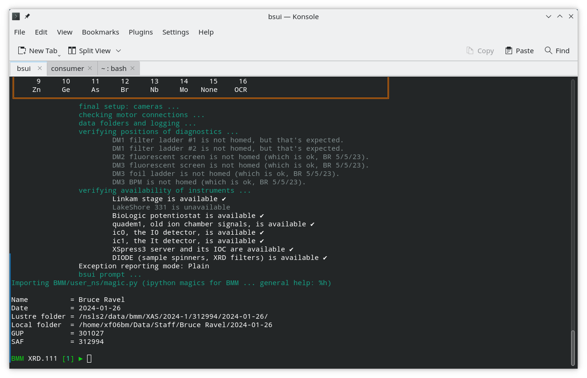

..
   This document was developed primarily by a NIST employee. Pursuant
   to title 17 United States Code Section 105, works of NIST employees
   are not subject to copyright protection in the United States. Thus
   this repository may not be licensed under the same terms as Bluesky
   itself.

   See the LICENSE file for details.

.. role:: key
    :class: key

.. _desktop:

BMM's Desktop
=============

This section provides an explanation of how to recover BMM's data
collection workspace after restarting the computer.

This is made a bit easier if a couple of symbolic links are made in
``~/bin/``.  If not already done, do this at the command line:

.. code-block:: sh

   ln -s ~/.ipython/profile_collection/startup/consumer/run-consumer ~/bin/run-consumer
   ln -s ~/git/BMM-beamline-configuration/tools/run-cadashboard ~/bin/run-cadashboard

Monitoring
----------

To have eyeballs on the operation of the beamline, we want ``Phoebus``
for engineering screens and the ``cadashboard`` application for the
heads-up overview of the state of the beamline.

Phoebus (engineering screens)
  There are two ways to start Phoebus.

  The more hands-on way is to open a new terminal window or tab, the
  type ``run-phoebus`` at the command line.  This will open the
  Phoebus window and it should remember to place it on the top screen.

  It is not necessary to keep open the terminal window used to launch
  Phoebus.  Phoebus is **very noisy**, spewing en endless stream of
  logging messages to the screen.  Happily, it forks itself upon
  launch, so it is not necessary to keep that terminal window open.
  If you first opened a new window or tab, you can safely close it.

  There should be an icon for Phoebus on the icon bar at the bottom of
  the lower, left screen.  It looks like a red eyeball.  Click on it.

  Once Phoebus is open, if the layout was not restored, click on the
  "Window" menu, then on "Load Layout", then select "Two cameras".

cadashboard
  Open a new terminal window.  Resize the window so it is a few lines
  tall, and the full width of the screen.  

  At the command line run ``run-cadashboard``.  Make the font much
  bigger by hitting :key:`Ctrl`-\ :key:`Shift`-\ :key:`+` several
  times |nd| maybe as many as 10 |nd| until it takes up the full width
  of the screen.

  Resize the height to just cover the three lines of the dashboard.
  Move the terminal to the very top of the top screen.  You can hide
  the window decoration by using :key:`Windows`-\ :mark:`leftclick,.`
  to position the terminal window.

.. _fig-monitoring:
.. figure:: _images/software/monitoring.png
   :target: _images/monitoring.png
   :width: 80%
   :align: center

   Once Phoebus and cadashboard are open, they should look something
   like this.

Data collection and visualization
---------------------------------

Data collection and visualization are separate things and should be
managed separately.  

On the main virtual desktop, open a terminal window for |bsui|.  At the
command line type ``bsui``.  |bsui| startup at BMM is rather
time-consuming, but after a couple minutes it is ready to go.

On the right-most virtual desktop, you will setup the Kafka file and
plot workers as explained in :numref:`the section on Kafka workers
(Section %s) <start_consumer>`.

   The tail end of the |bsui| startup messages and the
   command prompt.

All the rest
------------

Some other things that are handy to have on the desktop during an
experiment:

+ Firefox, with tabs open to :numref:`the command cheatsheet (Section
  %s) <cheatsheet>` and the XAS webcam.
+ Slack
+ A dolphin (file browser) window with a tab open to the current
  Workspace folder

Note that there is a button on the icon bar at the bottom of the
screen for |hephaestus|.

In the new data security regime, launching |athena| as the beamline
account (``xf06bm``) is not very helpful given that it cannot access
the data.  

If data are accessed by opening a terminal window and doing ``su -
<username>`` followed by authentication with password and DUO (see
:numref:`section %s <data>`), first ``cd`` to the proposal directory,
then start |athena| with this command:

.. code-block:: bash

   dathena > /dev/null 2>&1 &  

That will open |athena| and suppress the large stream of uniteresting
warning messages from the graphics tool kit.
