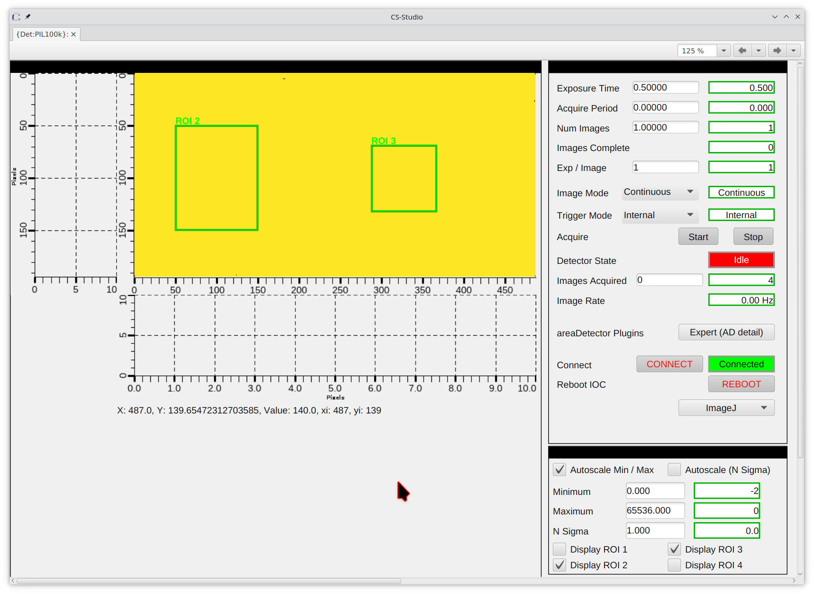

..
   This document was developed primarily by a NIST employee. Pursuant
   to title 17 United States Code Section 105, works of NIST employees
   are not subject to copyright protection in the United States. Thus
   this repository may not be licensed under the same terms as Bluesky
   itself.

   See the LICENSE file for details.

.. role:: strike
    :class: strike

.. _details:

Instrumentation Details
=======================

This section is a scattershot assortment of details about things at
the beamline, presented in no special order.  Subsection titles have
been alphebtized to make them a bit easier to find when reading this
page.  This is basically an attempt to capture institutional knowledge
... someplace.

Analog Video Capture
--------------------

Implementing `this USB video adapter
<https://www.amazon.com/REDGO-Video-Capture-Converter-Adapter/dp/B01E5ITE2W>`__
to capture video from the small analog cameras in the hutch took a bit
of doing.

First, the adapter must be plugged directly into the computer.  Using
a USB hub makes for an unreliable interface to the camera.

Second, the file ``/etc/udev/rules.d/99-usb-camera-capture.rules`` is
needed to set permissions on ``/dev/video0`` correctly when the adapter is
plugged in.

.. code-block:: none

   ACTION!="add|change", GOTO="webcam_capture_end"
   SUBSYSTEM=="usb", ATTRS{idVendor}=="534d", ATTRS{idProduct}=="0021", MODE="0666"
   KERNEL=="video*", ATTRS{idVendor}=="534d", ATTRS{idProduct}=="0021", GROUP="video", MODE="0666"
   KERNEL=="video*", ATTRS{idVendor}=="534d", ATTRS{idProduct}=="0021", ATTRS{avoid_reset_quirk}=1
   KERNEL=="video*", ATTRS{idVendor}=="534d", ATTRS{idProduct}=="0021", ATTRS{quirks}=0x100
   LABEL="webcam_capture_end"

Putting this file in place will require assistance from DSSI. Beamline
staff do not have permission to make a file in that folder. See `this
Jira ticket <https://jira.nsls2.bnl.gov/browse/HXSS-779>`__ for an
example of what to ask for.

This recognizes the vendor and product IDs of the specific adapter
that I bought.  When inserted, it sets the device to RW for all users
and sets a couple of possibly relevant attributes.  (This udev rules
file was adapted from the rules file that comes with the easycap dc60
package – info and links `here
<http://easycap.blogspot.com/p/easycap-dc60.html>`__).

Next a small function was written as a wrapper around `fswebcam
<https://github.com/fsphil/fswebcam>`__ to grab frames from the
camera. The function is basically a wrapper around a call to
``fswebcam`` like so:

.. code-block:: sh

   fswebcam -d /dev/video0 -r 640x480 -S 30 -F 5 foo.jpg

along with some image processing using python's ``wand`` package. 

Required packages:

+ ``fswebcam``
+ ``python-wand``
+ ``imagemagick``

This whole setup is filled with quirk.  There is a delay accessing the
video capture.  The ``-S`` switch builds in a 1 second delay, giving the
capture device enough time to begin displaying the image.  The ``-F``
switch tells the script how many frames to accumulate for good signal.
5 is probably overkill.

In any case, it is now possible to grab screen shots of the currently
displayed analog video while collecting data.

All of this is implemented in ``BMM/camera_device.py`` for use in
Bluesky. The heart of the implementation is a system call to
``fswebcam``. From there, the image is saved as an asset and correctly
pointed to in databroker.  See:

+ `BMM/user_ns/detectors.py <https://github.com/NSLS-II-BMM/profile_collection/blob/master/startup/BMM/user_ns/detectors.py#L253>`__
+ `BMM/camera_device.py <https://github.com/NSLS-II-BMM/profile_collection/blob/master/startup/BMM/camera_device.py#L62-L164>`__

While this resembles a properly integrated camera and counting on the
``anacam`` object will get recorded in the database, the resource file
|nd| the jpeg image |nd| gets written to the local machine, thus is
not recoverable via Tiled.  A future todo would be to make a caproto
IOC as a wrapper around ``fswebcam`` and give it proper authority to
write to storage.

.. admonition:: Update
   :class: note

   As of December 2024, this has been captured in BMM's ansible
   configuration.  Thus xf06bm-ws3 should always have this udev rule
   available, even after a system upgrade or installation.

Beamline maintenance tools
--------------------------

(Copied verbatim from wiki page.  Links and other information should
be verified.  February 2025)

Motor Controllers
~~~~~~~~~~~~~~~~~

On the Windows Laptop, use PEWIN.  PMAC User's Manual

The motor controllers are 10.6.130.81, .82, etc.  You can communicate
using PEWIN with the laptop on the 10.6.130.X network, with the laptop
plugged into a DHCP port (it's address will be 10.6.128.213), or using
a USB cable.  Unplug the network adapter from the Delta Tau before
plugging in the USB cable. The USB cable is the sort with an A-type
plug on one end and a B-type on the other end.  

.. _fig_USB:
.. figure:: _images/USB.png
   :target: _images/USB.png
   :width: 30%
   :align: center

MOXA Configuration
~~~~~~~~~~~~~~~~~~

On the Windows Laptop, use the NPort Admin Suite.  It is pretty
self-explanatory.  Put the computer on the 10.6.130.X network, then
ask the suite to do a search.  When it finds a MOXA device (they
should be 10.6.130.51, .52, etc), click on the configure button.  It
will query the device, then give a fairly self-explanatory set of tabs
for configuring things on the device.

`NPort5200 User Manual
<https://www.moxa.com/doc/manual/nport/5200/NPort5200_v1.pdf>`__ --
The small Moxa devices supplied by FMBO are in this series. 

.. note:: The 5200 series is an end of life Moxa product.

Camera Configuration
~~~~~~~~~~~~~~~~~~~~

On the Windows Laptop, Vimba is the tool for the Allied Vision cameras
supplied by FMBO (also the Prosilica GC in use at the XRD end station)
for looking at the fluorescence screens in DM1, DM2, and end station
FS.

Vimba can also be installed on a Linux machine. From the Quick Start
document:

.. code-block:: text

   Installing Vimba SDK on Linux Necessary runtime libraries for
   executing Vimba Viewer are available with the Vimba download.

   + Vimba ships as a tarball. Uncompress the archive with the command
     ``tar -xf ./AVTVimba.tgz`` to a directory you have writing
     privileges for. This creates a directory named ``AVTVimba``.

   + Navigate to ``AVTVimba/AVTGigETL`` and execute the shell script
     Install.sh with root privileges (for example ``dzdo
     ./Install.sh``).

   + Vimba Viewer is now ready to use, and it can be found in
     ``Vimba/Viewer/Bin``.

The second step is essential or the viewer will be unable to find the cameras on the network.

+ `Allied Vision homepage <https://www.alliedvision.com/en/products/software.html>`__
+ `Prosilica GC technical documentation
  <https://www.alliedvision.com/en/support/technical-documentation/prosilica-gc-documentation.html>`__

BNC Cable Map
-------------

Here is an explanation of the BNC and SHV patch panels going between
rack D at the control station, Rack C on the roof of the hutch, and
the in-hutch patch panel.

.. _fig-bncpatch:
.. figure:: _images/Bnc_map.png
   :target: _images/Bnc_map.png
   :width: 100%
   :align: center

DCM 1st Xtal Equilibration
--------------------------

The temperature of the first crystal is measured by a K type
thermocouple pressed against the crystal by .... (verify how this is done)

With the front end slits set to 8 mm x 1.5 mm, the DCM first crystal
saturates at about 30.5 C from the base cooling water temperature of
about 28 C.

This takes about 50 minutes. 

.. _fig-dcm1stxtal:

DI Water Flow
-------------

The DI water is controled by manual valves, which should only be
operated by the utilities group, and by solenoid valves in the FOE.
The solenoid valves are triggered by a water-sensing strip along the
floor of the FOE. They are also actuated by switches on the CSS
utilities screen. These toggles are the ones circled in pink inthe
screenshot on the left. 

The valves themselves are the large yellow and black boxes mounted
high on the back wall of the FOE.  The valve indicators are the rods
with orange markings.  When the valves are open, the orange marks are
facing downstream.  When closed, the orange marks are rotated towards
the wall.  Opening and closing those valves is managed through CSS.
They must be open for the utilities group to do their work on the DI
delivery to the mono and the filter assemblies.  

.. subfigure::  ABC
   :layout-sm: ABC
   :gap: 8px
   :subcaptions: above
   :name: fig-diwater
   :class-grid: outline

   .. image:: _images/Water_flow_CSS.png

   .. image:: _images/Water_flow_valves_1.jpg

   .. image:: _images/Water_flow_valves_2.jpg

   (Left) The CSS utilities screen where the water valve controls are
   found.  (Middle) A view into the FOE.  (Right) The inboard wall
   where the physical valve is found.

Disabling an MCS8 axis after a move
-----------------------------------

From Adam Young at FMBO
~~~~~~~~~~~~~~~~~~~~~~~

.. code-block:: none

   The motors can be disabled after a movement and this can be set at the
   Delta Tau level.

   First you will need to connect to each MCS8+ with the beamline laptop
   and start PEWin.

   Then please do the following:

   + Click on the 'View' menu at the top of the window. Then click
     'Program/PLC Status (and upload)'. 
   + Select PLC1 and click 'Upload'. An editor showing PLC1 will appear.
   + Scroll down to find the variables P105 to P805. The '1' to '8' part
     of these variables represent axis 1 to 8 on the MCS8+. The value of
     these variables determines whether or not the motors will be
     disabled after a move. They are likely all set to '0' meaning power
     stays on. The lateral motors are on axis 4 and 5 so P405 and P505
     should be set to '1'.
   + Click on the yellow downwards pointing arrow on the toolbar in the
     editor. This downloads the modified PLC1 from the editor to the
     Delta Tau. Close the editor. 
   + In the terminal window issue a 'save' to save the modified
     configuration to the Delta Tau non-volatile memory and issue '$$$'
     to refresh the controller. 

A follow up from Graeme Elliner, FMBO
~~~~~~~~~~~~~~~~~~~~~~~~~~~~~~~~~~~~~

.. code-block:: none

   Just done a fast scan of the config file and I think it is probably
   because P302=1.

   Px02 and Px05 (where x is the motor number) are special Pvars for
   setting the final state of the motor once it has stopped moving, they
   are used in PLC1x and set as you know in PLC1

   If Px02=1 the PLC to check if the motor is in position and its
   desired velocity is zero, if these two conditions are set a Flag is
   set, If the conditions are still met 1second later then the motor
   is put into OPEN LOOP. This means the motor is still enabled but
   will ignore the encoder and the motor will hold its current rotary
   location. This is useful for the motors that have DPTs pushing
   against them in flexures (trapezoidal roll and pitch assy on the
   DCMs), it gives a firm base for the DPT to push against but will
   not try to hold position (as it would in closed loop) when the DPT
   pushes the top part of the stage and moves the encoder.  If Px05=1
   then the PLC checks to see if the motor is in position and has zero
   velocity, then 1second later it will kill that motor

   Due to the way the code is ordered (it looks for thePx02 first) it
   will enter Px02 check first, when the conditions are met it will
   set the first Flag After that check it then see the Px05 check and
   kills the motor. However on the next pass through the PLC it will
   again enter the Px02 check, see that the first flag has been set
   then trigger the open loop command, re-enabling the motor.

   Hence by setting P302=0 in PLC1, it will not go into the check and
   not accidentally enable the motor.  If this does not fix it then
   the issue is in EPICS

Conclusion
~~~~~~~~~~

The above suggestions were done for ``dm3_bct``, a motor that was
showing the re-enable behavior.  This made that motor tricky to
operate in bluesky. Setting ``P302=0`` and ``P305=1`` did the trick.

DM3 CAT6 Patch Panel
--------------------

13 more CAT6 ports for use in the hutch. Note that ports listed as
SCI/EPICS are tagged ports on both subnets.

This is needed by workstations (like ``xf06bm-ws5``), display machines
running CSS (like ``xf06bm-disp1``), and machines running IOCs (like
``xf06bm-xspress3``).

Note that ``xf06bm-em1`` needs to be on an INST port while the ion
chambers are on EPICS ports. The difference is that the ion chambers
are running their own on-board IOCs, making them more like IOC servers
than instruments.

+-----------+----------+--------------------+----------------+---------------------+-------------------+
| **Patch** | **Port** |  **xf06bm-a port** |  **Network**   |  **Role**           |  **Cable number** |
+-----------+----------+--------------------+----------------+---------------------+-------------------+
| **DM3-A** |  1       |  44                |  EPICS         |  xf06bm-ic1         |  200235           |
+-----------+----------+--------------------+----------------+---------------------+-------------------+
|           |  2       |  45                |  EPICS         |  xf06bm-ic2         |  200236           |
+-----------+----------+--------------------+----------------+---------------------+-------------------+
|           |  3       |  46                |  EPICS         |  xf06bm-ic3         |  200237           |
+-----------+----------+--------------------+----------------+---------------------+-------------------+
|           |  4       |  06bm-agg 36       |  INST          |  xf06bm-em1         |  200238           |
+-----------+----------+--------------------+----------------+---------------------+-------------------+
| **DM3-B** |  1       |  17                |  SCI/EPICS     |  xf06bm-ws5         |  200239           |
+-----------+----------+--------------------+----------------+---------------------+-------------------+
|           |  2       |  18                |  SCI/EPICS     |  xf06bm-disp1       |  200240           |
+-----------+----------+--------------------+----------------+---------------------+-------------------+
|           |  3       |  19                |  SCI/EPICS     |  xf06bm-xspress3    |  200241           |
+-----------+----------+--------------------+----------------+---------------------+-------------------+
|           |  4       |                    |  SCI/EPICS     |                     |  200242           |
+-----------+----------+--------------------+----------------+---------------------+-------------------+
| **DM3-C** |  1       |                    |                |                     |  200243           |
+-----------+----------+--------------------+----------------+---------------------+-------------------+
|           |  2       |                    |                |                     |  200244           |
+-----------+----------+--------------------+----------------+---------------------+-------------------+
|           |  3       |                    |                |                     |  200245           |
+-----------+----------+--------------------+----------------+---------------------+-------------------+
|           |  4       |                    |                |                     |  200246           |
+-----------+----------+--------------------+----------------+---------------------+-------------------+
| **DM3-D** |  1       |                    |                |                     |  200247           |
+-----------+----------+--------------------+----------------+---------------------+-------------------+
|           |  2       |                    |                |  unused             |                   |
+-----------+----------+--------------------+----------------+---------------------+-------------------+
|           |  3       |                    |                |  unused             |                   |
+-----------+----------+--------------------+----------------+---------------------+-------------------+
|           |  4       |                    |                |  unused             |                   |
+-----------+----------+--------------------+----------------+---------------------+-------------------+

Some photos of the patch panel:

.. subfigure::  AB
   :layout-sm: AB
   :gap: 8px
   :subcaptions: above
   :name: fig-dm3cat6
   :class-grid: outline

   .. image:: _images/DM3_patch_panel.jpg

   .. image:: _images/DM3_first_cat6.jpg

   (Left) CAT6 patch panel at DM3.  (Right) Lowest numbered label on
   the CAT6 cables in the DM3 patch panel

Encoder loss second crystal roll
--------------------------------

On 9 January, 2018, when attempting to home the mono motors following
the schduled power outage in December, the 2\ :sup:`nd` crystal roll
motor moved to its negative limit, then reported an encoder loss.
With Graeme Elliner's (an FMB-O controls engineer) help, I came to a
resolution of the problem.  It has left that axis in an unusual state
that needs to be documented.

Executive summary: that axis does not use its encoder.  It homes by
running to its negative limit, then running back to it's home
position.  It does this by counting controller pulses rather than
encoder 

Here are a couple of useful emails from Graeme to me from January 11
and 12, 2018.

.. code-block:: text

   Hi Bruce

   We now need to work out where the problem is.
   NOTE you will not be able to drive anything while you're doing this or you potentially can break more.
   1: Unplug the Disable Plug from the back of the DCM (this will
      force all motors to be disabled) - it’s the small black connector
      (bottom right as you look at the back) 
   2: Disconnect PL102 & SK102 from IF2
   3: Disconnect PL103 & SK103 from IF3
   4: Connect PL103 & SK103 to IF2
   5: Connect PL102 & SK102 to IF3

   IF the Red light on the Interpolator stayed with IF3 then there is
   a problem with Interpolator - Need to put motor into Open Loop 

   IF the Red light on the Interpolator has moved to IF2 then the
   Interpolator is fine and it is cabling somewhere - GOTO STEP 6 

   6: SWAP PL102 and PL103

   IF the red light has moved back to IF3 then the problem is between
   PL103 to the read head on the Xtal2 Roll stage - GOTO STEP 7 

   IF the red light has stayed with IF2 then the problem is between SK103 to the MCS8
   
   This cabling is Pin to Pin so a simple continuity test on each pin should identify what has broken

   7: SWAP SK102 and SK103. The cabling should now be back to the original layout
   8: SWAP SK203-2 and SK203-3 at the feedthroughs on the DCM (FD3-2 & FD3-3 respectively)

   IF the red light has moved to IF2 then the problem is INSIDE the
   DCM vessel - Need to put motor into Open Loop (and ultimately open
   the vessel to find it) 

   If the red light has stayed on IF3 then there is a problem with the
   cable to the DCM. This cable is should be Pin to Pin so a simple
   continuity test on each pin should identify what has broken 

   To Put the Roll Axis into Open Loop
   Have you got PeWin working now??
   Using Pewin backup the config for the DCM and send it to me please.

A lot of the cable swapping Graeme called for was to try to isolate a
bad connection.  The connection between read-head and motor controller
is rather lengthy, with a vacuum feedthrough, a feedtrough on the side
of the service box, and two connections to the interpolators inside
the service box.

Following the steps laid out by Graeme, I isolated the problem to
being inside the vacuum vessel.  Drat! Using the `old MC02
configuration
<https://github.com/NSLS-II-BMM/BMM-beamline-configuration/blob/master/MCS8/mc02-11Jan2018.cfg>`__
I saved to a file, Graeme made some edits as described below and sent
me `a new configuration file
<https://github.com/NSLS-II-BMM/BMM-beamline-configuration/blob/master/MCS8/mc02-12Jan2018.cfg>`__.

.. code-block:: text

   Hi Bruce
   I have modified the config file to now not use the encoder for
   position feedback. I have tested that it downloads with no errors 

   Details of the mods are listed at the top of the file and below, I
   have marked all modifications with either GRE+ (for added code) or
   GRE- (for commented code) 

   In PLC1
   P446=0  this disables encoder loss detection for axis4

   In the Ivars
   I430=700        changed to default stepper gain for no encoder
   I432=0          changed to default value for no encoder
   I7040=8 this forces the system to use steps for feedback

   Use restore config from the backup menu in PEWin to install this
   CHECK that the box at the bottom reports NO ERRORS,
   in the terminal window you will need to "SAVE" and "$$$".

   You will now find that the position scaling will be completely
   different now that you are not using the encoder. This means that
   your jog speeds will also be different 

   I strongly suggest NOT trying to use EPICS imediately.

   Use the PeWin terminal (or the Jog Ribbon) to move axis 4 to the -ve
   limit ("#4j-") at the -ve limit type "#4HMZ" to zero the postion
   display and then to the +ve limit ("#4j+"). 

   This will tell you how many steps there are between the limits.

   Using this info and the data for the encoded version you should be
   able to move th axis to approximately the correct location. 

   I have noticed that in PLC14 (the homing PLC for axis 4) that even
   when the axis was using the encoder the home routine was not using
   the encoder home refernce. 

   It is moving to the -ve limit then moving off 51926 encoder counts,
   then setting this to be HOME  -  search for GRE*** in the file. 

   This will not be correct now the system is using steps and might
   actually be more than you have measured as the range in steps. 

   You will need to change this value before you can use EPICS to home the axis.

   Once all this is working in PeWin you can test the homing routine
   by entering M1416=1 in the Pewin terminal. 

Following this set of instructions, I found that there are 1,218,299
steps between the two limits on the 2\ :sup:`nd` crystal roll motor.
It would seem that there are about 10 or 12 steps per encoder count.
The homing procedure works in the sense of finding the negative limit,
then moving to a home position.  But that home position seems to be
about 1/10 of the way between the negative limit and the
home-using-encoder-counts.

Inert Gas Plumbing
------------------

Needle valves are mounted on the outboard side of DM3. Quick connect
outlets for the gases are mounted on the upstream/inboard corner of
the XAFS table.  

.. admonition::  Gaseous nitrogen supply
   :class: note
   
   BMM no longer uses a nitrogen cylinder as the supply of N\ :sub:`2`
   for the ion chambers.  The house GN2 supplies N\ :sub:`2` to the
   needle valves.

.. _fig-inertgas:
.. figure:: _images/Gas_handling.png
   :target: _images/Gas_handling.png
   :width: 100%
   :align: center

Vendor link for quick-disconnect fixture: https://www.mcmaster.com/5012K122/

In practice, the H\ :sub:`2`/N\ :sub:`2` and N\ :sub:`2`/Ar mixing
channels are not much used.  Unless measuring with the incident beam
below 5 keV or above 21 keV, it is a poor use of time to make changes
to the gas content of the ion chambers.  This is because it takes
quite some time for the volume of the ion chamber to equillibrate.

N\ :sub:`2` is adequate for almost all experiments at BMM.  For Tc or
Ru, it is helpful to use about 20% Ar.  For Sc or lower, 50% He might
be helpful.  But remember that purging the ion chambers takes
**hours**.

Logitech controller
-------------------

.. _fig-logitech:
.. figure:: _images/Logitech.png
   :target: _images/Logitech.png
   :width: 100%
   :align: center

.. todo::

   Explain how to configure buttons in CSS

.. todo::  Left joystick will be used for detector YZ.  Not X!

M2 Bender
---------

The homing sequence on the bender (MC04, channel 6) seems to have the
wrong parity.  Instead of moving to the negative limit, it moves to
the positive limit.

Rather than running the homing procedure, step to the negative limit.
This can be done via EPICS or by issuing the ``#6j-`` command in the
PEWIN terminal.  Adam Young from FMBO indicated that the home marker
is about +6000 steps from the negative limit, so move there and zero
out the display |nd| ``#6HMZ`` in PEWIN.  This will leave the bender
reporting to EPICS that it is not homed, but it can be moved sensibly
to a bend value.

=============  ========================== 
 End station    Bender position in steps
=============  ========================== 
 XAS            212225
 XRD            107240 
=============  ========================== 

MC09 patch panel
----------------

Photo and explain...

Motor controllers
-----------------

This section is a big, long list of all the motor PV names at BMM.

Most motors have aliases.  The alias is an alternate, easier-to-type
name for the axis.  These are equivalent:

.. code-block:: sh

   caget XF:06BMA-OP{Mono:DCM1-Ax:Bragg}Mtr
   caget xafs_bragg

Aliases work with most motor record fields, as well.  The following are
also equivalent:

.. code-block:: sh

   caget XF:06BMA-OP{Mono:DCM1-Ax:Bragg}Mtr.VELO
   caget xafs_bragg.VELO

The following tables give PV name and alias, a brief description of
the purpose of the motor, the controller and location of that
controller, and the channel number in the controller.  A few
abbreviations are used:  

:us: upstream
:ds: downsteam
:ib: inboard
:ob: outboard
:para: parallel
:perp: perpendicular

Collimating mirror, M1
~~~~~~~~~~~~~~~~~~~~~~

================================  =========  =========================  ======================  ==============
PV                                alias      Motor Description          controller              motor number
================================  =========  =========================  ======================  ==============
XF:06BM-OP{Mir:M1-Ax:YU}Mtr       m1_yu      us jack                    MC01 (mezzanine)        1
XF:06BM-OP{Mir:M1-Ax:YDO}Mtr      m1_ydo     ds, outboard jack          MC01 (mezzanine)        2
XF:06BM-OP{Mir:M1-Ax:YDI}Mtr      m1_ydi     ds, inboard jack           MC01 (mezzanine)        3
XF:06BM-OP{Mir:M1-Ax:XU}Mtr       m1_xu      us lateral                 MC01 (mezzanine)        4
XF:06BM-OP{Mir:M1-Ax:XD}Mtr       m1_xd      ds lateral                 MC01 (mezzanine)        5 
================================  =========  =========================  ======================  ==============

Filters, DM1
~~~~~~~~~~~~

================================  ============  =========================  ======================  ==============
PV                                alias         Motor Description          controller              motor number
================================  ============  =========================  ======================  ==============
XF:06BMA-BI{Fltr:01-Ax:Y1}Mtr     dm1_filters1  assembly #1                MC05 (RGA)              6
XF:06BMA-BI{Fltr:01-Ax:Y2}Mtr     dm1_filters2  assembly #2                MC05 (RGA)              7 
================================  ============  =========================  ======================  ==============

DCM
~~~

===================================  ============  ====================  ======================  ==============
PV                                   alias         Motor Description     controller              motor number
===================================  ============  ====================  ======================  ==============
XF:06BMA-OP{Mono:DCM1-Ax:Bragg}Mtr   dcm_bragg     DCM Bragg             MC02 (RGA)              1
XF:06BMA-OP{Mono:DCM1-Ax:Bragg2}Mtr  dcm_bragg2    Bragg 2nd encoder     MC02 (RGA)
XF:06BMA-OP{Mono:DCM1-Ax:P2}Mtr      dcm_pitch     2nd xtal pitch        MC02 (RGA)              3
XF:06BMA-OP{Mono:DCM1-Ax:R2}Mtr      dcm_roll      2nd xtal roll         MC02 (RGA)              4
XF:06BMA-OP{Mono:DCM1-Ax:Per2}Mtr    dcm_para      2nd xtal perp         MC02 (RGA)              5
XF:06BMA-OP{Mono:DCM1-Ax:Par2}Mtr    dcm_perp      2nd xtal para         MC02 (RGA)              6
XF:06BMA-OP{Mono:DCM1-Ax:X}Mtr       dcm_x         lateral               MC02 (RGA)              7
XF:06BMA-OP{Mono:DCM1-Ax:Y}Mtr       dcm_y         vertical              MC02 (RGA)              8 
===================================  ============  ====================  ======================  ==============

Slits 2, DM2
~~~~~~~~~~~~

==============================  ============  ====================  ======================  ==============
PV                              alias         Motor Description     controller              motor number
==============================  ============  ====================  ======================  ==============
XF:06BMA-OP{Slt:01-Ax:O}Mtr     dm2_slits_o   outboard              MC03 (RGA)              1
XF:06BMA-OP{Slt:01-Ax:I}Mtr     dm2_slits_i   inboard               MC03 (RGA)              2
XF:06BMA-OP{Slt:01-Ax:T}Mtr     dm2_slits_t   top                   MC03 (RGA)              3
XF:06BMA-OP{Slt:01-Ax:B}Mtr     dm2_slits_b   bottom                MC03 (RGA)              4 
==============================  ============  ====================  ======================  ==============

DM2 fluorescence screen
~~~~~~~~~~~~~~~~~~~~~~~

==============================  ============  ====================  ======================  ==============
PV                              alias         Motor Description     controller              motor number
==============================  ============  ====================  ======================  ==============
XF:06BMA-BI{Diag:02-Ax:Y}Mtr    dm2_fs        vertical              MC04 (RGA)              7 
==============================  ============  ====================  ======================  ==============

Focusing mirror, M2
~~~~~~~~~~~~~~~~~~~

==============================  ============  ====================  ======================  ==============
PV                              alias         Motor Description     controller              motor number
==============================  ============  ====================  ======================  ==============
XF:06BMA-OP{Mir:M2-Ax:YU}Mtr    m2_yu         us jack               MC04 (RGA)              1
XF:06BMA-OP{Mir:M2-Ax:YDO}Mtr   m2_ydo        ds, outboard jack     MC04 (RGA)              2
XF:06BMA-OP{Mir:M2-Ax:YDI}Mtr   m2_ydi        ds, inboard jack      MC04 (RGA)              3
XF:06BMA-OP{Mir:M2-Ax:XU}Mtr    m2_xu         us lateral            MC04 (RGA)              4
XF:06BMA-OP{Mir:M2-Ax:XD}Mtr    m2_xd         ds lateral            MC04 (RGA)              5
XF:06BMA-OP{Mir:M2-Ax:Bend}Mtr  m2_bender     bender                MC04 (RGA)              6 
==============================  ============  ====================  ======================  ==============

Harmonic rejection mirror, M3
~~~~~~~~~~~~~~~~~~~~~~~~~~~~~

==============================  ============  ====================  ======================  ==============
PV                              alias         Motor Description     controller              motor number
==============================  ============  ====================  ======================  ==============
XF:06BMA-OP{Mir:M3-Ax:YU}Mtr    m3_yu         us jack               MC05 (RGA)              1
XF:06BMA-OP{Mir:M3-Ax:YDO}Mtr   m3_ydo        ds, outboard jack     MC05 (RGA)              2
XF:06BMA-OP{Mir:M3-Ax:YDI}Mtr   m3_ydi        ds, inboard jack      MC05 (RGA)              3
XF:06BMA-OP{Mir:M3-Ax:XU}Mtr    m3_xu         us lateral            MC05 (RGA)              4
XF:06BMA-OP{Mir:M3-Ax:XD}Mtr    m3_xd         ds lateral            MC05 (RGA)              5 
==============================  ============  ====================  ======================  ==============

Slits 3, DM3
~~~~~~~~~~~~

==============================  ============  ====================  ======================  ==============
PV                              alias         Motor Description     controller              motor number
==============================  ============  ====================  ======================  ==============
XF:06BM-BI{Slt:02-Ax:O}Mtr      dm3_slits_o     outboard            MC06 (RGC1)             5
XF:06BM-BI{Slt:02-Ax:I}Mtr      dm3_slits_i     inboard             MC06 (RGC1)             6
XF:06BM-BI{Slt:02-Ax:T}Mtr      dm3_slits_t     top                 MC06 (RGC1)             7
XF:06BM-BI{Slt:02-Ax:B}Mtr      dm3_slits_b     bottom              MC06 (RGC1)             8
==============================  ============  ====================  ======================  ==============

DM3
~~~

==============================  ============  ====================  ======================  ==============
PV                              alias         Motor Description     controller              motor number
==============================  ============  ====================  ======================  ==============
XF:06BM-BI{FS:03-Ax:Y}Mtr       dm3_fs        fluorescent screen     MC06 (RGC1)            1 
XF:06BM-BI{Fltr:01-Ax:Y}Mtr     dm3_foils     foils actuator         MC06 (RGC1)            4
XF:06BM-BI{BCT-Ax:Y}Mtr         dm3_bct       vertical stage         MC06 (RGC1)            3
XF:06BM-BI{BPM:1-Ax:Y}Mtr       dm3_bpm       NanoBPM                MC06 (RGC1)            2 
==============================  ============  ====================  ======================  ==============

XAFS Table
~~~~~~~~~~

========================================  ====================  ========================= ======================  ==============
PV                                        alias                 Motor Description         controller              motor number
========================================  ====================  ========================= ======================  ==============
XF:06BMA-BI{XAFS-Ax:Tbl_YU}Mtr            xafs_yu               xafs table y us            MC07 (RGC1)             1
XF:06BMA-BI{XAFS-Ax:Tbl_YDO}Mtr           xafs_ydo              xafs table y ds ob         MC07 (RGC1)             2
XF:06BMA-BI{XAFS-Ax:Tbl_YDI}Mtr           xafs_ydi              xafs table y ds ib         MC07 (RGC1)             3
:strike:`XF:06BMA-BI{XAFS-Ax:Tbl_XU}Mtr`  :strike:`xafs_xu`     :strike:`xafs table x us`  :strike:`MC07 (RGC1)`   :strike:`4`
XF:06BMA-BI{XAFS-Ax:Tbl_XD}Mtr            :red:`xafs_detx`      xafs detector stage x      MC07 (RGC1)             5
========================================  ====================  ========================= ======================  ==============

.. note::

   As part of a problem in 2024 involving a shorted motor coil on the
   ``xafs_detx`` stage, the table horizontal motors got repurposed.
   Axis 4 suffered a damaged amplifier.  After replacing the motor,
   the ``xafs_detx`` was placed on axis 5.

   Axis 4 on MC07 is out of service. ``xafs_xu`` and ``xafs_xd`` have
   been moved to MC09, axes 4 and 5

XAFS Stages
~~~~~~~~~~~

XAFS stages on MC08
*******************

======================================  ==================  ===============================  ======================  ==============
PV                                      alias               Motor Description                controller              motor number
======================================  ==================  ===============================  ======================  ==============
XF:06BMA-BI{XAFS-Ax:LinY}Mtr            xafs_liny           xafs sample y                    MC08 (RGC1)             1
XF:06BMA-BI{XAFS-Ax:LinX}Mtr            xafs_linx           xafs sample x                    MC08 (RGC1)             2
:strike:`XF:06BMA-BI{XAFS-Ax:LinS}Mtr`  :strike:`xafs_det`  :strike:`xafs reference stage`   :strike:`MC08 (RGC1)`   :strike:`3`
XF:06BMA-BI{XAFS-Ax:LinXS}Mtr           xafs_refy           xafs reference y                 MC08 (RGC1)             4
XF:06BMA-BI{XAFS-Ax:Pitch}Mtr           xafs_pitch          xafs pitch stage                 MC08 (RGC1)             5
XF:06BMA-BI{XAFS-Ax:Roll}Mtr            xafs_roll           xafs tilt stage                  MC08 (RGC1)             6
XF:06BMA-BI{XAFS-Ax:Ref}Mtr             xafs_ref            xafs reference wheel             MC08 (RGC1)             7
XF:06BMA-BI{XAFS-Ax:Mtr8}Mtr            xafs_garot          glancing rotation                MC08 (RGC1)             8
======================================  ==================  ===============================  ======================  ==============

XAFS stages on MC07
*******************

======================================  ==================  ===============================  ======================  ==============
PV                                      alias               Motor Description                controller              motor number
======================================  ==================  ===============================  ======================  ==============
XF:06BMA-BI{XAFS-Ax:Tbl_RefX}Mtr        xafs_refx           xafs reference x                 MC07 (RGC1)             6
XF:06BMA-BI{XAFS-Ax:Tbl_RotB}Mtr        xafs_wheel          xafs wheel stage                 MC07 (RGC1)             7
XF:06BMA-BI{XAFS-Ax:Tbl_RotS}Mtr        xafs_rots           xafs small rot stage             MC07 (RGC1)             8
======================================  ==================  ===============================  ======================  ==============

.. note::
   In cabinet 4, there are two useful stages that are unused.  One is
   a Huber theta/2theta stage.  The other is a set of 4-axis slits.

XAFS stages on MC09
*******************

======================================  ==================  ===============================  ======================  ==============
PV                                      alias               Motor Description                controller              motor number
======================================  ==================  ===============================  ======================  ==============
XF:06BMA-BI{MC:09-Ax:1}Mtr              xafs_dety           xafs detector stage y            MC09 (RGC1)             1
XF:06BMA-BI{MC:09-Ax:2}Mtr              xafs_detz           xafs detector stage z            MC09 (RGC1)             2
XF:06BMA-BI{MC:09-Ax:3}Mtr              xafs_spare          spare xafs stage                 MC09 (RGC1)             3
XF:06BMA-BI{MC:09-Ax:4}Mtr              xafs_xu             xafs detector stage y            MC09 (RGC1)             4
XF:06BMA-BI{MC:09-Ax:5}Mtr              xafs_xd             xafs detector stage y            MC09 (RGC1)             5
======================================  ==================  ===============================  ======================  ==============

Gonimeter circles
~~~~~~~~~~~~~~~~~

=============================  =============  =====================  ======================  ==============
PV                                alias         Motor Description     controller             motor number
=============================  =============  =====================  ======================  ==============
XF:06BM-ES{SixC-Ax:VTTH}Mtr    6bm:sixc_vtth   Vertical two theta      MC11 (RGC2)            1
XF:06BM-ES{SixC-Ax:VTH}Mtr     6bm:sixc_vth    Vertical theta          MC11 (RGC2)            2
XF:06BM-ES{SixC-Ax:CHI}Mtr     6bm:sixc_chi    Chi                     MC11 (RGC2)            3
XF:06BM-ES{SixC-Ax:PHI}Mtr     6bm:sixc_phi    Phi                     MC11 (RGC2)            4
XF:06BM-ES{SixC-Ax:HTH}Mtr     6bm:sixc_hth    Horizontal theta        MC11 (RGC2)            5
XF:06BM-ES{SixC-Ax:HTTH}Mtr    6bm:sixc_htth   Horizontal two theta    MC11 (RGC2)            6
XF:06BM-ES{SixC-Ax:ANAL}Mtr    6bm:sixc_anal   Analyzer                MC11 (RGC2)            7
XF:06BM-ES{SixC-Ax:DET}Mtr     6bm:sixc_det    Detector                MC11 (RGC2)            8
=============================  =============  =====================  ======================  ==============

Goniometer motors
~~~~~~~~~~~~~~~~~

==============================  ==============  ====================  ======================  ==============
PV                                alias         Motor Description     controller               motor number
==============================  ==============  ====================  ======================  ==============
XF:06BM-ES{SixC-Ax:DETHOR}Mtr   6bm:sixc_det_h  det horiz               MC12 (RGC2)            1
XF:06BM-ES{SixC-Ax:WHEEL1}Mtr   6bm:sixc_wh1    wheel 1                 MC12 (RGC2)            2
XF:06BM-ES{SixC-Ax:WHEEL2}Mtr   6bm:sixc_wh2    wheel 2                 MC12 (RGC2)            3
XF:06BM-ES{SixC-Ax:SAMX}Mtr     6bm:sixc_samx   sample X                MC12 (RGC2)            4
XF:06BM-ES{SixC-Ax:SAMY}Mtr     6bm:sixc_samy   sample Y                MC12 (RGC2)            5
XF:06BM-ES{SixC-Ax:SAMZ}Mtr     6bm:sixc_samz   sample Z                MC12 (RGC2)            6
XF:06BM-ES{SixC-Ax:Tbl_YD}Mtr   6bm:sixc_tyd    table Y ds              MC12 (RGC2)            7
XF:06BM-ES{SixC-Ax:Tbl_YUI}Mtr  6bm:sixc_tyui   table Y us ib           MC12 (RGC2)            8
==============================  ==============  ====================  ======================  ==============

Goniometer table
~~~~~~~~~~~~~~~~

==============================  ===============  ====================  ======================  ==============
PV                                alias          Motor Description     controller               motor number
==============================  ===============  ====================  ======================  ==============
XF:06BM-ES{SixC-Ax:Tbl_YUO}Mtr  6bm:sixc_tyuo    table Y us ob          MC13 (RGC2)             1
XF:06BM-ES{SixC-Ax:Tbl_XU}Mtr   6bm:sixc_txu     table X us             MC13 (RGC2)             2
XF:06BM-ES{SixC-Ax:Tbl_XD}Mtr   6bm:sixc_txd     table X ds             MC13 (RGC2)             3
XF:06BM-ES{SixC-Ax:Tbl_Z}Mtr    6bm:sixc_tz      table Z                MC13 (RGC2)             4
XF:06BM-ES{SixC-Ax:Slt1_T}Mtr   6bm:sixc_slt1_t  top slit               MC13 (RGC2)             5
XF:06BM-ES{SixC-Ax:Slt1_B}Mtr   6bm:sixc_slt1_b  bottom slit            MC13 (RGC2)             6
XF:06BM-ES{SixC-Ax:Slt1_I}Mtr   6bm:sixc_slt1_i  inboard slit           MC13 (RGC2)             7
XF:06BM-ES{SixC-Ax:Slt1_O}Mtr   6bm:sixc_slt1_o  outboard slit          MC13 (RGC2)             8
==============================  ===============  ====================  ======================  ==============

Shutters and screen
~~~~~~~~~~~~~~~~~~~

================================  =========  ======================  ======================  ==============
PV                                alias      Motor Description       controller              motor number
================================  =========  ======================  ======================  ==============
XF:06BM-PPS{Sh:FE}Pos-Sts                    front end shutter       PPS     
XF:06BM-PPS{Sh:A}Pos-Sts                     A hutch shutter         PPS     
XF:06BMA-OP{FS:1}Pos-Sts                     fluorescent screen      EPS     
================================  =========  ======================  ======================  ==============

Front-end slits
~~~~~~~~~~~~~~~

================================  =========  ======================  ======================  ==============
PV                                alias      Motor Description       controller              motor number
================================  =========  ======================  ======================  ==============
FE:C06B-OP{Slt:12-Ax:X}size                  horizontal size         geobrick (mezzanine)    virtual
FE:C06B-OP{Slt:12-Ax:X}center                horizontal center       geobrick (mezzanine)    virtual
FE:C06B-OP{Slt:12-Ax:Y}size                  vertical size           geobrick (mezzanine)    virtual
FE:C06B-OP{Slt:12-Ax:Y}center                vertical center         geobrick (mezzanine)    virtual
FE:C06B-OP{Slt:1-Ax:Hrz}Mtr                  Slit 1 horizontal       geobrick (mezzanine)    
FE:C06B-OP{Slt:1-Ax:Inc}Mtr                  Slit 1 incline          geobrick (mezzanine)    
FE:C06B-OP{Slt:1-Ax:O}Mtr                    Slit 1 X outboard       geobrick (mezzanine)    
FE:C06B-OP{Slt:1-Ax:T}Mtr                    Slit 1 Y top            geobrick (mezzanine)    
FE:C06B-OP{Slt:2-Ax:Hrz}Mtr                  Slit 2 horizontal       geobrick (mezzanine)    
FE:C06B-OP{Slt:2-Ax:Inc}Mtr                  Slit 2 incline          geobrick (mezzanine)    
FE:C06B-OP{Slt:2-Ax:I}Mtr                    Slit 2 X inboard        geobrick (mezzanine)    
FE:C06B-OP{Slt:2-Ax:B}Mtr                    Slit 2 Y bottom         geobrick (mezzanine)
================================  =========  ======================  ======================  ==============

Network configuration
---------------------

When introducing a new device to the beamline network:

+ Open a Jira ticket to request a new IP address and device name for
  DNS.  As an example, a new Moxa terminal server was introduced.  In
  the Jira ticket, we requested an IP address of 10.68.42.83 and a DNS
  entry of ``xf06bm-tsrv13`` (full name:
  ``xf06bm-tsrv13.nsls2.bnl.local``). 

+ In the case of a device that one in s series of similar devices, be
  sure that the name matches the similar devices and that the number
  is incremented.  In the case of the new Moxa server, there are 12
  others at the beamline.  The numbers were incremented correctly for
  both the name and the IP address

+ Identify a port on one of the servers that is available and
  configured for the correct network.  The networks are:

  + **SCI** (650): 10.68.40.xxx
  + **CAM** (651): 10.68.41.xxx
  + **INST** (652): 10.68.42.xxx
  + **EPICS** (653): 10.68.43.xxx

When configuring an individual device, here are the network configurations:

+ The gateway address on each network is ``xz.yy.zz.2``.  For example,
  the gateway on the SCI network is 10.68.40.2. 

* The netmask is ``255.255.255.0``.

+ There are two DNS servers:

  + DNS1: 10.65.2.25
  + DNS2: 10.65.2.26

.. _pilatus:   

Pilatus 100K
------------

The Pilatus camserver is running on ``xf06bm-pilatus100k-651``, which
is in the rack on wheels in the hutch.  ``xf06bm-pilatus100k-651`` is
``10.68.41.29`` and must be on the CAM network.  The network cable
should be plugged into the port on the left on the back of the server
in the rack.

The IOC for the pilatus is running on ``xf06bm-ioc1``.  Note that this
is the only IOC running on ``xf06bm-ioc1``.

Starting the system
~~~~~~~~~~~~~~~~~~~

+ Start the NFS server on ``xf06bm-pilatus100k-651``.  This can be
  done with the YAST GUI or by ``/etc/init.d/nfsserver restart``
+ Make sure that ``/disk2`` on ``xf06bm-pilatus100k-651`` is mounted
  by ``xf06bm-ioc1`` at ``/disk2`` on that machine.  That mount should
  happen at boot and be available as long as the Pilatus server is on
  the network.
+ Start camserver on ``xf06bm-pilatus100k-651``.  This is done in a
  terminal by ``start-camserver``.
+ Start (or restart) the IOC on ``xf06bm-ioc1`` by doing ``dzdo
  manage-iocs restart Pilatus100k``

Overview of file saving
~~~~~~~~~~~~~~~~~~~~~~~

+ The camserver writes tiff files to ``/disk2`` on ``xf06bm-pilatus100k-651``.
+ That folder is NFS mounted on ``xf06bm-ioc1`` as ``/disk2``.
+ The tiff and hdf5 AD plugins read individual images from that
  location and write tiff or hdf5 files to proposal directories.
+ In |bsui|, there are ``pilatus`` and ``pilatus_tiff`` objects.  We
  normally use ``pilatus``, which writes images to HDF5 files.  The
  ``pilatus_tiff`` object is helpful for testing tiff file writing,
  which is used by IBM.

Configuring the tiff and pilatus AD plugins
~~~~~~~~~~~~~~~~~~~~~~~~~~~~~~~~~~~~~~~~~~~

In CSS, configure the pilatus plugin parameters highlighted in yellow.
Note that in Bluesky all of this is handled automagically by the ophyd
object.

The file path **must** be set to ``/disk2``.

The file name needs to be something, but is unimportant.  TThese
images will be copied by the IOC to the proposal folder or written by
the IOC to an HDF5 file in the proposal folder.

Make sure the auto increment is set to Yes and that the filename
format is identical to the format used on the tiff plugin screen.
``%s%s_%3.3d.tiff`` is a good choice.

.. _fig-pilatus_plugin:
.. figure:: _images/pilatus_plugin.png
   :target: _images/pilatus_plugin.png
   :width: 70%
   :align: center

   Pilatus plugin configuration screen

On the tiff plugin configuration screen, several of the parameters
must be set for any measurement.

The file path must be a location in the user's proposal folder on
shared storage.  Thus, the path must be something like 

.. code-block:: text

   /nsls2/data/bmm/proposals/2025-1/pass-123456/assets/pilatus100k-1

where you would replace the cycle number (``2025-1`` in this example)
with the current cycle number and the proposal number (``123456`` in
this example) with the user's proposal number.

The IOC is only capable of writing to a location in the ``assets``
folder.  By good practice, it will write to the folder under
``assets`` created for it.  In the case of our Pilatus 100K, that
would be ``pilatus100k-1``.

The filename format **must** be the same as on the pilatus plugin
screen.  ``%s%s_%3.3d.tiff`` is a good choice.

The write mode **must** be ``stream`` and auto save **must** be
``yes``.

Much of this is handled in Bluesky by the ophyd object.

.. _fig-tiff_plugin:
.. figure:: _images/tiff_plugin.png
   :target: _images/tiff_plugin.png
   :width: 70%
   :align: center

   Tiff plugin configuration screen

Setting ROIs
~~~~~~~~~~~~

To set and use ROIs, the ROI and Stats plugins must be enabled in the
IOC.  This can be done on the appropriate CSS screen, but all
necessary plugins should become enabled when bsui starts and the
pilatus object is instantiated.

.. _fig-roi1:
.. figure:: _images/pilatus_rois_1.png
   :target: _images/pilatus_rois_1.png
   :width: 70%
   :align: center

   Initial configuration of the ROIs.  In this example, ROIs 1 and 2
   are being set to a subsection of the full image.

To interact with the ROIs, their visualization must be enabled by
clicking the corresponding buttons near the bottom of the CSS screen,
as shown in the figure below.  With those buttons clicked, the ROIs
will be outlined on the image.

.. _fig-roi2:

	   
   ROIs are displayed on top of the Pilatus image on the CSS screen.

You can then click on the outline in the image to move or resize the ROI.

Measurements with the Pilatus in bluesky
~~~~~~~~~~~~~~~~~~~~~~~~~~~~~~~~~~~~~~~~

In bsui, the total-counts statistic (from the STATS plugin) for ROI2
is called ``diffuse`` and is hinted.  This means that the total count
rate in the ROI will be recorded as a scalar in Tiled and that the
count rate will be reported in the best effort callback table printed
to the screen during the scan.

Similarly, the total count rate in ROI3 is called ``specular`` and is
hinted.  

Those names are chosen as mnemonics for obvious parts of the
scattering signal.

The header of the output XAFS scan file contains a metadata line
identifying the location of the HDF5 file containing the Pilatus image
stack for the scan.

Moving the detector between end stations
~~~~~~~~~~~~~~~~~~~~~~~~~~~~~~~~~~~~~~~~

The Pilatus and its rack typically live in the downstream, outboard
corner of the hutch, near the XRD end station.  For use on the XAS
table, it is convenient to move the entire rack closer to the XAS table.

You will need to power down the server, the rack-mount computer in the
rack.  Then:

#. Unplug the power cables to the power strip
#. Disconnect the network cable from the back of the server
#. Valve off the GN2 supply at the wall, then disconnect the purple
   polyflow tube
#. Remove the green grounding line from the back wall.

Now the rack can be moved.

There is a power outlet and an GN2 supply fixture on the back wall,
near the end of the XAS table.  There is also a copper grounding strip
near the floor that the green grounding cable can be clipped to.  Also
in that area is a blue network cable with a label that says "Pilatus @
XAS".  Plug that into the back of the server.

At the downstream network patch panel, unplug the network cable used
when the rack is in its m=normal location.  Search around for the
other end of the "Pilatus @ XAS" cable and plu it into the patch
panel.

Open flow of GN2 to the detector.  Power up the server.  Make sure the
power switch for the detector is on.

Once you have logged into the server as the ``det`` user, open a
terminal window and do ``../start_camserver`` to power up the
detector.

Make sure the time is correct on the Pilatus server

On ``xf06bm-ioc1``, restart the ``Pilatus100K`` IOC with

.. code-block:: bash

   dzdo manage-iocs restart Pilatus100K

You should be good to go.

Time synchronization
~~~~~~~~~~~~~~~~~~~~

Although the Pilatus server is configured to use an NTP server, it is
(as of April 2025) unable to connect.  As a result, the system time is
likely to be quite wrong, possibly by several minutes.

The part of the IOC that moves images from ``/disk2`` and saves them
on central storage either as HDF5 or tiff files requires that the
system times on the two machines be no more than a few seconds apart.

To synchronize the system time on ``xf06bm-pilatus100k-651`` with
``xf06bm-ioc1`` do this:

#. On an ``xf06bm-ioc1`` command line, enter ``date``.  This will
   print a string like so:

   .. code-block:: text

      Wed Apr  2 07:35:49 PM EDT 2025

   Copy that string.

#. On a command line on ``xf06bm-pilatus100k-651``, do this command:

   .. code-block:: text

      date -s "Wed Apr  2 07:35:49 PM EDT 2025"

   replacing that string with the correct date and time from
   ``xf06bm-ioc1``.

That should do it.

.. _table_height:

Setting the table height
------------------------

This section outlines how the table height settings in the `Modes
lookup table
<https://github.com/NSLS-II-BMM/profile_collection/blob/master/startup/lookup_table/Modes.xlsx>`__
were found. 

For starters, the positions of ``dm3_bct`` in each of the modes were
established.  This was done at 300 eV above the Pt L3 edge for modes
A, D, and E; the Fe K edge for mode C, and the Cr K edge for mode F.

Armed with set ``dm3_bct`` positions, the setup shown in
:numref:`Figure %s <fig-tableheightmeasurement>` was used to find the positions
of the XAFS table jacks.

.. _fig-tableheightmeasurement:

   Table height measurement.

The I\ :sub:`r` detector is moved downstream of the two downstream
jacks on the XAFS table.  The I\ :sub:`t` detector is moved downstream
slightly to the other side of the upstream jack.

The manual slit assembly is mounted such that the opening is about 1/4
mm tall and centered in its housing.  The height of the slit opening
is carefully set to be at the same height as the centers of all the
ion chambers.

With the slits in front of I\ :sub:`t`, do a scan of the ``xafs_yu``
motor looking at the signal on I\ :sub:`t`.  Move to the peak of this
scan.

With the slits in front of the I\ :sub:`r` detector, adjust
``xafs_ydo`` and ``xafs_ydi`` in unison to optimize the signal on I\
:sub:`r`. 

Move the slits back to the first position and verify that the
``xafs_yu`` position still maximized the signal.

Record these positions in the `Modes lookup table
<https://github.com/NSLS-II-BMM/profile_collection/blob/master/startup/lookup_table/Modes.xlsx>`__.

For the lower energy edges, insert the flight path borrowed from the
XRD end station in between I\ :sub:`t`  and I\ :sub:`r`.  Run He
through to reduce the attenuation of the beam at lower energies.

.. _holding_current:

XAFS table holding current
--------------------------

The controller axes for the vertical motion of the XAFS table were
originally configured  without a holding current.  Over time, we
noticed that the XAFS table would lose its position by a couple
millimeters over the course of months.  In an effort to combat this
drift, a holding current was applied to those three axes in
January 2025. 

The three vertical table axes are channels 1, 2, and 3 on MC07, which
is a Geobrick Power PMAC.

This turned out to be a little complicated.  It turns out that the
holding current is controlled by PLC7 in the Geobrick Power PMAC
controllers.  That PLC uses several P-variables on the controller, as
explained in `the comment block at the top of the PLC code
<https://code.nsls2.bnl.gov/xf/06bm/iocs/xf06bm-ioc/mc07/-/blob/master/tpmacApp/pmc/xf06bma-mc07-plc07-power-down.pmc>`__.
(Note: that link requires logging onto the BNL VPN.)

Here is the text of that comment:

.. code-block:: text

   ; Note1: Geobrick coontrollers when killed effectively short the motor cables together providing an
   ; brake due to back EMF when the motor is rotated. Most axis can be safely killed without losing 
   ; position, this is certainly the case for most lead screw drives (ball screws may require a 
   ; holding current).
   ; 
   ; Note2: When using this PLC make sure the standard kill PLC (usually PLC7, sometimes PLC3) is removed from the geobrick.
   ; 
   ; Settings: 
   ; P701-P708
   ;   Define timeout period in milliseconds after which the axis will be powered 
   ;   down provided it has been idle for the whole period (note clock resolution below).
   ;   Set to zero to leave the amp powered continously. 
   ;   Set to one for (almost) immediate power down on motor stop.
   ;   Set to number of milliseconds for delayed power down after motor stops.
   ;   Typically this should be set to a few seconds.
   ; P733-740
   ;   Drive current & percentage for each axis.
   ;   Set to zero for axis that are to be killed or if controller is not a geobrick (i.e. does not support Ixx77 amp current).
   ;   For axis requiring a reduced holding current this contains ' normal_drive_current * 100 + power_down_percentage '
   ;   Note the drive current is defined in milliamps.
   ;   e.g. For motor axis 1 with 2000 milliamp drive current and 33% holding
   ;   current define P733 as 200033

OK!  So how do we make all that happen?  Firing up PEWIN on the
Windows laptop connected to MC07, open the windows for viewing the
I-variables and the P-variables.

All the relevant parameters were set in PEWIN as shown in the figures
below.  MC07 was then power cycled.  After power cycling, those three
axes have a good strong holding current in place.

A holding current of 30% of drive current was selected because the
table is rather heavy.  Jakub Wlodek's suggestion was "I usually go
with 10% unless it is lifting something heavy".  

.. subfigure::  ABC
   :layout-sm: ABC
   :subcaptions: above
   :gap: 8px
   :name: fig-holding-current
   :class-grid: outline

   .. image:: _images/timeout.png

   .. image:: _images/holding_current.png

   .. image:: _images/drive_current.png

   (Left) The P-variables window showing parameters P701-708.  The
   values P701, P702, and P703 are for axes 1, 2, and 3.  The value of
   5000 |nd| disable amplifier 5000 ms after a move |nd| are changed
   to the value of 0, thus leaving the amplifiers enabled.  (Middle)
   The P-variables window showing parameters P733-740.  The values
   P733, P734, and P735 are for axes 1, 2, and 3.  These are set to
   supply a holding current of 30% of the drive current using the
   specified formula.  (Right) The I-variables window showing the
   relevant parameter for axis 1.  The I177 parameters is set to 1800
   mA, as are I277 and I377.  This value was used to compute the value
   of the P733 - 735 parameters.

.. note::

   To effect this change in the holding current, it seems you have to
   press the "Upload To Editor" button at the top of the P-variables
   window.  In truth, I am not 100% sure about that step, but it seems
   as though the changes to the P-variables and the subsequent changes
   to the PLC do not take effect without that step.

   Maybe this could be revisited by someone with more knowledge of how
   PEWIN and the Power PMAC actually work...

Vortex pressure
---------------

Using a probe to measure the voltage on the IP port of the Vortex ME4.
This reading will tell you the internal pressure according to the
table in the snapshot below.  

.. _fig-votexpressure:
.. figure:: _images/Vortex_pressure.jpeg
   :target: _images/Vortex_pressure.jpeg
   :width: 40%
   :align: center

======================  ==========
 IP reading (Voltage)    Pressure
======================  ==========
 -0.01                   5E-9
 -0.1                    5E-8
 -1                      5E-7
 -10                     5E-6 
======================  ==========

Note that the voltages are positive on the 7-element and negative on
the 4-element.

Temperature reading on the 4-element should be 1.5 V when the TEC is
at proper temperature.  Temperature should be 0.6 V on the 7-element
detector.

`Vortex SDD manual
<https://www.aps.anl.gov/files/download/DET/Detector-Pool/Spectroscopic-Detectors/Vortex_SDD/Vortex_ME4/Vtx-ME4%20Multi-El%20User%20Manual%20Rev.4.pdf>`__
(link to copy at APS detector pool).

There is a copy of the Vortex manual at BMM.  Look in
``/nsls2/data3/bmm/legacy/products/ME7/``, the file is called
``Vtx-Multi-El User Manual Rev 15.0_Oct 16, 2023.pdf``.

Zoom calls in the hutch
-----------------------

``xf06bm-ws5`` (``10.68.40.225``) is the System 76 Meerkat mounted on
the inboard wall of the end station behind the XAS table. This machine
is intended to allow the users in the hutch to join a Zoom chat from
within the hutch. This helps Bruce provide user support from home.

.. todo::  Need a new photo

.. _fig-ws5:
.. figure:: _images/Xf06bm-ws5.jpg
   :target: _images/Xf06bm-ws5.jpg
   :width: 70%
   :align: center

There are a number of peripherals attached to ``xf06bm-ws5``:

+ A wireless mouse and keyboard clearly labeled as being for this
  computer. These are normally sitting near the end of the XAS table.

+ A screen. This is the screen mounted in the back wall of
  the hutch using an articulated arm.

+ A reasonably loud speaker.  This is the black ball-shaped item
  which usually sits underneath the reference ion chamber.

+ A good microphone. This is the Blue Yeti on a boom above the I\
  :sub:`r` chamber. It has good noise cancellation so the din from the
  XSpress3 should not effect voice quality.  It is, however, important
  that the speaker face the microphone rather than the screen.

+ A decent camera. This is the Nexigo mounted on the inboard wall to t
  he right of the screen.

While these devices are all connected to ``xf06bm-ws5`` and powered
on, there are no long running processes that connect to the camera or
microphone. You are not being spied upon while in the hutch -- unless
you are on a Zoom call, in which case the Zoom session will be on
screen.

``xf06bm-ws5`` is available via Guacamole.  When needed for remote
support, Bruce will initiate the Zoom call and have the hutch computer
join in.

