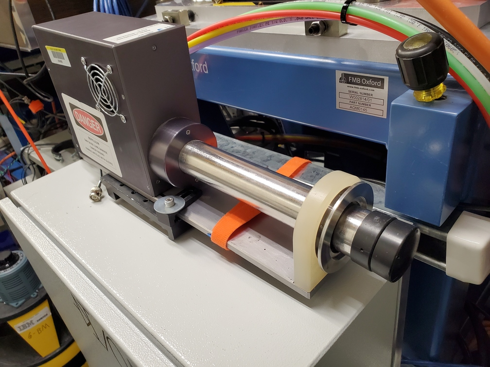
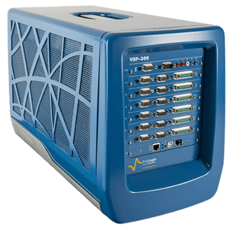
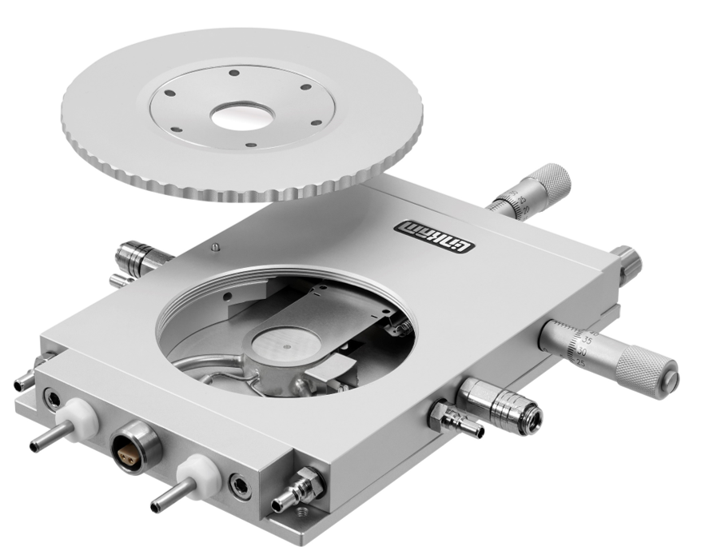
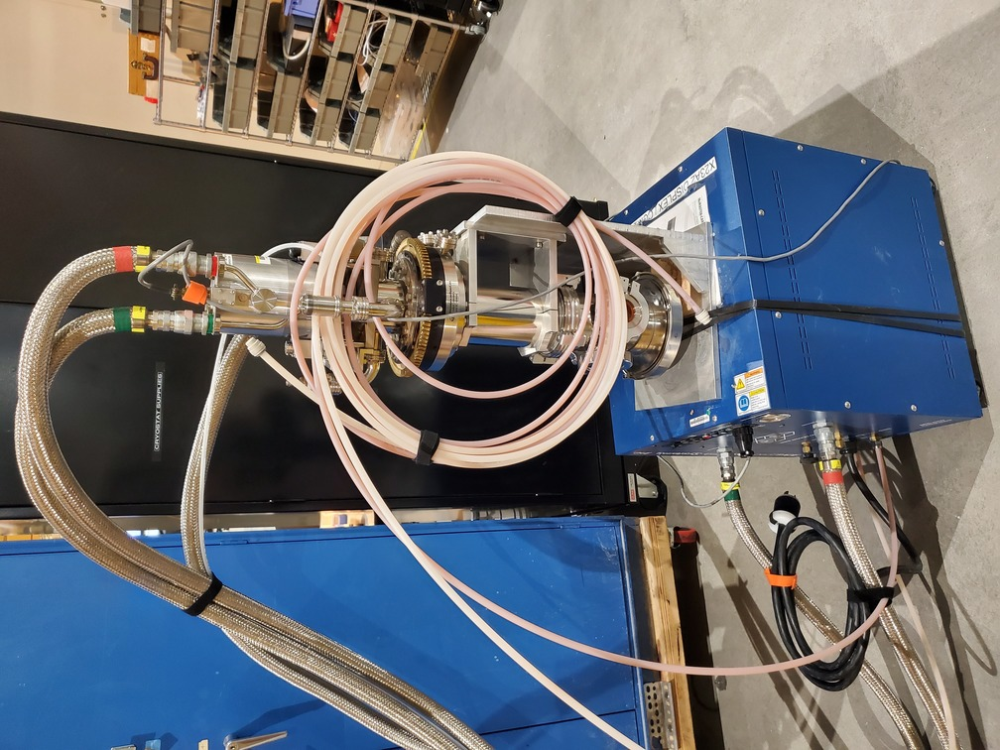
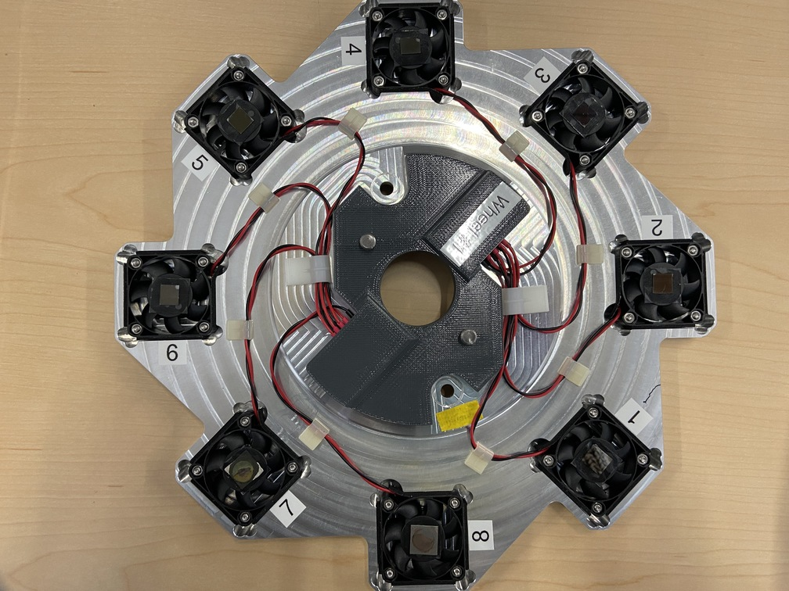

..
   This manual is copyright 2018 Bruce Ravel and released under
   The Creative Commons Attribution-ShareAlike License
   http://creativecommons.org/licenses/by-sa/3.0/

.. _instruments:

Beamline instrumentation
========================

This section provides a brief overview of the instrumentation
available for various kinds of routine and *in situ* experiments.

If you have questions about any of these tools or wish to pursue other
experimental options, contact the beamline staff.

Fluorescence detectors
----------------------

The standard fluorescence detector at BMM is a four element silicon
drift detector with an `Xspress3
<https://quantumdetectors.com/products/xspress3/>`_ readout.

We also have a single element silicon drift detector which is useful
in certain situations.  If your experimental setup requires placing
the detector in an unusual orientation, the single element detector
can be used.  Unlike the 4-element detector, the single element is not
required to remain in an upright orientation during operation.  While
the single element detector sees fewer photons, this versatility of
setup is occasionally very helpful.

.. subfigstart::

.. _fig-4elementINST:

   Four element silicon drift detector

.. _fig-1elementINST:
.. figure::  _images/1element.jpg
   :target: _images/1element.jpg
   :width: 100%
   :align: center

   One element silicon drift detector

.. subfigend::
   :width: 0.45
   :label: _fig-XRFINST

Area detector
-------------

An older model of the `Pilatus 100K
<https://www.dectris.com/detectors/x-ray-detectors/pilatus3/pilatus3-for-synchrotrons/pilatus3-x/>`_
is available.

.. _fig-pilatusINST:
.. figure::  _images/pilatus.jpg
   :target: _images/pilatus.jpg
   :width: 50%
   :align: center

   Dectris Pilatus 100K

Please note:

+ BMM offers only limited integration of data output into the beamline
  workflow.
+ BMM has limited options for mounting and integrating the Pilatus
  into your experiments.
+ This Pilatus has a rather small detection area and a rather large
  pixel size (about 170 microns).

BMM does not have access to a larger/better/faster detector and has no
plans of getting a new area detector in the near future.

Sample wheel
------------

At BMM, the standard *ex situ* sample stage is a laser-cut plastic
disk. The disk has 24 or 48 slots cut from the disk.  These are the
sample positions. 

This disk is mounted on a rotation stage.  The slots are 15 degrees
apart, so moving from sample to sample only involves moving through a
known rotation angle.  

The rotation stage is mounted on the XY stage, allowing alignment of
the sample holder to the incident beam.

.. _fig-wheel_stageINST:
.. figure::  _images/wheel_stage.jpg
   :target: _images/wheel_stage.jpg
   :width: 70%
   :align: center

   The standard *ex situ* sample holder is a plastic disk with slots
   for the sample positions.

Here are photos of some of the sample holder options.  There are
designs which use slots or circle for the sample position.  The
circular holes are 13 mm, which is a common size for a pellet press.
133mm pellets can usually slip snugly in those holes.

Samples can be packed into the slots or holes.  More commonly, samples
are prepared in some manner and affixed to the front of the sample
holder with tape.

There is also a design which is, essentially, a normal disk cut in
half.  That one holds fewer samples, but is easier to load and unload
from a glove box during sample preparation.

.. subfigstart::

.. _fig-samplewheelINST:
.. figure::  _images/Samplewheel.jpg
   :target: _images/Samplewheel.jpg
   :width: 100%
   :align: center

   A single-ring sample wheel with 24 sample positions.  There are
   options with 13mm x 3 mm slots or 13mm diameter holes.

.. _fig-doublewheelINST:
.. figure::  _images/double_wheel_sm.jpg
   :target: _images/double_wheel_sm.jpg
   :width: 100%
   :align: center

   Double-ring sample wheels with 48 sample positions.  There are
   options with 13mm x 3 mm slots or 13mm diameter holes.

.. subfigend::
   :width: 0.45
   :label: _fig-wheelINST

Electrochemistry
----------------

At BMM, we have a `BioLogic VSP-300 Potentiostat
<https://www.biologic.net/products/vsp-300/>`_ which is available for
all manner of electrochemistry experimentation. This is a 6 channel
model, allowing you to prep samples during measurements or to run
multiple electrochemistry experiments in parallel, moving those cells
into and out of the beam.

.. _fig-biologiclINST:

   The BioLogic VSP-300 Potentiostat

We run the vendor-supplied control software on a Windows 10 instance
running in a virtual container.

We do not, at this time, have full EPICS-level control of the
potentiostat, limiting the level of automation and integration with
the rest of the beamline.

Also, BMM does not provide electrochemical cells.  The user is
expected to bring their own cells.

Temperature control
-------------------

BMM has two options for experiments as elevated or reduced temperature.

Linkam stage
~~~~~~~~~~~~

The `Linkam stage <https://www.linkam.co.uk/thms600>`_ has LN2 flow
for cooling a sample down to 77K and a resistive heater to go up to
600C. The volume inside can be pumped or exposed to flowing gas.  The
sample stage at the center is modified to have a 3mm diameter hole for
transmission XAFS.

.. _fig-linkamstageINST:

   The linkam stage at BMM is much like this one, except with a 3mm
   diameter hole in the heating block to allow for transmission XAFS.

Displex Cryostat
~~~~~~~~~~~~~~~~

BMM also has a helium compression cryostat capable of reducing
temperature at the sample to around 10K and with a resistive heater
allowing a sample temperature range of 10K to about 400K.

This Displex model is designed for low-vibration applications.  as a
result, it is a bit slow to cool down, requiring about 2 hours to get
to 10K from room temperature. Sample changes are a bit laborious
due to the construction of the vacuum shroud.

.. subfigstart::

.. _fig-cryostatINST:

   The Displex cryostat and it's compressor.

.. _fig-lakeshoreINST:
.. figure::  _images/lakeshore331.png
   :target: _images/lakeshore331.png
   :width: 60%
   :align: center

   The LakeShore 331 controller, used to control temperature for the
   cryostat shown to the left.

.. subfigend::
   :width: 0.45
   :label: _fig-displexINST

Glancing angle and thin film stage
----------------------------------

We use this glancing angle stage for high throughput studies of thin
film and other flat samples.  The apparatus shown below rests on a
rotation stage for moving up to 8 samples into and out of the beam.
The rotation stage sits on a tilt stage, allowing fine control of
incident angle.  Each sample position is a spinner, which is used to
suppress diffraction from the substrate.

In most cases, sample alignment is fully automated.

.. _fig-glancinganglestageINST:

   The glancing angle stage with 8 sample positions.

