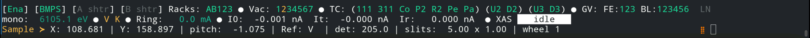
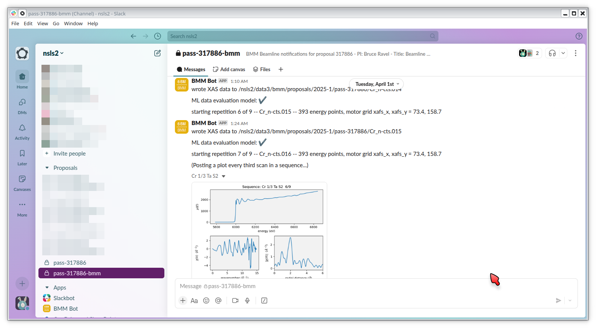
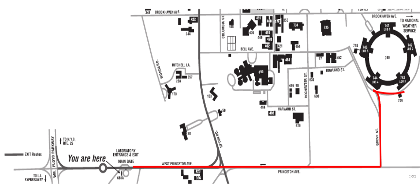
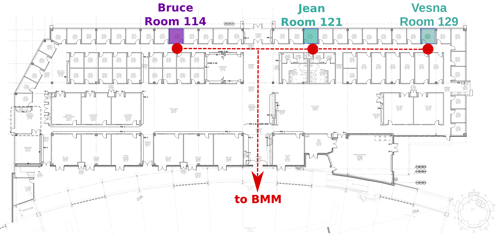

..  
   This document was developed primarily by a NIST employee. Pursuant
   to title 17 United States Code Section 105, works of NIST employees
   are not subject to copyright protection in the United States. Thus
   this repository may not be licensed under the same terms as Bluesky
   itself.

   See the LICENSE file for details.

.. _intro:

Introduction to BMM
===================

BMM is NIST's :red:`B`\ eamline for :red:`M`\ aterials :red:`M`\ easurement.

At the unix command line, type ``bsui`` to start the Bluesky user
interface.  |bsui| is simply an `IPython shell <https://ipython.org/>`_
with some customizations specific to Bluesky.  On top of that, there
are a number of customizations specific to BMM.

In this user manual, there are chapters covering most of the chores
one will need to do at the beamline, including:

#. moving motors
#. changing the state of the photon delivery system
#. making motor scans
#. making energy scans
#. interacting with the beamline's electronic log book
#. troubleshooting common problems

TL;DR
-----

**Open/close the shutter**
   ``shb.open()`` and ``shb.close()``, see :numref:`{name}, Section {number} <shutters>`

**Change energy**
   Use the ``RE(change_edge())`` command, see :numref:`{name}, Section {number} <pds>`

**Sample alignment scans**
   Use the ``RE(linescan())`` command, see :numref:`{name}, Section {number} <linescan>`

**XAFS scan**
   Use the ``RE(xafs())`` command, see :numref:`{name}, Section {number} <xafsscan>`

**Import an automation spreadsheet**
   Prepare a spreadsheet, then ``xlsx()``, see :numref:`{name}, Section {number} <automation>`

**Details, details, details**
   :numref:`Command cheatsheet, Section {number} <cheatsheet>`

Essential links
---------------

:NSLS-II:  https://www.bnl.gov/nsls2/
:BMM's page:  https://www.bnl.gov/nsls2/beamlines/beamline.php?r=6-BM
:Operations schedule:  https://www.bnl.gov/nsls2/schedule/
:Beamtime schedule:  https://scheduler.nsls2.bnl.gov/
:NSLS Status:  https://www.bnl.gov/nsls2/operating-status.php
:BMM at Github:  https://github.com/orgs/NSLS2/teams/bmm/repositories

The user experience
-------------------

The IPython/|bsui| prompt at BMM is modified to provide at-a-glance
information about the state of the beamline.

.. _fig-prompt:

   The BlueSky user prompt at BMM

* The green ``BMM`` indicates that the beamline is :numref:`set up and
  ready for the user (see Section %s) <start_end>`.  When the beamline
  is not ready for users, the ``BMM`` string is red.

* The string ``D.111`` indicates that the photon delivery system is in
  :numref:`mode D (see Table %s) <pds-modes>` and that :numref:`the
  Si(111) monochromator (Section %s) <change-crystals>` is in use.

* The green number in square brackets is an incremented count of how
  many commands have been issued since |bsui| was started.

* If the prompt starts with three red exclamation points |nd| something like 

      :red:`!!!` :green:`BMM` D.111 :green:`[1]`

  that means that some motors were not connected when Bluesky started.
  Contact beamline staff immediately!

.. _cadashboard:

CA Dashboard
~~~~~~~~~~~~

At the top of the some screens, you see a crude-but-handy beamline
monitor.  It looks something like this:

.. _fig-cadashboard:

   The CA dashboard beamline monitor

This provides a concise (but rather color-blind-unfriendly) overview of
the state of the beamline.

.. role:: darkyellow

**Top line**
   In short, if the top line has no red text, the beamline is all ready to go.

   + BMM is enabled (:green:`green`) or disabled (:gray:`gray`)
   + The BM, FE, & user photon shutters are open (:green:`green`) or closed (:gray:`gray`)
   + Indicators that the temperature sensors in the racks are in range
     (:green:`green`) or running hot (:red:`red`)
   + The state of vacuum sections 1 through 7 |nd| :green:`green`
     means vacuum level is OK, :darkyellow:`yellow` means vacuum level is
     not great but not a problem, :red:`red` means vacuum level is
     high
   + The state of the in-vacuum motors, 4 on the DCM, 2 on the
     focusing mirror, 2 on the harmonic rejection mirror |nd| :green:`green`
     means temperature is OK, :red:`red` means temperature is high
   + The open (:green:`green`) or closed (:red:`red`) state of the 3 front end gate
     valves and the 6 beamline gate valves
   + The open (:blue:`blue`) or closed (:gray:`gray`) state of the liquid nitrogen
     valve on the roof of the hitch

.. role:: hlyellow
.. role:: hlcyan
.. role:: hlmagenta
.. role:: hlblue

**Middle line**
   + The energy position of the monochromator
   + The current element and edge configuration of the beamline
   + The ring current
   + The signals on the I\ :sub:`0`, I\ :sub:`t`, and I\ :sub:`r` ion
     chambers, measured in nanoamps
   + The current operation at the beamline, options are: idle (white),
     XAFS scan (:hlmagenta:`pink`), line scan (:hlcyan:`cyan`), area scan (:hlyellow:`yellow`), or time
     scan (:hlblue:`blue`)

.. role:: brown

**Bottom line**
   + The positions of several common sample motors
   + The size of the sample slits
   + The element currently in the reference position
   + The state of the instrument being used |nd| in this example, *the
     ex-situ* sample wheel
   + The :brown:`brown` block at the end is a heartbeat monitor to visually
     verify that the dashboard is functioning correctly

.. todo:: Document cadashboard in appendix of this manual.

.. _slack:

Slack and Data Access
~~~~~~~~~~~~~~~~~~~~~

At the beginning of your experiment, you will be invited to the BMM
Slack workspace.  There you can follow along with the progress of the
experiment in the ``#pass-123456-bmm channel``, where ``123456`` will
be the proposal number of your experiment.

There is also a channel called ``#pass-123456`` which is for use as a
discussion channel.

Throughout the course of the experiment, messages and figures will be
automatically posted to that channel.  This allows someone to keep
track of progress and to keep an eye on data quality without being
physically at the beamline.

.. _fig-slack:

   An example of messages and a picture of measured data posted to the
   beamline Slack channel.

.. attention::
   
   As of the 2024-1 cycle, BMM is no longer syncing data automatically
   to Google Drive.  Data are now available to users via sftp with
   proper authentication.  See :numref:`Data Access (Section %s)
   <data>`.

   As of the 2025-2 cycle, BMM is using the NSLS-II Slack channels.
   The old BMM Slack with the ``#beamtime`` channel has been retired.

..
  Electrochemistry experiments
  ~~~~~~~~~~~~~~~~~~~~~~~~~~~~

  .. note:: January 2022

     Electrochemistry is not yet properly supported in the experimental
     work flow.  This section is remains aspirational.

  The data acquisition system at BMM has rudimentary support for
  electrochemistry experiments using the BioLogic potentiostat.  When
  starting a new experiment, do this::

    BMMuser.begin_experiment(name='Betty Cooper', date='2019-02-29', gup=123456, saf=654321, echem=True)

  The ``echem`` argument, when set to ``True`` tells the system to look
  for data from the potentiostat in the appropriate place on the Windows
  computer running the EC-Lab software.  It will make a folder called
  ``electrochemistry`` in the data folder and make a folder on the
  Windows machine at ``C:Users\xf06nm\My Documents\EC-Lab\Data``.
  There will be a folder with the PI's name and a subfolder with the
  start date of the experiment.

  At the end of the experiment, the electrochemistry files are copied
  from the Windows machine to the data folder.  This puts all of the
  data in one place and makes sure that the electrochemistry data are
  backed up correctly.

Getting help at the command line
~~~~~~~~~~~~~~~~~~~~~~~~~~~~~~~~

To see a summary of common commands, use ``%h``:

.. code-block:: text

   Open the shutter:                 shb.open()
   Close the shutter:                shb.close()

   Change energy:                    RE(mv(dcm.energy, <energy>))
   Move a motor, absolute:           RE(mv(<motor>, <position>))
   Move a motor, relative:           RE(mvr(<motor>, <delta>))
   Where is a motor?                 %w <motor>

   Where is the DCM?                 %w dcm
   Where is M2?                      %w m2
   Where is M3?                      %w m3
   Where are the slits?              %w slits3
   Where is the XAFS table?          %w xafs_table

   Summarize all motor positions:    %m
   Summarize utilities:              %ut

   How long will a scan seq. be?     howlong('scan.ini')
   Run a scan sequence:              RE(xafs('scan.ini'))
   Scan a motor, plot a detector:    RE(linescan(<det>, <motor>, <start>, <stop>, <nsteps>))
   Scan 2 motors, plot a detector:   RE(areascan(<det>, <slow motor>, <start>, <stop>, <nsteps>, <fast motor>, <start>, <stop>, <nsteps>))
   Make a log entry:                 BMM_log_info("blah blah blah")

   DATA = /home/bravel/BMM_Data/bucket

   All the details: https://nsls-ii-bmm.github.io/BeamlineManual/index.html

and to see a summary of some useful command line hotkeys, use ``%k``:

.. code-block:: text

   Abort scan:             Ctrl-c twice!
   Search backwards:       Ctrl-r
   Quit search:            Ctrl-g
   Beginning of line:      Ctrl-a
   End of line:            Ctrl-e
   Delete character        Ctrl-d
   Cut text to eol         Ctrl-k
   Cut text from bol       Ctrl-u
   Paste text              Ctrl-y

   More details: http://readline.kablamo.org/emacs.html

The day will come that we have a GUI for running XAFS experiments at
BMM.  For now, we have the command line.  Read on |nd| it's not too
difficult!

BMM and Building 743
--------------------

BMM is on the south side of the NSLS-II building: `what3words:
///width.corrugated.support
<https://what3words.com/width.corrugated.support>`__

You should park at building 743 and enter through the main entrance
of 743.

.. _fig-sitemap:

   Route from the Main Gate to Building 743

Walk though the lobby to the doors that lead out onto the experimental
floor.  BMM is just across the walk way from the doors to the 743 lobby.

.. subfigure::  ABC
   :layout-sm: ABC
   :gap: 8px
   :subcaptions: above
   :name: fig-BMMlocation
   :class-grid: outline

   .. image:: _images/location/743lobby.jpg

   .. image:: _images/location/corridor.jpg

   .. image:: _images/location/BMMcontrolstation.jpg

   (Left) Approaching the floor through the lobby of
   Building 743. (Center) BMM is just across the corridor from the
   door to the 743 lobby. (Right) Walk past the diagonal support beam
   and head into the BMM control station

BMM's staff have offices on the outer hallway of Building 743.

.. _fig-lob3:

   Bruce's, Jean's and Vesna's offices in Building 743

A Bit about BMM
---------------

BMM is an XAS beamline.  As such it is on the simpler end of things at
NSLS-II.  We use an NSLS-II `three-pole wiggler (3PW)
<https://www.bnl.gov/nsls2/project/source_properties.asp>`_ as our
photon source.  This provides broadband radiation throughout the hard
X-ray range, up to about 30 keV.  It is a small device |nd| only about
40 cm long and with a magnetic path length of about 12 cm |nd| which
is inserted in a short section between the two bend magnets in the
dual-bend achromat lattice at NSLS-II.  The flux is certainly not the
equal of any of the many-pole insertion devices in the straight, but
it is highly performant for many XAS experiment.

About 13 meters from the source, we have a paraboloid collimating
mirror.  This position is well within the storage ring tunnel and
about 12 meters from the entrance to the BMM first optical enclosure.
We placed a mirror at that location to capture the largest possible
swath of the divergent light coming from the 3PW source.  A paraboloid
is the correct shape for focusing light in both the horizontal and
vertical directions.  However, a paraboloid must be a fixed figure,
fixed angle device in order to optimally collimate the light.  Because
the mirror is in the front end, thus inaccessible during operations,
we found the paraboloid to be an attractive solution.  Once aligned in
the beam, it should never need adjustment.

The collimated light is delivered to a double crystal monochromator
(DCM).  The DCM has pairs of Si(111) and Si(311) crystals which are
accessed by :numref:`translating the DCM vacuum vessel laterally
(Section %s) <change-crystals>` .  A transition between the two
crystal sets takes about 2 minutes.

After the DCM, we have a toroidal focusing mirror followed by a flat
harmonic rejection mirror.  One or both of these mirrors is in the
beam depending on :numref:`the configuration of the XAS experiment
(Section %s) <change-mode>` in the end station.  Because the beam is
deflected upward after the collimating mirror, at least one of the
mirrors after the DCM must be used in order to deflect the beam
through the lengthy transport pipe and into the end station.

Because the collimating mirror is at a fixed angle, it only serves as
a harmonic rejection mirror above an energy determined by its
operating angle.  That turns out to be about 23.5 keV.  For XAS
experiments conducted above 8 keV, then, the harmonic rejection
provided by the collimating mirror is adequate.  At lower energies,
the flat harmonic rejection mirror is used to provide clean beam.

With just the harmonic rejection mirror in place, a beam of size 8 mm
by 1 mm is delivered to the end station.  For many XAS experiments,
this rather large beam is desirable.  Indeed, many of the visitors to
BMM specifically request the large beam for their experiments.  With
the focusing mirror in place, that large swath is reduced to a spot of
about 300 |mu| m by 250 |mu| m.

Acknowledgements
----------------

This documentation project uses `Sphinx
<https://www.sphinx-doc.org/en/master/index.html>`__ and the lovely
`{book}theme
<https://sphinx-book-theme.readthedocs.io/en/latest/index.html>`__
from the `The Executable Book Project
<https://ebp.jupyterbook.org/>`__.  Appendices are numbered properly
using the ``appendix.py`` extension from
https://github.com/heig-tin-info/handout.

BMM's `Bluesky <https://blueskyproject.io/>`__ profile was mostly
written by Bruce.  But this would not have happened without the help
of several members of NSLS-II's DSSI program.  In particular, I want
to thank Dan Allan, Tom Caswell, Josh Lynch, Jakub Wlodek, Max
Rakitin, Dmitri Gavrilov, Stuart Campbell, Abby Giles, Garrett Bishof,
Nate Maytan, Matt Snyder, Oksana Ivashkevych, and Ryan Jaskiel.  And I
need to thank every BMM user |nd| being a BMM user means being a beta
tester for the beamline software!

BMM makes use of `lots of great python tools
<https://speakerdeck.com/jakevdp/the-unexpected-effectiveness-of-python-in-science?slide=52>`__.
Matt Newville's `Larch <http://xraypy.github.io/xraylarch/>`__ is used
to process every XAS scan that gets measured and Matt's `lmfit
<https://lmfit.github.io/lmfit-py/>`__ is used for many alignment
chores.

This manual uses a GitHub action to build and deploy `(see details
here)
<https://github.com/marketplace/actions/sphinx-docs-to-github-pages>`__
this document whenever a ``git push`` happens.  We are grateful to the
`UIBCDF <https://github.com/uibcdf/action-sphinx-docs-to-gh-pages>`__
developers for this continuous deployment capability.

A note about copyright
----------------------

This document and `the BlueSky data collection profile
<https://github.com/NSLS2/bmm-profile-collection>`__ it covers was
developed primarily by a NIST employee. Pursuant to title 17 United
States Code Section 105, works of NIST employees are not subject to
copyright protection in the United States. Thus this repository may
not be licensed under the same terms as Bluesky itself or its
documentation.

See the `LICENSE file
<https://github.com/NSLS2/bmm-profile-collection/blob/main/LICENSE>`__
for details.
