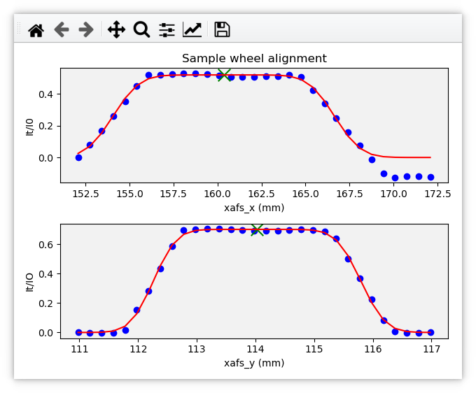
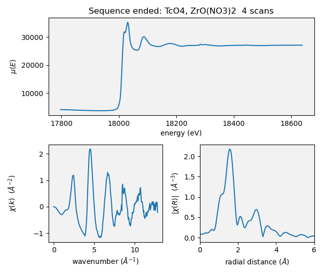

..
   This document was developed primarily by a NIST employee. Pursuant
   to title 17 United States Code Section 105, works of NIST employees
   are not subject to copyright protection in the United States. Thus
   this repository may not be licensed under the same terms as Bluesky
   itself.

   See the LICENSE file for details.

.. _plotting:

Kafka workers at BMM
====================

In 2023, BMM began using a Kafka client to manage real-time data
visualization.  Prior to that, BMM was using a modified version of
Bluesky's `LivePlot
<https://blueskyproject.io/bluesky/callbacks.html#liveplot-for-scalar-data>`__.
With the advent of BMM's use of `BlueSky queueserver
<https://blueskyproject.io/bluesky-queueserver/>`__ alongside |bsui|, we
had to rethink how plots were made.

In short, a Kafka client was developed to manage real-time
visualization.  This client is subscribed to two topics, a private
BMM-only topic and the same topic used by Bluesky to distribute
event documents to databroker.

Messages on the private topic tell the worker what kind of plot is
requested.  The worker then parses event documents and adds data
points to the real-time plots.

In May 2024, data security upgrades were implemented at BMM.  The
upshot of this new data security regime is that the |bsui| or qs process
is not able to write data to the proposal directory on central
storage.  Moving all data file output from the |bsui| profile to a new
Kafka worker gave us a path forward.  The workers can be run with
adequate privilege to write to central storage.

At this time (June 2024), there are three Kafka workers running to
manage file IO and data visualization:

:File manager: running via `systemd <https://systemd.io/>`__ with
	       adequate privilege to write to project directories.

:Headless plot manager: running via `systemd <https://systemd.io/>`__
			with adequate privilege to write to project
			directories. This is in charge of exporting
			data visualization to png files and other
			formats.

:Visualization plot manager: running as the beamline operator.  This
			     does not have permission to write to the
			     proposal directory, but it does have
			     permission to make real-time plots on
			     screen.

For now (June 2024), all three are running on xf06bm-ws3.  However,
these can run on any machine at the beamline.  The visualization plot
manager, though, should be running on a machine with a screen in plain
sight of the experimenter.  xf06bm-ws3 is a fine choice.

.. admonition:: Future Tech!

		Some day the workers will be stable and battle tested.
		The systemd workers could then run on a machine out of
		sight, like an IOC server.

.. _start_consumer:

Starting the Kafka consumer
---------------------------

In the ``consumer/bin/`` folder of the `beamline profile
<https://github.com/NSLS2/bmm-profile-collection/tree/main/startup>`__
there are several files used to manage the workers.

:run-filemanager: a shell script for launching the file manager worker
                  in the correct conda environemnt

:run-plotmanager: a shell script for launching the plot manager worker
                  in the correct conda environemnt

:set-konsole-tab-title.sh: interact nicely with the Konsole terminal

:tab-layout: a Konsole configuration file for opening a window with
	     three tabs for the three workers

:open-tabs.sh: s shell script for using the tab-layout file

:xafs_service: a shell script for restarting the workers as system
	       services, then run journalctl in tail mode to display
	       worker screen messges

It is convenient to make symlinks to each of the shell scripts in a
folder in the execution path.  ``~/bin/`` makes sense.

To start, run the ``open-tabs.sh`` script to make a Konsole window
with three tabs.  Each tab is named something evocative of what will
be running in it.

#. In the tab labeled "Visual plot manager", do ``run-plotmanager`` as
   the beamline operator.

#. In the tab labeled "File manager", do ``su - <username>`` to
   become youself rather than the beamline operator, then do
   ``xafs_services file``.  You will be prompted for your password and
   then sent a DUO push.

#. In the tab labeled "Headless plot manager", do ``su -
   <username>`` to become youself rather than the beamline operator,
   then do ``xafs_services plot``.  You will be prompted for your
   password and then sent a DUO push.

Note that you must be beamline staff to run the system services.  A
beamline user will not be able to execute the second and third steps
above.

Once all three workers are running, you are ready to start |bsui| or
|qs| and begin collecting data.

.. _fig-consumer:
.. figure:: _images/software/kafka_consumers.png
   :target: _images/kafka_consumers.png
   :width: 80%
   :align: center

   A terminal window in which the Kafka consumers have been started.

A few words about Kafka
-----------------------

Kafka is a message bus.  A message bus is a service that sits between
applications that generate messages and applications that want to
consume those messages and act upon them.

This works via subscription topics.  An application can subscribe to
a topic as a producer.  That means it can say "I just did something
and here is information about what I did."  It will post that message
to Kafka, then move on.

A separate application can subscribe to the topic as a consumer.  It
will be waiting on messages that get posted to the topic.  The
consumer will only see messages on a topic to which it is subscribed.
It can then interpret the message to decide if it should act upon it.

Many applications can subscribe as producers and many applications can
subscribe as consumers.  

In the case of BMM, there are two possible producers of messages |nd|
|bsui| and |qs|.  At BMM, there are three consumers |nd| the
three listed above.  The consumers are in separate processes, thus can
act upon messages in parallel.

Because the Kakfa message bus is involved, actions can be taken by
consumers on messages asynchronously with the producer of the
messages.  This means, for instance, that |bsui| can carry on with data
collection and let the file worker take care of the details of writing
files.

This is, admittedly, a lot more complicated than just having |bsui|
handle all those chores by itself.  But this complication pays off in
two very significant ways:

#. The plot worker makes plots regardless of whether |bsui| or |qs| is
   running the experiment.  Since |qs| is probably not running on the
   beamline workstation, that is very handy.
#. The workers run as systemd processes are able to write files to the
   secure proposal directory.  Neither |bsui| nor |qs| are run
   with adequate privilege for that.

Plot types
----------

The plot worker makes a tightly curated set of plots.  The beamline
user has little freedom to adjust the plots.  This is by design |nd|
the data visualization is a tool used during data collection.  The
entire data collection workflow is intended for streamlined, automated
measurement.  Highly specialized data visualization can be made with
the recorded data.

Communicating over the ``bmm-test`` topic, two sorts of plotting
chores are managed |nd| real-time visualization and visualization
after the end of the mesurement.  

In each case, the documents sent to Kafka are simple dictionaries
which the consumer parses to perform a plotting chore using
`matplotlib <https://matplotlib.org/>`__.

These dictionaries are not structured like a BlueSky document.  There
is no schema.  The dictionary simply contains keywords which the
consumer is programmed to recognize.

.. admonition:: Future Tech!

   Consider a browser-y solution like `Bokeh
   <https://docs.bokeh.org/en/latest/index.html>`__.

.. _liveline:

Live linescan plots
~~~~~~~~~~~~~~~~~~~

At BMM, :numref:`a linescan (Sec %s) <linescan>` is a scan where a
motor is moved and a signal is plotted.  A linescan begins by issuing
a message telling the consumer to start a new plot and to begin
looking for BlueSky event documents:

.. code-block:: python

   {'linescan' : 'start',
    'motor'    : 'xafs_x',
    'detector' : 'I0',}

Those event documents will be parsed to obtain the result of the most
recently measured data point.  The new data point is added to the plot
and the plot is redrawn.

When the linescan finishes, a *stop* message is issued:

.. code-block:: python

   {'linescan': 'end',}

This replicates very closely how the BlueSky `LivePlot
<https://blueskyproject.io/bluesky/callbacks.html#liveplot-for-scalar-data>`__
displays data of this sort.

.. _livetime:

Live timescan plots
~~~~~~~~~~~~~~~~~~~

With the BMM plotter, a timescan and a linescan are made with the
same code.  The only difference is that no motor is given for a
timescan and the X-axis is plotted as the time stamp of the current
point minus the time stamp of the first point.  Thus the X-axis is in
units of seconds.  The signal plotted on the Y-axis is determined the
same as for a linescan and all the internal mechanics of the time plot
are the same as for a motor plot.

A timescan begins by issuing a message telling the consumer to start a
new plot and to begin looking for BlueSky event documents:

.. code-block:: python

   kafka_message({'timescan': 'start',
		  'detector' : 'if',})

When the linescan finishes, a *stop* message is issued:

.. code-block:: python

    kafka_message({'timescan': 'stop',
                   'fname' : outfile,
                   'uid' : uid, })

The ``fname`` and ``uid`` arguments are optional and are used for
single energy absorption detection (SEAD) scans.  The ``uid`` is the
UID of the timescan and the ``fname`` is the filname (without path) of
the output data file.

.. todo:: Document SEAD scans.

.. _livearea:

Live areascan plots
~~~~~~~~~~~~~~~~~~~

.. todo::

   Explain this in words.  Explain how the contour plot is made at the
   end of the scan.

.. code-block:: python

        kafka_message({'areascan'     : 'start',
                       'slow_motor'   : xafs_y.name,
                       'slow_start'   : -9,
                       'slow_stop'    : 9,
                       'slow_steps'   : 91,
                       'slow_initial' : xafs_y.position,
                       'fast_motor'   : xafs_x.name,
                       'fast_start'   : -9,
                       'fast_stop'    : 9,
                       'fast_steps'   : 91,
                       'fast_initial' : xafs_x.position,
                       'detector'     : 'if',
                       'element'      : BMMuser.element,
                       'energy'       : dcm.energy.position})

.. code-block:: python

        kafka_message({'areascan': 'stop',
                       'uid'     : uid,
                       'filename': stub})

.. _livealignment:

Alignment plots
~~~~~~~~~~~~~~~

Various alignment chores at the beamline |nd| for example, aligning a
slot on a :numref:`sample wheel (Sec %s) <sample-wheel>` or aligning
the :numref:`glancing angle stage (Sec %s) <glancing-angle-stage>`
|nd| involve a series of :numref:`linescans (Sec %s) <linescan>`, each
of which is plotted in real time |nd| as shown :numref:`above (Sec %s)
<liveline>` |nd| followed by a plot summarizing the result of the
alignment.

Using the sample wheel alignment as an example, the sequence is
initiated by this document:

.. code-block:: python

   {'align_wheel' : 'start'}

As each linescan in the alignment procedure is completed, some
automated analysis is performed to determine the optimal position of
the motor axis being scanned.  The results of this analysis are issued
in a document like this.

.. code-block:: python

   {'align_wheel' : 'find_slot',
    'motor'       : 'xafs_x',
    'detector'    : 'it',
    'xaxis'       : list_of_axis_positions,
    'data'        : list_of_signal_values,
    'best_fit'    : list_of_fitted_values,
    'center'      : midpoint_value,
    'amplitude'   : amplitude_value,
    'uid'         : uid}

From this a plot showing the measured data and the results of the
analysis is made.

Once all parts of the alignment procedure are finished, this document
is issued:

.. code-block:: python

   {'align_wheel' : 'end'}

This tells the consumer to create a plot summarizing the results of
the alignment.  

The alignment of the glancing angle stage works in much the same
manner.

.. _fig-find_slot:

   An example of the final plot for an alignment of the *ex situ*
   sample wheel. The green X marks show the aligned positions in
   ``xafs_x`` and ``xafs_y``.

.. _livexafs:

Live XAFS plots
~~~~~~~~~~~~~~~

The problem of making live XAFS plots is quite similar to live
linescan plots, but with some additional considerations:

#. It is common to make multiple repetitions of XAFS scans, thus
   successive scans should be overplotted.
#. There are various interesting views of the XAFS data, including
   both transmission and fluorescence of the data, transmission of the
   energy calibration standard, and a view of the raw I0 spectrum (to
   keep an eye on monochromator glitches and other issues).

.. admonition:: Future Tech!

   Panel for live |chi|\ (k) plots, begin plotting this panel, say, 60
   eV above the edge.

.. admonition:: Future Tech!

   Plot electron yield data in a consistent, maintainable manner.

Like with the linescan, the plot begins with a message issued to tell
the consumer to begin preparing for an XAFS plot and providing enough
information to make that plot.  This ``start`` message is issued at
the beginning of the entire scan sequence.

.. code-block:: python

   {'xafsscan'   : 'start',
    'element'    : 'Fe',
    'edge'       : 'K',
    'mode'       : 'fluorescence',
    'filename'   : 'example'
    'repetitions': 3,
    'sample'     : 'Fe sample',
    'reference_material': 'Fe foil', }

At the beginning of each individual repetition, a ``next`` message is
sent, telling the consumer to prepare to add a new set of traces to
the plot for the repetition about to begin.

.. code-block:: python

   {'xafsscan': 'next',
    'count': 2, }

Finally, a message is sent telling the consumer that the sequence of
scans has finished, putting the consumer back into a state where it is
ready to receive the next sequence of messages for the next plot.

.. code-block:: python

   {'xafsscan': 'end',}

The plot that is made for an XAFS scan depends on whether fluorescence
measurement is available.  If so, a 2x2 grid is shown with the
transmission and fluorescence |mu| (E) on the top, a plot of I0 on the
bottom left, and plot of the transmission |mu| (E) of the reference
material on the bottom right.

For a scan not using the fluorescence detector, the plot is a 3x1 grid
of transmission |mu| (E), I\ :sub:`0`, and the reference spectrum.

.. _fig-xafs_live_view:
.. figure:: _images/software/XAFS_live_view.png
   :target: _images/XAFS_live_view.png
   :width: 80%
   :align: center

   An example of the XAFS live plot made for a fluorescence XAFS scan.
   This is a somewhat old example. I\ :sub:`0` is now normalized by
   the dwell time, thus is plotting in units of nanoamperes rather than
   nanoampere*seconds, as shown (but labeled incorrectly).

The live plot at the end of the scan sequence is posted to Slack and
included in the :numref:`dossier (Section %s) <dossier>`.

.. _xafssequence:

Scan sequence data reduction
~~~~~~~~~~~~~~~~~~~~~~~~~~~~

At the end of a scan sequence, we show the user a 3-panel plot showing
|mu| (E), |chi| (k), and |chi| (R).  (This is the same 3-panel plot
that is written to the :numref:`dossier (Section %s) <dossier>`.  This
plot is of the merge of the scans measured in the scan sequence.
Behind the scenes, Larch is used to make the merge, remove the
background function, and perform the Fourier transform.  Additionally,
every time an individual repetition in the scan sequence is finished,
this 3-panel plot is made from the merge of the scans measured thus far.

At the beginning of a scan sequence, a Kafka document with a payload
like this is issued:

.. code-block:: python

   {'xafs_sequence' : 'start',
    'element'       : 'Fe',
    'edge'          : 'K',
    'folder'        : BMMuser.folder,
    'repetitions'   : 3,
    'mode'          : 'fluorescence'}

The presence of the ``xafs_sequence`` key tells the Kafka consumer to
interpret this document as relevant to the creation of the 3-panel
plot.  The value of ``start`` tells the consumer to prepare for making
this plot from data under the conditions specified by the remainder of
the keywords.

As each scan finishes, the following document is issued.  This tells
the consumer that a repetition finished and supplies the UID of the
just-completed scan.  `Tiled <https://github.com/bluesky/tiled>`__ is
used to grab the data from the just-completed scan.  This triggers a
recalculation of the merge and the recreation of the 3-panel plot.

.. code-block:: python

   {'xafs_sequence' :'add',
    'uid'           : uid}

Finally, at the end of the scan sequence, this document is issued:

.. code-block:: python

   {'xafs_sequence' : 'stop', 
    'filename'      : '/path/to/dossier/image'}

This tells the consumer to make the final version of the 3-panel plot
using all the data and to save a png image of the plot for use in the
dossier.

.. _fig-triplot:

   An example of a 3-panel plot created by the Kafka consumer.

This motif of issuing a ``start`` message to begin crafting a plot,
messages to ``add`` to the plot, and a message to ``stop`` the plot is
the common thread to how BMM uses Kafka to make plots, both static and
real-time plots.

.. todo:: there are more plot actions that need to be documented.

Headless and visualization workers
----------------------------------

There are two plotting workers that share code and behave almost
identically.  This seems redundant, so merits a few words of
explanation.

The visualization worker is run as the beamline operator |nd|
``xf06bm``.  The beamline operator owns the screen and is able to make
plots of data to the screen.  However, the beamline operator does not
have permission to write data and png images to the proposal
directory.  The visualization worker can be run on any machine on the
local network at BMM |nd| even on multiple machines!

The headless worker does not make visible plot visualization.
Instead, it writes plots to a virtual device which can then be saved
as png images to the proposal directory.  It is also able to write
data files to the proposal directory.  For example, the XRD data file
measured before each scan sequence is written by the visualization
worker.

In short, the visualization worker is for the benefit of the humans at
the beamline while the headless worker is responsible for writing
files for the data record of the experiment.

Credit goes to Dan Allan for suggesting running two instances of the
plot worker using the QtAgg and Agg `matplotlib backends
<https://matplotlib.org/stable/users/explain/figure/backends.html>`__.

File management
---------------

.. todo::

   Explain all the file management actions with example dicts.

Cleaning up the screen
----------------------

Most of the plotting options from the Kafka consumer are good about
closing the last plot before starting a new one.  However, linescans,
in general, do not clean up prior plots.

You can close some or all of the plots made by the Kafka consumer by
issuing a suitable message, either at the command line or in a plan. 

This will close all plots on screen made by the consumer:

.. code-block:: python

   kafka_message({'close': 'all'})

This will close all plots associated with linescans, but not close
plots associated with XAFS scans:

.. code-block:: python

   kafka_message({'close': 'line'})

And this will close the most recent plot:

.. code-block:: python

   kafka_message({'close': 'last'})

