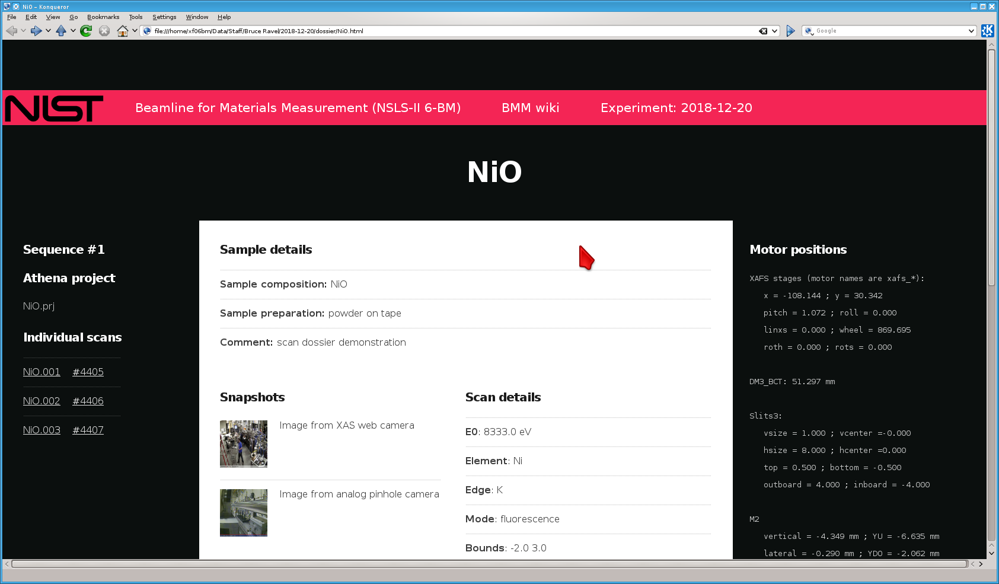

..
   This document was developed primarily by a NIST employee. Pursuant
   to title 17 United States Code Section 105, works of NIST employees
   are not subject to copyright protection in the United States. Thus
   this repository may not be licensed under the same terms as Bluesky
   itself.

   See the LICENSE file for details.

.. _log:

Experimental Log
================

At BMM, we are trying to run the system in a way that automatically
generates a useful electronic log book.  This is meant to complement
|nd| not replace |nd| a paper log book or an online system like `Olog
<http://olog.github.io/2.2.7-SNAPSHOT/>`_.

The point of the BMM experimental log is to capture with time stamps
all the significant actions at the beamline.  In part, this provides a
record of the actions in an experimental campaign.  It also is an
attempt to provide enough information to recover from mistakes and
confusions about sample positions and other experimental issues.

.. _logfile:

Log file
--------

At the beginning of a user experiment, run something like this command::

  BMMuser.begin_experiment('Betty Cooper', date='2019-02-28', gup=123456, saf=654321)

Among other things, this instruments the logger to maintain a log file
specifically for the current experiment.  The logger also maintains a
master log file which is, effectively, a concatenation of all the
individual experimental logs.

The log is an attempt to capture a record of all significant actions
taken during an experimental campaign.  It errs of the conservative
side in that it likely captures way too much information.

Experimental events are captures with a time stamp and a brief
explanation of what happened.  For example, when a motor is moved, the
motor name and target position are written to the log with a time
stamp.

Similarly, a line scan or an XAFS scan is captured with enough
information to understand what the scan accomplished.  For a line
scan, the motor name, scan range, and starting position are captured.
For an XAFS scan, the contents of the :numref:`INI file (See Section
%s) <xafs>` are written to the log along with the motor positions as
reported by the ``ms()`` command :numref:`(see Section %s) <motors>`.
The names of the output data files are recorded with timestamps
indicating when they were written.

Several other activities specific to BMM also recorded to the log file.
The snapshot tool described above is an example.

Writing to the log file is accomplished in two ways.  This function::

  BMM_log_info('text of message')

is used to insert most messages into the log.  ``BMM_log_info()`` can
be called at any time from the command line to insert any message into
the log.

BMM also uses `Bluesky's msg_hook
<https://nsls-ii.github.io/bluesky/debugging.html#message-hook>`_.
This is how ``mv()`` and ``mvr()`` commands are captured in the log.
This bespoke message hook parses the document returned by BlueSky for
specific kinds of events and captures a log message when appropriate.

.. _snap:

Snapshots
---------

.. todo:: Document the USB cameras

The XAFS scan plan described in :numref:`Section %s <xafs>` includes a
step where snapshots are taken from the XAS webcam and the small
analog camera.  These photos are written to JPG files with names
related to the XAS data file written as part of the call to the
``xafs()`` plan.  This provides automated photographic documentation
of the state of the measurement as it is being made.

Snapshots can be taken at any time using this command::

  snap('<camera>', filename='/path/to/image.jpg')

The choices for ``<camera>`` are

``XAS``
  Take a snapshot from the XAS webcam

``XRD``
  Take a snapshot from the XRD webcam

``analog``
  Take a snapshot of the image currently displayed on the monitor to
  the left of the control station.

The image will then be written to the file specified by the
``filename=`` argument.

The ``xafs()`` plan does something equivalent to the ``snap()``
function for each available camera.  These are recorded to the scan's
:numref:`dossier (Section %s) <dossier>`.

.. subfigure::  AB|CD
   :layout-sm: AB|CD
   :gap: 8px
   :subcaptions: above
   :name: fig-snapshots
   :class-grid: outline

   .. image:: _images/infrastructure/analog.jpg

   .. image:: _images/infrastructure/XASwebcam.jpg

   .. image:: _images/infrastructure/usbcam1.jpg

   .. image:: _images/infrastructure/usbcam2.jpg

   Snapshots from an experiment using the Linkam stage.  Note that
   each snapshot is annotated along the bottom, visually displaying
   the time and identifying the sample being measured.  
   (Top left) Snapshot taken with the analog camera.  (Top right)
   Snapshot taken with the XAS web camera. (Bottom left) Snapshot
   taken with USB camera #1. (Bottom left) Snapshot taken with USB
   camera #2.

.. _video:

Recording videos
----------------

.. caution:: Does this actually work?

The USB cameras can be used to record short videos of whatever they
are pointing at.  The resulting video will be saved to a `.avi
<https://en.wikipedia.org/wiki/Audio_Video_Interleave>`__ file in
the ``video`` folder under the experiment folder.

The simplest way to record a video is by this command:

.. code-block:: python

       usbvideo1.record_video(name, time)

Here the arguments are:

``name``
  The stub of the file to be written to disk.  The ``.avi`` extension
  will be added
``time``
  The length in seconds of the recording

This is, perhaps, a bit clunky since you have to specify the time of
the recording.  You can do the recording in a more hands on manner by
explicitly starting the recording.

.. code-block:: python

       usbvideo1.start()

Do whatever you want to capture, then explicitly stop the recording.
Finally, you save the video to a name which means the same thing as is
explained above.

.. code-block:: python

       usbvideo1.stop()
       usbvideo1.save_video(name)

.. _dossier:

Scan dossier
------------

The BMM data collection system now captures a dossier for each scan
sequence that is run.  The definition of a scan sequence is a call to 
:numref:`the xafs plan (Section %s) <xafsscan>`, which may
involve multiple repetitions of the scan.

The dossier is a static html file which captures most of the
information discussed on this page.  It includes, links to each
individual data file, the transient ID and UID for each scan, links to
the snapshots, tables of information from :numref:`the INI file
(Section %s) <ini>`, a verbatim copy of the INI file, and a table of
motor positions at the time of the beginning of the scan sequence.

These dossiers aggregate other assets described on this page and
complement the user's paper logbook by providing comprehensive
summaries of all the information relevant to the scan sequence
provided by the user and gleaned from beamline instrumentation.

.. _fig-dossier:

   An example of the scan sequence dossier, displayed in a web browser.

.. admonition:: New in April 2023

   Along with the dossier, the beamline now records a flat HTML file
   which records all the messages sent to :numref:`Slack (Section %s)
   <slack>`.  This can be accessed by the "Timeline" link at the top
   of every dossier page.
