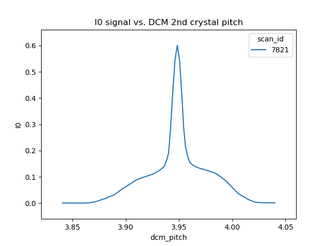
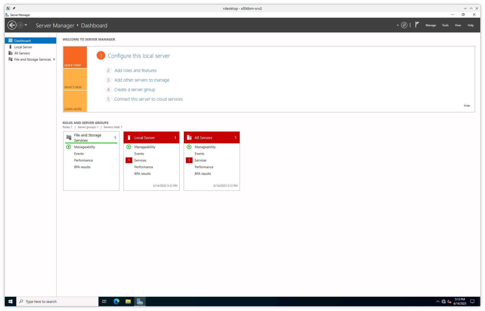
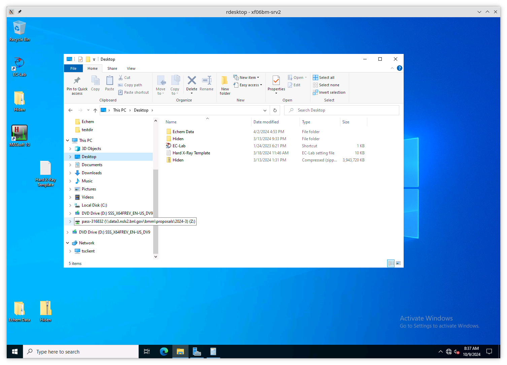
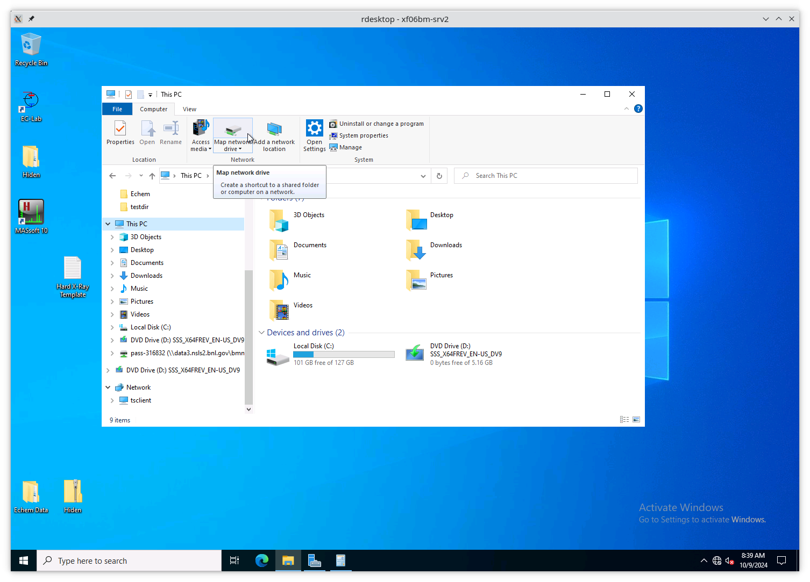
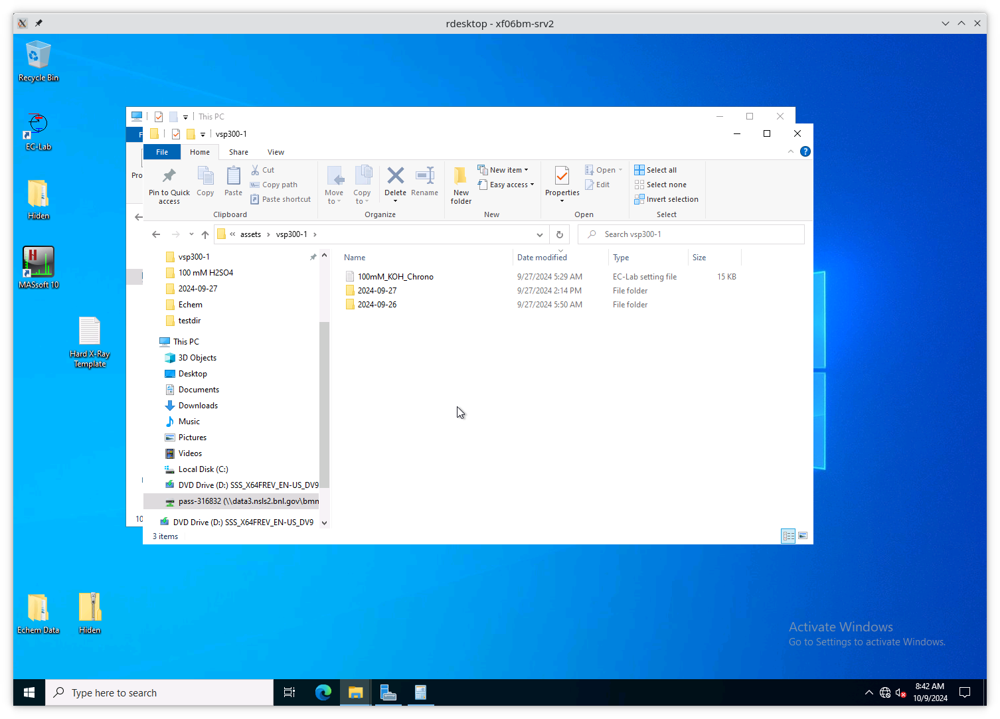

..
   This document was developed primarily by a NIST employee. Pursuant
   to title 17 United States Code Section 105, works of NIST employees
   are not subject to copyright protection in the United States. Thus
   this repository may not be licensed under the same terms as Bluesky
   itself.

   See the LICENSE file for details.

.. _manage:

Managing the beamline
=====================

In this section, some recipes are provided for managing the beamline
and meeting the needs and expectations of different experiments.

.. _start_end:

Starting and ending an experiment
---------------------------------

When a new experiment begins, run the command::

  BMMuser.begin_experiment(name='Betty Cooper', date='2019-02-29', gup=123456, saf=654321)

This will create that data folder and populate it with an
:numref:`experimental log (Section %s) <log>`, write a template for a
:numref:`macro file (Section %s) <macro>`, configure the logger to
write a :numref:`user log file (Section %s) <logfile>` for this
experiment, set the GUP and SAF numbers as metadata for output files,
set up :numref:`snapshot (Section %s) <snap>` and :numref:`dossier
(Section %s) <dossier>` folders, and perform other experiment start-up
chores.

The ``name`` should be the PI's full name, preferably transliterated
into normal ASCII.  The ``date`` should be the starting day of the
experiment in the ``YYYY-MM-DD`` format.  The ``GUP`` and ``SAF``
numbers can be found on the posted safety approval form.

Once the experiment is finished, run this command::

  BMMuser.end_experiment()

This will reset the logger and the ``BMMuser.folder`` variable and
unset the GUP and SAF numbers.

Change energy
-------------

Changing energy is simple.  Usually, it is as simple as doing

.. code-block:: python
		
   RE(change_edge('Fe'))

replacing the two-letter element symbol with the element you actually
want to measure. This command will move the monochromator, put the
photon delivery system in the correct mode, move the M2 bender to
approximately the correct setting, run a rocking curve scan,
optimize the slit height, move the reference foil holder to the
correct position (if configured), and select the correct ROI channel
(if configured).

If you want to reproduce this by hand, here is the command sequence:

#. First move the DCM to the new energy position.  It is usually a
   good idea to move a bit above the target edge energy.  Here's an
   example for moving 50 eV above the iron K edge energy:

   .. code-block:: python

      RE(mv(dcm.energy, 7112+50))

#. Put the beamline in the correct photon delivery system mode.  (See
   the table just above.)  Continuing with the example of the iron K
   edge, for unfocused beam:

   .. code-block:: python

      RE(change_mode('E'))

   If the new edge energy is in the same energy range according to the
   table above, you can skip this step.  For example, Mn and Fe are
   both in mode E (or mode C).  The ``change_mode()`` command does not
   need to be run to move between those edges.

#. Measure a :numref:`rocking curve scan (Sec %s) <special-linescans>`
   to verify that the second crystal of the rocking curve is parallel
   to the first crystal.  This is more important for large energy
   changes.  You may find that you can skip this step if you are
   changing between nearby edges.

   .. code-block:: python

      RE(rocking_curve())

   At the end of the scan, the mono pitch will be moved to the top of
   the rocking curve.

#. If using focused beam, make sure that the mirror bender is in the
   correct position.  For focusing at the XAS table, ``m2_bender``
   should be at about 212000 counts.  For focusing at the position of
   the goniometer, ``m2_bender`` should be about 112000 counts.

   .. code-block:: python

      RE(mv(m2_bender, 212000))

#. Next, verify that the :numref:`height of the hutch slits (Sec %s)
   <special-linescans>` is optimized for the beam height.  In
   principle, this should be correct after changing photon delivery
   system mode.  But it doesn't hurt to verify.

   .. code-block:: python

      RE(slit_height())

   At the end of the scan, you will need to pluck the correct position
   from the plot.

#. Next, if you are using a reference foil, you should move the
   reference foil holder to the slot containing the correct foil.  The
   command is something like:

   .. code-block:: python

      RE(reference('Fe'))

   choosing the correct element for your measurement.

#. Finally,  select the correct ROI channel:

   .. code-block:: python

      BMMuser.verify_roi(xs, 'Fe', 'K')

As a reminder, here is the table of operating modes.

.. _pds_modes:
.. table:: Photon delivery modes
   :name:  pds-modes2
   :align: left

   ====== ============ ========================= 
   Mode   focused      energy range
   ====== ============ ========================= 
   A      |checkmark|  above 8 keV
   B      |checkmark|  below 6 keV
   C      |checkmark|  6 keV |nd| 8 keV
   D      |xmark|      above 8 keV
   E      |xmark|      6 keV |nd| 8 keV
   F      |xmark|      below 6 keV
   XRD    |checkmark|  above 8 keV
   ====== ============ ========================= 

..
 Change mode
 -----------

 Suppose that you want to change from high-energy, unfocused operations
 to low energy, focused.  That is, you are changing from mode D to mode
 B, for example moving from a large sample at the yttrium K edge to a
 small sample at the vanadium K edge.

 .. code-block:: python

		 RE(change_mode('B'))
		 RE(mv(dcm.energy, 5465+50))
		 RE(rocking_curve())
		 RE(slit_height())

		 
    #. If the beam has recently been focused at the XRD station, you will
       also need to adjust the bender on M2 to optimize vertical focus at
       the XAS station (or vice versa).  This is best done with the small
       CCD camera sitting in the XAS sample stage.
       
    #. Again, iterating the optimization of the rocking curve and slit
       height might be necessary.

Change crystals
---------------

Suppose you wanted to change from the Pt L3 edge (11564 eV) on the
Si(111) crystal to the same energy on the Si(311) crystal.

.. code-block:: python

   RE(change_xtal('311'))

This will move the lateral motor of the DCM and optimize the roll and
pitch of the second crystal.  It will then move the DCM to the energy
that you started at with the other crystal set and run a rocking curve
scan.

Note that some of these motions can be a bit surprising in the sense
that the monochromator will briefly report itself as being outside the
normal operating range of the beamline.  They will, however,
eventually return to sensible places.

.. _xas-to-xrd:

Change XAS |larr| XRD
---------------------

To move the photon delivery system to delivery of focused beam to the
goniometer:

.. code-block:: python

   RE(change_edge('Ni', xrd=True, energy=8600))

The element symbol in the first argument is not actually used in any
way when ``xrd=True`` is used, however the funtion requires
`something` as its first argument.  Setting ``xrd=True`` forces the
``focus=True`` and ``target=0`` arguments to the ``change_edge()``
command to be set.  This will move to the specified energy, place the
photon delivery mode in `XRD` mode, optimize the second
crystal and the slit height, and move to an approximately M2 bender
position. 

To do all of that by hand, you would do the follow commands:

.. code-block:: python

   RE(change_mode('XRD'))
   RE(mv(dcm.energy, 8600))
   RE(rocking_curve())
   RE(slit_height())

This change of mode should have the beam in good focus at the position
of the goniometer.  8600 eV is the nominal operating energy for the
goniometer.  If a higher energy is required, substitute the correct
energy for ``8600`` in the second line.

.. note:: The I\ :sub:`0` chamber should be left in place.  This will
          facilitate changing energy while doing scattering
          experiments. The flight path can be put in place at any time.

.. todo:: Determine look-up table for lower energy operations using
	  both M2 and M3.  This will require a new XAFS table and
	  adjustments to the limit switches on ``m3_ydo`` and
	  ``m3_ydi``.

.. _use333:

XAFS with Si(333)
-----------------

Using the Si(111) monochromator, it is possible to use the third
harmonic |nd| the Si(333) reflection |nd| to measure XAS with slightly
higher energy resolution.  In this section, we explain how to set up
the beamline to measure the Ge K edge at 11103 eV using the Si(333).

You cannot use the ``change_edge()`` command to do this.  Use of the
Si(111) (or Si(311)) is hard-wired into that plan.  You have to set up
the beamline by hand.

First, put the photon delivery system in mode D (or mode A if using
the focusing mirror):

.. code-block:: python

   RE(change_mode('D'))

Next, move the monochromator to a few 10s of eV above the absorption
edge, as measured with the third harmonic.  The Ge K edge is at 11103
eV, so we need to move the monochromator to 11103/3 = 3701 eV.

.. code-block:: python

   RE(mv(dcm.energy, (11103+27)/3))

or simply

.. code-block:: python

   RE(mv(dcm.energy, 3701+9))

This will put the third harmonic energy 27 eV above the Ge K edge.

Now, run a rocking curve scan:

.. code-block:: python

   RE(rocking_curve())

This will produce a plot that looks something like this:

.. _fig-rocking333:

   A rocking curve scan with the photon delivery system in mode D and
   the mono at 3716 eV.

The broad base of this curve is the Si(111) rocking curve with photons
at 3710 eV. The sharp spike in the middle is the Si(333) rocking curve
with photons at 11130 eV.

Optimize the slit_height:

.. code-block:: python

   RE(slit_height())

You are ready to measure XAS with the Si(333) reflection!

Here's an example ``scan.ini`` file for XANES of elemental Ge:  

.. code-block:: ini

   [scan]
   experimenters = Bruce Ravel

   filename      = Ge
   sample        = elemental Ge, crystalline
   prep          = standard sample
   comment       = measured with Si(333) reflection, 25um Al foil in beam path before I0

   ththth        = True
   e0            = 11103
   element       = Ge
   edge          = K

   nscans        = 1
   start         = next

   ## mode is one of transmission, fluorescence, both, or reference
   mode       = transmission

   ## Ge Si(333)
   bounds     = -45    -18     -9      36    150
   steps      =      9     0.9     0.3    0.9
   times      =      0.5    0.5    0.5    0.5
 

Several things to note:

#. Note that the actual value for E0 is specified, not the divided-by-3 value.  
#. Actual energy bounds and steps are specified, the xafs scan plan
   will convert them to appropriately sized steps for the Si(111).
#. By setting the 333 flag to True, the correct thing will happen,
   including writing the correct energy axis to the output data file.
#. The on-screen plot will show the fundamental |nd| Si(111) |nd| energy, however.  
#. Also, you still need to set up the photon delivery system up by hand.

Motor controller kill switches
------------------------------

The MCS8 motor controllers supplied by FMBO have a kill switch for
power cycling the Phytron amplifier cards.  This is implemented by the
vendor as connector plugged into the back of the chassis which shorts
the two leads of the receptacle.  To kill the amplifiers, this plug is
removed and reinserted.

That's fine, but the motor controllers are on top of the FOE |nd| not
a convenient location.

The new kill switch system uses DIODE to close the kill switch
circuit. Two-conductor cable is run from each motor controller to a
remote DIODE box mounted on the inboard wall of the end station.

The Bluesky interface is defined `here
<https://github.com/NSLS2/bmm-profile-collection/blob/main/startup/BMM/killswitch.py>`__

From the docstring of the class: 

.. code-block:: none

   A simple interface to the DIODE kill switches for the Phytron
   amplifiers on the FMBO Delta Tau motor controllers.

   In the BMM DIODE box, these are implemented on channels 0 to 4 of
   slot 4.

   attributes
   ----------
   dcm 
     kill switch for MC02, monochromator
   slits2
     kill switch for MC03, DM2 slits
   m2
     kill switch for MC04, focusing mirror
   m3
     kill switch for MC05, harmonic rejection mirror
   dm3
     kill switch for MC06, hutch slits and diagnostics

   methods
   -------
   kill(mc)
     disable Phytron
   enable(mc)
     activate Phytron
   cycle(mc)
     disable, wait 5 seconds, reactivate, then re-enable all motors

   Specify the motor controller as a string, i.e. 'dcm', 'slits2', 'm2', 'm3', 'dm3'
   
   Here is a common problem which is resolved using a kill switch.

      BMM E.111 [36] ▶ RE(mvr(m2.pitch, 0.05))
      INFO:BMM_logger:    Moving m2_pitch to 2.550

      Moving m2_pitch to 2.550
      ERROR:ophyd.objects:Motion failed: m2_yu is in an alarm state status=AlarmStatus.STATE severity=AlarmSeverity.MAJOR
      ERROR:ophyd.objects:Motion failed: m2_yu is in an alarm state status=AlarmStatus.STATE severity=AlarmSeverity.MAJOR
      ERROR:ophyd.objects:Motion failed: m2_ydi is in an alarm state status=AlarmStatus.STATE severity=AlarmSeverity.MAJOR
      ERROR:ophyd.objects:Motion failed: m2_ydi is in an alarm state status=AlarmStatus.STATE severity=AlarmSeverity.MAJOR
      Out[36]: ()

   This is telling you that the amplifiers for two of the M2 jacks
   went into an alarm state. In the vast majority of cases, this
   simply requires killing and reactivating those amplifiers.

   The solution to this one is:

      BMM E.111 [1] ▶ ks.cycle('m2')
      Cycling amplifiers on m2 motor controller
      killing amplifiers
      reactivating amplifiers
      enabling motors

Old kill switch system
~~~~~~~~~~~~~~~~~~~~~~

There is a row of switches on rack D, the rack next to the control
station, that are used to disable the amplifiers for the MCS8 motor
controllers.  The cabling for this system still exists, but is not
plugged into the controllers.  Should the DIODE system somehow fail,
this can be redeployed easily.

.. _fig-killswitches:
.. figure:: _images/infrastructure/Kill_switches.jpg
   :target: _images/Kill_switches.jpg
   :width: 70%
   :align: center

   The manual kill switch system

When you suspect that a motor has an amplifier fault, toggle the
appropriate switch to the off position.  Wait 10 seconds (to be very
safe...).  Then toggle the switch back to the on position. The motor
should be ready to go. These switches replace the shorted plugs that
came attached to the "disable" port on the back side of the MCS8s.

=======  ==========================  ===============================   =================================
 MCS8     RGA label                   RGD label                         motors
=======  ==========================  ===============================   =================================
 MC02     6BM-100149-RG:A1-PT1B3-A    6BM-100149-RG:A1-PT1B3-B	        DCM
 MC03     6BM-100150-RG:A1-PT1B3-A    6BM-100150-RG:A1-PT1B3-B	        slits2
 MC04     6BM-100151-RG:A1-PT1B3-A    6BM-100151-RG:A1-PT1B3-B	        M2 + DM2 FS
 MC05     6BM-100152-RG:A1-PT1B3-A    6BM-100152-RG:A1-PT1B3-B	        M3 + Filters
 MC06                                 <installed, not yet labeled>      DM3 (bct,bpm,fs,foils)+ Slits3
=======  ==========================  ===============================   =================================

In the situation where toggling the switch does not clear the
amplifier fault, the next troubleshooting step is to power cycle the
MCS8.  This is done by toggling the red, illuminated switch on the
front of the MCS8.  Wait for the red amplifier lights to stop
flickering after turning off the MCS8, then turn the MCS8 back on.

After power cycling the MCS8, it is necessary to re-home all the
motors controlled by the MCS8.

MCS8 Connector
~~~~~~~~~~~~~~

The disable plug on the back of the MCS8 controllers is a Binder RS
connector, part number 468-885. `Here's an
example. <https://uk.rs-online.com/web/p/industrial-automation-circular-connectors/0468885/?sra=pstk>`__

And here is the wiring diagram.  Short the prongs on the side opposite
to the alignment groove.

.. _fig-killswitcheconnector:
.. figure:: _images/infrastructure/Kill_switch_connector.png
   :target: _images/Kill_switch_connector.png
   :width: 30%
   :align: center

Tutorial for how to put together the Binder connectors: :download:`PDF <_static/Binder-instructions.pdf>`

Windows VM and BioLogic
-----------------------

We use the `BioLogic EC_lab software
<https://www.biologic.net/support-software/ec-lab-software/>`__ to run
the `VSP-300 potentiostat
<https://www.biologic.net/products/vsp-300/>`__.  Since there is not a
dedicated Windows machine at BMM, EC-Lab is run on a virtual machine
that is spun up when needed.  

Similarly, Hiden's control software is a Window's only produce.  It is
run on the same firtual machine.

Here are the instructions for starting and interacting with the
the VM.

Starting the virtual machine
~~~~~~~~~~~~~~~~~~~~~~~~~~~~

+ At a command line, do ``rdesktop xf06bm-srv2 &``
+ This will open a new window and display a Windows login
  screen. Normal BNL credentials do not work. Log in as user
  ``xf06bm`` using the password known by beamline staff.
+ The Windows desktop might start with a full-screen management
  application that looks like the figure below. You can close
  or minimize that window.
+ Double-click on the EC-lab or Hiden icon.
+ Do some electrochemistry or mass spectrometry.
+ Save your electrochemistry or mass spectrometry data to the assets
  folder as explained below.

.. _fig-winvm:

   VM management window. You can minimize or close this.

Storing electrochemistry or mass spectrometry data
~~~~~~~~~~~~~~~~~~~~~~~~~~~~~~~~~~~~~~~~~~~~~~~~~~

The Windows VM has permission to connect to central storage with
permissions to write files from EC-lab or the Hiden software to the
correct location.

To start a new experiment, you first have to disconnect the old drive
(if connected).  This is likely mounted as the ``Z:`` drive.

.. _fig-winstaledrive:

   An example of a stale folder from a previous experiment mounted as
   the ``Z:`` drive.

Disconnect the stale ``Z:`` drive by right clicking on its entry in
the side bar and selecting "Disconnect".

.. _fig-windisconnect:
.. figure:: _images/WinVM/Windows_disconnect.png
   :target: _images/Windows_disconnect.png
   :width: 70%
   :align: center

   Disconnect the stale ``Z:`` drive.

Next, click on "This PC" in the sidebar, then click on the button that
says "Map network drive".

.. _fig-winmapnewdrive:

   Map a new network drive to the VM.

On the "Map Network Drive" page, you need to fill in the path to the
current experiment's proposal folder.  Suppose the current cycle is
2024-3 and the current proposal number is 316832.  Using ``Z:`` as the
drive letter, enter the following as the "Folder" 

.. code-block:: none

   \\data3.nsls2.bnl.gov\bmm\proposals\2024-3\pass-316832

Note that the backslashes are important.  Also substitute the correct
cycle and proposal numbers.

Be sure to leave "Reconnect at sign-in" checked.  Note that "Connect
using different credentials" should be unchecked.

.. _fig-winspecifynewdrive:
.. figure:: _images/WinVM/Windows_specify_new_drive.png
   :target: _images/Windows_specify_new_drive.png
   :width: 70%
   :align: center

   Map a new network drive to the VM.

Click the finish button.  The connection will take several seconds,
but then the new entry will show up in the side bar.

The new network drive can now be clicked into.

Configure EC-lab to write its data files into the
``assets\vsp300-1`` folder.

Configure the Hiden software to write its data files into the
``assets\hpr20-1`` folder.

.. _fig-winsassetsfolder:

   The ``assets\vsp300-1`` folder is the correct place for data from
   EC-lab to be written.  The ``assets\hpr20-1`` folder is the correct
   place for data from the Hiden to be written.

By following this procedure, the electrochemistry data from EC-lab and
mass spectrometry data from the Hiden will be available to the user in
the :numref:`same manner as their XAS data (Section %s) <data>`.

Calibrate the mono
------------------

The typical calibration procedure involves measuring the angular
position of the Bragg axis for the edge energies of 10 metals: Fe, Co,
Ni, Cu, Zn, Pt, Au, Pb, Nb, and Mo.  

The tabulated values of edge energies from Table 1 in `Kraft, et
al. <https://doi.org/10.1063/1.1146657>`__ are used in the
calibration.

#. Be sure that all 10 of these elements are actually mounted on the
   reference wheel and configured in the ``xafs_ref.mapping`` dict.
   (They should be.  It would be very unusual for any of these foils
   to have been removed from the reference wheel.)

#. Run the command 

   .. code-block:: python

      RE(calibrate(mono='111'))

   Use the ``mono='311'`` argument for the Si(311) monochromator.
   This will, in sequence, move to each edge and measure a XANES scan
   over a wide enough range that it should cover the edge (unless the
   mono is currently calibrated VERY wrongly).  This will write a file
   called :file:`edges111.ini` (or :file:`edges3111.ini`).  Each XANES
   scan uses the file
   :file:`/home/xf06bm/Data/Staff/mono_calibration/cal.ini` as the INI
   file.  Edge appropriate command line parameters will be added by
   the ``calibrate()`` plan.

#. Examine the data in |athena|. Make sure E\ :sub:`0` is selected
   correctly for all 10 edges. Copy those values into the first column
   of :file:`edges111.ini` (or :file:`edges311.ini`). 

   .. attention::

      It is no longer necessary to compute the angular positions of
      the monochromator.  Those will be computed from the edge energy
      values you edited into the INI file by hand.

   .. todo::

      Implement on-the-fly determination of E\ :sub:`0` to obviate the
      step of editing the INI file.  Pb is tricky.  Nb and Mo are kind
      of tricky.

   .. 
     Compute the
     angular positions using
     .. code-block:: python
	dcm.e2a(<energy values>)
     and copy those numbers into the :file:`edgeH11.ini` file.

#. Run the command

   .. code-block:: python

      calibrate_mono(mono='111')

   (or use the ``'311'`` argument).  This will show the fitting
   results and plot the best fit.  It will also print in a text box
   instructions for modifying the :file:`BMM/dcm-parameters.py` file
   to use the new calibration values.

   .. _fig-calibrate:
   .. figure:: _images/software/Calibration_111.png
      :target: _images/Calibration_111.png
      :width: 70%
      :align: center

      Example calibration curve
   

#. Edit :file:`BMM/dcm-parameters.py` as indicated.

#. Do

   .. code-block:: python

      %run -i 'home/xf06bm/.ipython/profile_collection/startup/BMM/dcm-parameters.py'

   then do

   .. code-block:: python

      dcm.set_crystal()

   Or simply restart |bsui|, which is usually the easier thing.

#. Finally, do 

   .. code-block:: python

      calibrate_pitch(mono='111')

   This performs a simple linear fit to the rocking curve peak
   positions for ``dcm_pitch`` found at each edge.  Use the fitted
   slope and offset to modify ``approximate_pitch`` in
   :file:`BMM/functions.py`.

The mono should now be correctly calibrated using the new calibration
parameters.

Provision a new beamline computer
---------------------------------

This is a list of notes on how to finish the provisioning of a new
beamline computer.

Firstly, make sure that ``/nsls2/data`` is a symlink to
``/nsls2/data3``.  If it is not, ask for help from DSSI.

install additional packages
~~~~~~~~~~~~~~~~~~~~~~~~~~~

+ plasma-desktop (just ... better)
+ redis (essential for operation of |bsui|)
+ most (used as the pager in BMM's |bsui| profile)
+ ag (powerful ack-like grep alternative)
+ fswebcam (used to capture analog pinhole camera)
+ demeter and perl-Graphics-GnuplotIF (something silly, no doubt)
+ slack (communications)
+ ark (compression, useful in file manager)

To install these, do:

.. code-block:: sh

   dzdo dnf install redis most ag fswebcam demeter perl-Graphics-GnuplotIF slack ark
   dzdo dnf install --skip-broken --nobest @kde-desktop

The second command installs the KDE metapackage, skipping missing
packages. 

To finish installing ``sddm``, do 

.. code-block:: sh

   dzdo systemctl stop gdm
   dzdo systemctl start sddm

Desktop wallpaper
~~~~~~~~~~~~~~~~~

This may not be provisioned correctly out of the box.  Find the
beamline wallpapers in ``/usr/share/nsls2/wallpapers/beamlines``. 

Right click on the desktop and select "Configure Desktop and
Wallpaper".  Click on "Add Image" and navigate to the folder above.

Things to install from git
~~~~~~~~~~~~~~~~~~~~~~~~~~

+ BMM stuff: ``git clone git@github.com:NSLS-II-BMM/BMM-beamline-configuration.git``
  + then, ``cd ~/bin`` and ``ln -s ~/git/BMM-beamline-configuration/tools/run-cadashboard``
+ BMM user manual: ``git clone git@github.com:NSLS2/bmm-beamline-manual.git``
+ BMM standards: ``git clone git@github.com:NSLS2/bmm-standards.git``
+ Switch visualization: ``git clone git@github.com:NSLS-II-BMM/switch-pretty-printer.git``

Also do ``cd ~/bin`` and ``ln -s ~/.ipython/profile_collection/startup/consumer/run-consumer``

Workspace folders
~~~~~~~~~~~~~~~~~

Make the local data collection folders.  The
:numref:`BMMuser.begin_experiment() command (Section %s) <start_end>`
will make symlinks under those folders to the correct place on central
storage.

.. code-block:: text

   mkdir ~/Workspace
   mkdir ~/Workspace/Visitors
   mkdir ~/Workspace/Staff

Manage Silicon Drift Detectors
------------------------------

The assumption in the data acquisition system is that one of the three
silicon drift detectors will be the primary detector in an experiment.
At the |bsui| command line (or in |qs|) the ``xs`` symbol should
point at the correct detector.  Also, a parameter is set in Redis
allowing other processes (such as the Kafka plotting agent) to know
which detector to be paying attention to.

.. code-block:: python

   xs = xspress3_set_detector(7)

where the argument to ``xspress3_set_detector`` is 1, 4, or 7.  Since
October 2024, use of the seven element detector is the default.

This sets ``xs`` to the selected detector object |nd| ``xs1``,
``xs4``, or ``xs7``.  

Also set is the Redis parameter ``BMM:xspress3``, which is set to 1,
4, or 7 (and represented as a b-string).

.. code-block:: python

   n_elements = int(rkvs.get('BMM:xspress3'))
