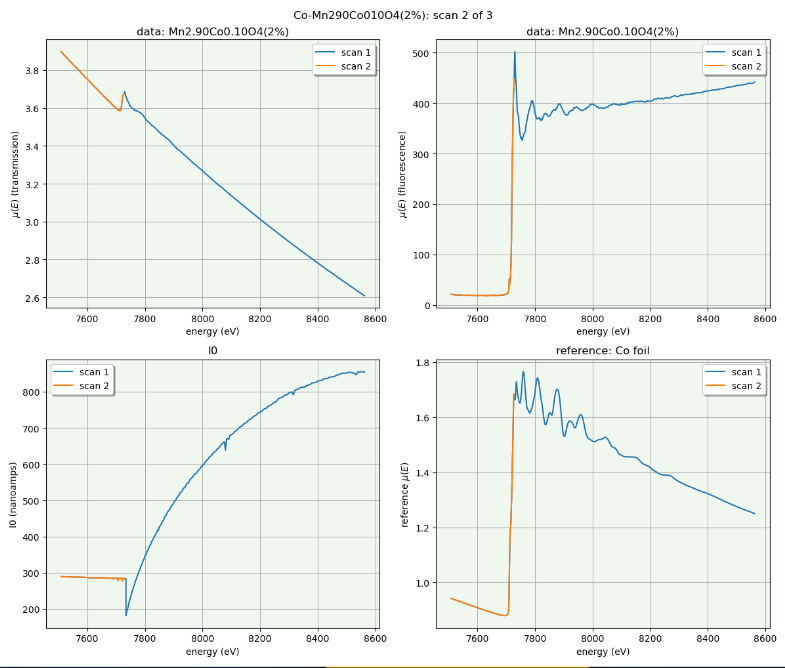
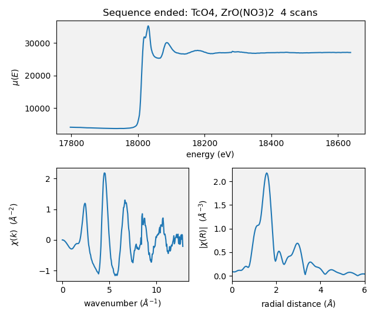

.. _plotting:

Plotting via Kafka at BMM
=========================

For years, plotting at BMM used a `BlueSky preprocessor
<htps://github.com/bluesky/bluesky/blob/master/bluesky/preprocessors.py#L333>`__
and specially constructed functions for extracting data from Bluesky
event documents.  That was fine and provided useful real-time views
of data for our users.

The problem with using these modified BlueSky `LivePlots
<https://blueskyproject.io/bluesky/callbacks.html#liveplot-for-scalar-data>`__
is that they are tied to the machine which is running the Run Engine.
As BMM began to use `BlueSky queueserver
<https://blueskyproject.io/bluesky-queueserver/>`__, which is
typically `not` run on the same machine as ``bsui``, this plotting
scheme stopped being helpful.  

The solution was to move all plotting chores out of the main data
collection profile and into a Kafka consumer.  Using the
`bluesky-kafka producer and consumer
<https://github.com/bluesky/bluesky-kafka>`__ and with the help of
DSSI, the beamline computers were given access to the same Kafka
server used by BlueSky to orchestrate it's communications.  We were
also given a private Kafka topic over which to send BMM-specific
messages intended for use by a BMM-specific consumer.

.. _start_consumer:

Starting the Kafka consumer
---------------------------

In the ``consumer/`` folder, there is a bash script called
``run-consumer``.  This script establishes the correct shell and conda
environments for running the data plotter.  It then starts an ipython
instance, loads ``consumer/consume_measurement.py``, and starts the
Kafka consumer.

For ease of use, ``run-consumer`` can be copied into ``$HOME/bin`` so
that it is in the execution path.

Bruce's preference for this is to open a new terminal window on a
virtual desktop that is not the main desktop.  In that terminal
window, run ``run-consumer``.

.. _fig-consumer:
.. figure::  _images/consumer.png
   :target: _images/consumer.png
   :width: 70%
   :align: center

   A terminal window in which the Kafka consumer has just been started.

Various types of plots
----------------------

Communicating over the ``bmm-test`` topic, two sorts of plotting
chores are managed.  In each case, the document is a simple dictionary
which the consumer parses to perform a plotting chore using
`matplotlib <https://matplotlib.org/>`__.

.. admonition:: Future Tech!

   Would a browser-y solution like `Bokeh
   <https://docs.bokeh.org/en/latest/index.html>`__ be an
   alternative?

The dictionary sent as the document is not structured like a BlueSky
document.  There is no schema.  The dictionary simply contains
keywords which the consumer is programmed to recognize.

Over time, more plotting chores will be added to the consumer.  At the
time of this writing, these plotting chores are supported.  The
explanation here will hopefully lower the barrier of understanding how
plotting via Kafka consumer works at BMM.  It is, admittedly, a rather
baroque system using a lot of infrastructure.

.. _liveline:

Live linescan plots
~~~~~~~~~~~~~~~~~~~

At BMM, :numref:`a linescan (Sec %s) <linescan>` is a scan where a
motor is moved and a signal is plotted.  A linescan begins by issuing
a message telling the consumer to start a new plot and to begin
looking for BlueSky event documents:

.. code-block:: python

   {'linescan' : 'start',
    'motor'    : 'xafs_x',
    'detector' : 'I0',}

Those event documents will be parsed to obtain the result of the most
recently measured data point.  The new data point is added to the plot
and the plot is redrawn.

When the linescan finishes, a *stop* message is issued:

.. code-block:: python

   {'linescan': 'end',}

This replicates very closely how the BlueSky `LivePlot
<https://blueskyproject.io/bluesky/callbacks.html#liveplot-for-scalar-data>`__
has been used to display linescsan data.

.. _livetime:

Live timescan plots
~~~~~~~~~~~~~~~~~~~

With the BMM plotter, a timescan and a line scan are made with the
same code.  The only difference is that no motor is given for a
timescan and the X-axis is plotted as the time stamp of the current
point minus the time stamp of the first point.  Thus the X-axis is in
units of seconds.  The signal plotted on the Y-axis is determined the
same as for a linescan and all the internal mechanics of the time plot
are the same as for a motor plot.

.. _livearea:

Live areascan plots
~~~~~~~~~~~~~~~~~~~

.. todo:: Make and document live areascan plots.  Currently, a
	  LivePlot is used when running ``areascan()`` and the Kafka
	  consumer replicates the plot afterwards.  The replicated
	  plot has the correct axes and is saved in the dossier.

	  This (along with the ``%xrf`` plot) is the only remaining
	  plot not yet made via the Kafka consumer.

.. _livealignment:

Alignment plots
~~~~~~~~~~~~~~~

Various alignment chores at the beamline |nd| for example, aligning a
slot on a :numref:`sample wheel (Sec %s) <sample-wheel>` or aligning
the :numref:`glancing angle stage (Sec %s) <glancing-angle-stage>`
|nd| involve a series of :numref:`linescans (Sec %s) <linescan>`, each
of which is plotted in real time |nd| as shown :numref:`below (Sec %s)
<liveline>` |nd| followed by a plot summarizing the result of the
alignment.

Using the sample wheel alignment as an example, the sequence is
initiated by this document:

.. code-block:: python

   {'align_wheel' : 'start'}

As each linescan in the alignment procedure is completed, some
automated analysis is performed to determine the optimal position of
the motor axis being scanned.  The results of this analysis are issued
in a document like this.

.. code-block:: python

   {'align_wheel' : 'find_slot',
    'motor'       : 'xafs_x',
    'detector'    : 'it',
    'xaxis'       : list_of_axis_positions,
    'data'        : list_of_signal_values,
    'best_fit'    : list_of_fitted_values,
    'center'      : midpoint_value,
    'amplitude'   : amplitude_value,
    'uid'         : uid}

From this a plot showing the measured data and the results of the
analysis is made.

Once all parts of the alignment procedure are finished, this document
is issued:

.. code-block:: python

   {'align_wheel' : 'end'}

This tells the consumer to create a plot summarizing the results of
the alignment.  

The alignment of the glancing angle stage works in much the same
manner.

.. _fig-find_slot:
.. figure::  _images/find_slot.png
   :target: _images/find_slot.png
   :width: 50%
   :align: center

   An example of the final plot for an alignment of the *ex situ*
   sample wheel. The green X marks shows the aligned positions in
   ``xafs_x`` and ``xafs_y``.

.. _livexafs:

Live XAFS plots
~~~~~~~~~~~~~~~

The problem of making live XAFS plots is quite similar to live
linescan plots, but with some additional considerations:

#. It is common to make multiple repetitions of XAFS scans, thus
   successive scans should be overplotted.
#. There are various interesting views of the XAFS data, including
   both transmission and fluorescence of the data, transmission of the
   energy calibration standard, and a view of the raw I0 spectrum (to
   keep an eye on monochromator glitches and other issues).

.. admonition:: Future Tech!

   Panel for live |chi|\ (k) plots, begin plotting this panel, say, 60
   eV above the edge.

Like with the linescan, the plot begins with a message issued to tell
the consumer to begin preparing for an XAFS plot and providing enough
information to make that plot.  This ``start`` message is issued at
the beginning of the entire scan sequence.

.. code-block:: python

   {'xafsscan'   : 'start',
    'element'    : 'Fe',
    'edge'       : 'K',
    'mode'       : 'fluorescence',
    'filename'   : 'example'
    'repetitions': 3,
    'sample'     : 'Fe sample',
    'reference_material': 'Fe foil', }

At the beginning of each individual repetition, a ``next`` message is
sent, telling the consumer to prepare to add a new set of traces to
the plot for the repetition about to begin.

.. code-block:: python

   {'xafsscan': 'next',
    'count': 2, }

Finally, a message is sent telling the consumer that the sequence of
scans has finished, putting the consumer back into a state where it is
ready to receive the next sequence of messages for the next plot.

.. code-block:: python

   {'xafsscan': 'end',}

The plot that is made for an XAFS scan depends on whether fluorescence
measurement is available.  If so, a 2x2 grid is shown with the
transmission and fluorescence |mu| (E) on the top, a plot of I0 on the
bottom left, and plot of the transmission |mu| (E) of the reference
material on the bottom right.

For a scan not using the fluorescence detector, the plot is a 3x1 grid
of transmission |mu| (E), I\ :sub:`0`, and the reference spectrum.

.. _fig-xafs_live_view:

   An example of the XAFS live plot made for a fluorescence XAFS scan.

.. note:: I\ :sub:`0` is now normalized by the dwell time, thus is
	  plotting in units of amperes rather than ampere*seconds,
	  as shown.

	  Also, as of January 2024, the live plot at the end of the
	  scan sequence is posted to Slack and included in the
	  :numref:`dossier (Section %s) <dossier>`.

.. _xafssequence:

Scan sequence data reduction
~~~~~~~~~~~~~~~~~~~~~~~~~~~~

At the end of a scan sequence, we show the user a 3-panel plot showing
|mu| (E), |chi| (k), and |chi| (R).  (This is the same 3-panel plot
that is written to the :numref:`dossier (Section %s) <dossier>`.  This
plot is of the merge of the scans measured in the scan sequence.
Behind the scenes, Larch is used to make the merge, remove the
background function, and perform the Fourier transform.  Additionally,
every time an individual repetition in the scan sequence is finished,
this 3-panel plot is made from the merge of the scans measured thus far.

At the beginning of a scan sequence, a Kafka document with a payload
like this is issued:

.. code-block:: python

   {'xafs_sequence' : 'start',
    'element'       : 'Fe',
    'edge'          : 'K',
    'folder'        : BMMuser.folder,
    'repetitions'   : 3,
    'mode'          : 'fluorescence'}

The presence of the ``xafs_sequence`` key tells the Kafka consumer to
interpret this document as relevant to the creation of the 3-panel
plot.  The value of ``start`` tells the consumer to prepare for making
this plot from data under the conditions specified by the remainder of
the keywords.

As each scan finishes, the following document is issued.  This tells
the consumer that a repetition finished and supplies the UID of the
just-completed scan.  `Tiled <https://github.com/bluesky/tiled>`__ is
used to grab the data from the just-completed scan.  This triggers a
recalculation of the merge and the recreation of the 3-panel plot.

.. code-block:: python

   {'xafs_sequence' :'add',
    'uid'           : uid}

Finally, at the end of the scan sequence, this document is issued:

.. code-block:: python

   {'xafs_sequence' : 'stop', 
    'filename'      : '/path/to/dossier/image'}

This tells the consumer to make the final version of the 3-panel plot
using all the data and to save a png image of the plot for use in the
dossier.

.. _fig-triplot:

   An example of a 3-panel plot created by the Kafka consumer.

This motif of issuing a ``start`` message to begin crafting a plot,
messages to ``add`` to the plot, and a message to ``stop`` the plot is
the common thread to how BMM uses Kafka to make plots, both static and
real-time plots.

Cleaning up the screen
----------------------

Most of the plotting options from the Kafka consumer are good about
closing the last plot before starting a new one.  However, linescans,
in general, do not clean up prior plots.

You can close some or all of the plots made by the Kafka consumer by
issuing a suitable message, either at the command line or in a plan. 

This will close all plots on screen made by the consumer:

.. code-block:: python

   kafka_message({'close': 'all'})

This will close all plots associated with linescans, but not close
plots associated with XAFS scans:

.. code-block:: python

   kafka_message({'close': 'line'})

And this will close the most recent plot:

.. code-block:: python

   kafka_message({'close': 'last'})

