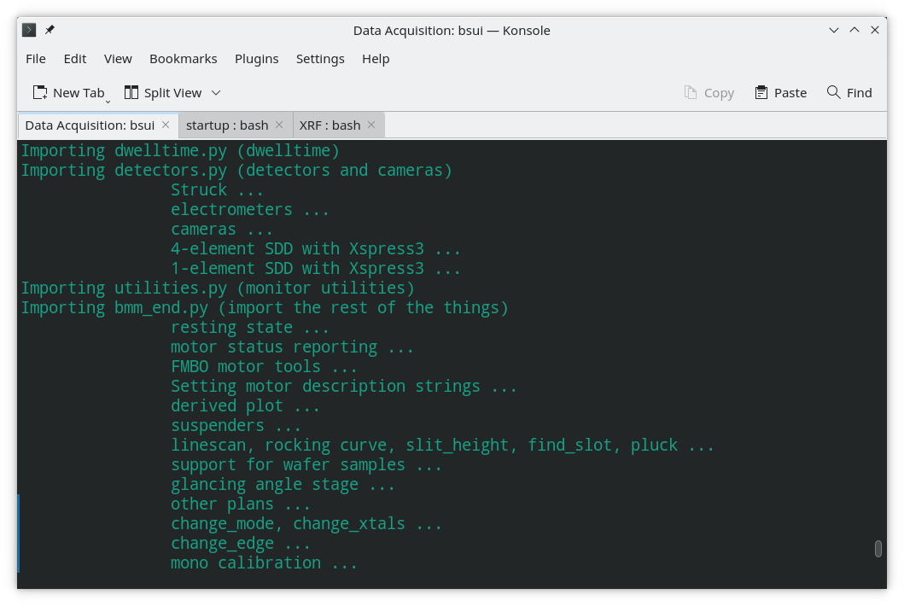

..
   This document was developed primarily by a NIST employee. Pursuant
   to title 17 United States Code Section 105, works of NIST employees
   are not subject to copyright protection in the United States. Thus
   this repository may not be licensed under the same terms as Bluesky
   itself.

   See the LICENSE file for details.

.. _profile:

An overview of BMM's profile
============================

Once upon a time, the advice from Bluesky's developers was to populate
a ``profile_collection`` folder with python files containing the
beamline customizations.  These files would start with a two digit
number from ``00-`` to ``99-`` |nd| that is, files like
``30-detectors.py`` or ``17-motors.py``.  These files would be
imported into the main namespace of the IPython session in
numeric order.

As BMM's profile grew in size and complexity, this system of ordered,
numbered files all imported into the main namespace became
increasingly unweilding, hard to maintain, and hard to extend.

At Dan Allan's suggestion, we took a different approach.

The startup folder
------------------

The startup folder is a symlink to a folder on Lustre where BMM's
profile is kept.  If |bsui| does not start with BMM's profile, make that
symlink by doing the following:

.. code-block:: sh

   cd ~/.ipython
   ln -s /nsls2/data3/bmm/shared/config/bluesky/profile_collection

If a folder called ``profile_collection`` already exists at that
location |nd| which would be the case if you have already used |bsui|
or ipython |nd| go ahead and rename or delete that folder.

The top folder of the profile contains a single python file.  It
follows the old convention in that it is named
``00-populate-namespace.py`` and is read as soon as IPython starts.

There are three files in the ``startup`` folder:

``00-populate-namespace.py``
   This is the first file ipython loads as it starts |bsui|.
   :numref:`See Section %s <namespace>`.

``BMM_configuration.ini``
   This windows-style INI file contains configuration information for
   the instrumentation and network services at the beamlines.

``rois.json``
   This is a small database of ROI definitions used by the XSpress3
   configuration.

``user_group_permissions.yaml``
   This is a configuration file used by |qs| to grant access to plans
   according to authentication

Beneath the ``startup`` folder, there are several sub-folders:

``BMM/`` 
   the bulk of the code used for data acquisition.

``consumer/``
   the code used by the process that captures Kafka messages and
   generates plots for real-time and other data visualization
   :numref:`(Section %s) <plotting>`

``BMM_common/``
   code shared by data acquisition and the Kafka consumer

``lookup_table/``
   the spreadsheet with the look up table of motor positions used by
   the ``change_edge()`` command :numref:`(Section %s) <pds>`

``standards/``
   the spreadsheet for working with `BMM's collection of measurement
   standards <https://nsls2.github.io/bmm-standards/BMM-standards.html>`__

``ML/``
   the data used for the machine learning data evaluation
   model :numref:`(Section %s) <dataevaluation>`

``telemetry/``
   the data used for the time estimates of XAFS and other
   scans :numref:`(Section %s) <telemetry>`

``dossier/``
   files used to construct dossiers :numref:`(Section %s) <dossier>`

``tmpl/``
   template files used for dossiers, INI files, and other
   templated materials

``xlsx/``
   empty spreadsheet examples for the various forms of
   automation :numref:`(Section %s) <automation>`

.. _config_ini:

BMM_configuration.ini
---------------------

This files controls configuration details for measurement
instrumentation and network services.  The concept is that this file
is edited prior to starting bsui to reflect the current state of the
beamline and the needs of the current experiment.

Much of this file consists of flags for turning specific instruments
on and off when starting bsui.  For example, this section is used to
enable or disable the use of the Pilatus 100K area detector and the
Dante readout for the NSLS-II germanium detector in XAS experiments.

.. code-block:: ini

   [detectors]
   # use Pilatus 100K as an available detector
   pilatus = False
   # use the DANTE at xf06bm-edxd1
   dante   = False

Additionally, there are sections with flags for controlling

+ electrometer use for ion chambers and the
  electron yield detector
+ which silicon drift detectors are in use
+ which cameras (usb, analog, web) are in use
+ special instrumentation needs, e.g. Linkam stage, Lakeshore
  temperature controller, or radiological enclosure

Additional sections control configuration for

+ the network addresses of various services or disk locations
  containing files and folders needed for proper operation of bsui at
  BMM

+ for both the new NSLS-II Slack workspace and the older, deprecated
  BMM Slack workspace

.. _namespace:

The IPython namespace
---------------------

The ``00-populate-namespace.py`` file contains a single line:

.. sourcecode:: python

   from BMM.user_ns import *

This tells python to read the ``BMM/user_ns/__init__.py`` file and
follow it's instructions.  That file, in turn, imports each of the
files in the ``BMM/user_ns/`` and imports those symbols into the main
IPython namespace.

This is different from the old-fashioned approach in that the files in
``BMM/user_ns/`` contain a more carefully curated group of symbols to
be imported into the main namespace.

Most of the code for creating ophyd objects, defining plans,
establishing automation, and so on is contained in the files found in
the ``BMM`` folder.  And most of that is not imported into the main
namespace.

A motif used in almost every file in the profile is this one:

.. sourcecode:: python

   from BMM import user_ns as user_ns_module
   user_ns = vars(user_ns_module)

This allows functions and plans defined in the files in the ``BMM``
folder to have access to symbols from the user namespace without
either importing the entire main namespace or exporting additional
symbols to the main namespace.

This, perhaps, makes the code in ``BMM`` a bit clunkier.  For example,
a motor name like ``xafs_x`` which is defined in the main namespace
cannot be directly accessed by a module in ``BMM``.  Instead, it is
accessed as ``user_ns['xafs_x']``.  A bit of extra typing, but it
makes for code that is more robust and more readily maintainable and
extensible.

Managing |bsui| and |qs|
------------------------

A common motif found in many files, including
``BMM/user_ns/__init__.py``, looks like this:

.. sourcecode:: python

   try:
      from bluesky_queueserver import is_re_worker_active
   except ImportError:
      def is_re_worker_active():
          return False

This is used to allow a plan or some other bit of code to know whether
it is being run under |bsui| or |qs|.

|bsui| is, by design, run on the same workstation with which the
experimenter is interacting.  |qs| is, by design, run on a
remote server.  Having a way to distinguish the two is essential.  For
example, there are many plans which, when run with |bsui|, stop to
prompt for an interaction from the user.  Such prompts need to be
disabled when running under |qs|.

Profile start-up as a narrative
-------------------------------

Early in the loading of the profile, a function called
``run_report()`` is defined.  This function is defined in
``BMM/functions.py`` and called near the top of
``BMM/user_ns/bmm.py``, which is the second file loaded by 
``BMM/user_ns/__init__.py``.  So, it is defined very early in the
process of loading the profile.

This is used to write a message to the screen explaining what chore is
being done during start-up or what file is being loaded.  As such it
is very similar to the common python idiom of

.. sourcecode:: python

   print(__file__)

to identify the module or source code file being loaded.  While
similar in concept, it is a bit more suited to our purpose.

.. _fig-bsui_startup:

   Screen messages during |bsui| start-up.

For one thing, it applies consistent coloring to the text.  In that
way the user knows that that color is a progress report explaining
what is happening at that moment.  That is helpful for debugging
problems in that it gives a hint where to look when the problem
presents itself.

For another, it is a consistent way to write any progress message to
the screen.  For example,

.. sourcecode:: python

   run_report(__file__)

would behave very similarly to the idiom.  However, the way it is used
throughout the profile is in lines like this:

.. sourcecode:: python

   run_report('\tglancing angle stage')

This is the message that appears on screen as the ophyd objects and
automation procedures related to the glancing angle stage
:numref:`(Section %s) <glancing-angle-stage>` are imported.  As you
can see in the screenshot, one such message is issued for every major
component of the profile.

Taken together, this sequence of messages provides a start-up
narrative that tells the user something about what capabilities are
available and provides the code maintainer/developer some hints about
where to look in the code base for various features.

Profile start-up as acceptance testing
--------------------------------------

At NSLS-II, beamline staff are asked to develop ways to do acceptance
testing to verify things like recovery from power failures, or upgrades
of computer operating systems, upgrades of conda and python.

At BMM, we have chosen *not* to develop one-off or on-delivery
acceptance testing practices.  Instead, acceptance testing is built
right into BMM's profile.

Very early in profile start-up, several basic functions are checked
for, including:

#. Verify that Channel Access Security is configured for read/write
   access
#. Verify that the LAN is up and that IOC servers can be pinged
#. Verify that various necessary folders on the local machine can be
   found
#. Verify that Lustre mounts can be found
#. Verify that authentication keys (e.g. for Slack) can be found
#. Verify that a redis server can be found

If any of these tests fail, the profile stops loading and issues a
(hopefully) useful error message.

As the profile continues loading, it runs a variety of tests, such as:

#. Verify that beamline state and user configuration can be obtained
   from redis
#. Establish all necessary user configuration
#. Check each axis to verify that it is connected
#. Check each axis to verify that it is homed, or identify those that
   are used without homing
#. Verify that detectors are started correctly (e.g. the XSpress3
   needs to save an HDF5 file to initialize file saving)
#. Initialize the hinted ROI from the XSpress3 using data from redis

In short, the concept is that the profile is instrumented to do
acceptance testing *every time it starts*. If anything is found to be
missing, it can be noticed and addressed immediately.

Core Bluesky functionality
--------------------------

The file ``BMM/user_ns/base.py`` is used to define core features of
the bluesky ecosystem:

+ The plan stubs ``mv``, ``mvr``, and ``sleep`` are imported into the
  main namespace

+ `nslsii.configure_base()
  <https://github.com/NSLS-II/nslsii/blob/55fad71851d61eb7dbae9823d216296b072344fd/nslsii/__init__.py#L29>`__
  is called appropriately for |bsui| or |qs|

+ Some configuration of best effort callbacks is done

+ A `Tiled <https://blueskyproject.io/tiled/>`__ catalog is created

+ A ZeroMQ publisher is defined.

All of this happens before any BMM-specific code is run.

Everything in the BMM folder
----------------------------

Here's a brief summary of every module in the BMM profile.

   ============================   ===================================================
    file                           purpose
   ============================   ===================================================
    ``actuators.py``               define shutters and valves
    ``agent_plans.py``             BMM-specific ML agents
    ``areascan.py``                define an area scan plan
    ``busy.py``                    define a "wall clock" motor
    ``camera_device.py``           interact with AD and non-AD cameras 
    ``db.py``                      utilities for working with *DataBroker*
    ``dcm.py``                     define monochromator ophyd objects
    ``dcm_parameters.py``          mono calibration parameters
    ``demeter.py``                 |athena| and |hephaestus| integration
    ``derivedplot.py``             :silver:`deprecated plotting capabilities`
    ``desc_string.py``             fix epics motor ``DESC`` fields for CSS
    ``detector_mount.py``          mostly deprecated tools for ``xafs_detx``
    ``dossier.py``                 manage writing of dossier files
    ``dwelltime.py``               coordinate dwell time across detectors
    ``edge.py``                    change edge
    ``electrometer.py``            ophyd objects for QuadEM and related
    ``energystep.py``              simple plan for I0 vs. energy
    ``fmbo.py``                    FMBO motor controller tools
    ``frontend.py``                ophyd objects for front-end devices
    ``functions.py``               miscellaneous utilities
    ``gdrive.py``                  :silver:`interact with Google drive (deprecated)`
    ``glancing_angle.py``          define glancing angle stage + automation
    ``grid.py``                    generic grid automation
    ``handler.py``                 DataBroker handler for images
    ``kafka.py``                   Kafka producer for profile
    ``killswitch.py``              interact with FMBO controller kill switches
    ``lakeshore.py``               LakeShore temp. controller 
    ``larch_interface.py``         connect to Larch XAFS functionality
    ``linescans.py``               generic and specific motor scans
    ``linkam.py``                  Linkam stage temp. controller
    ``logging.py``                 various logging tools
    ``macrobuilder.py``            base class for automation
    ``metadata.py``                manage metadata
    ``mirror_trigonometry.py``     incomplete tools for mirrors and distances
    ``ml.py``                      data evaluation tools
    ``modes.py``                   manage lookup table and PDS modes
    ``mono_calibration.py``        energy calibration tools
    ``motor_status.py``            motor status reporting tools
    ``motors.py``                  ophyd objects for motors
    ``periodictable.py``           periodic table tools
    ``pilatus.py``                 Pilatus tools
    ``plans.py``                   simple plans, power cycle recovery plans
    ``prompt.py``                  customize IPython prompts
    ``purpose.py``                 :silver:`deprecated`
    ``raster.py``                  areascan measurement + dossier
    ``resting_state.py``           put beamline in a defined resting state
    ``rois.py``                    :silver:`deprecated, struck tools`
    ``slits.py``                   ophyd objects and tools for BL slits
    ``struck.py``                  :silver:`deprecated |nd| interact with Struck`
    ``suspenders.py``              define suspenders
    ``telemetry.py``               tools for scan telemetry and time estimates
    ``timescan.py``                time sequence plan
    ``usb_camera.py``              interact with USB cameras
    ``user.py``                    define and manage the BMMuser object
    ``utilities.py``               inetract with BL EPS and utilities
    ``video.py``                   record videos from USB cameras
    ``wafer.py``                   tools for wafer samples
    ``wdywtd.py``                  :silver:`deprecated user help tools`
    ``webcam_device.py``           interact with Axis webcams
    ``wheel.py``                   tools for *ex situ* sample wheel
    ``workspace.py``               acceptance tests for working environment
    ``xafs.py``                    XAFS plan definition + dossier
    ``xafs_functions.py``          XAFS-related tools
    ``xdi.py``                     XDI formatting tools
    ``xspress3.py``                XSpress3 tools
    ``xspress3_1element.py``       customizations for 1 element detector
    ``xspress3_4element.py``       customizations for 4 element detector
    ``xspress3_7element.py``       customizations for 7 element detector
   ============================   ===================================================
