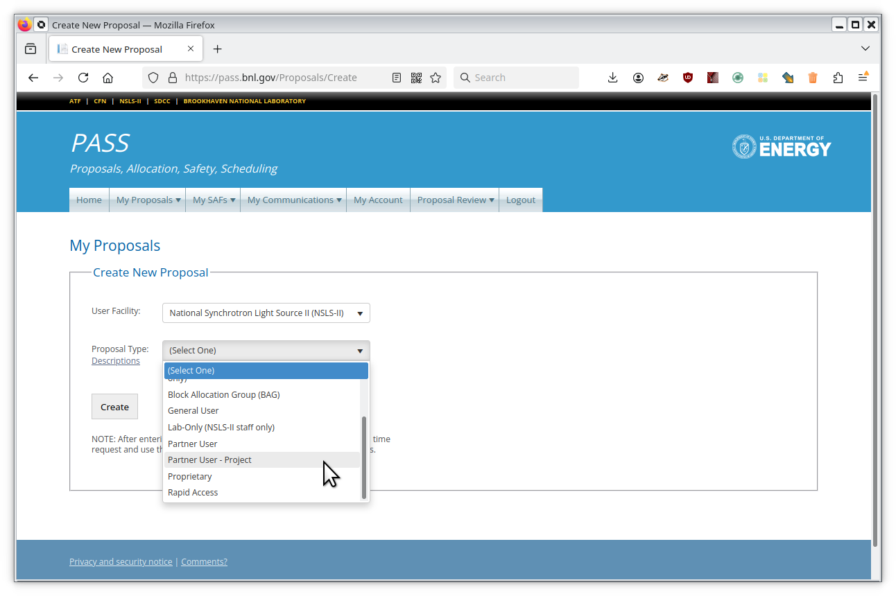
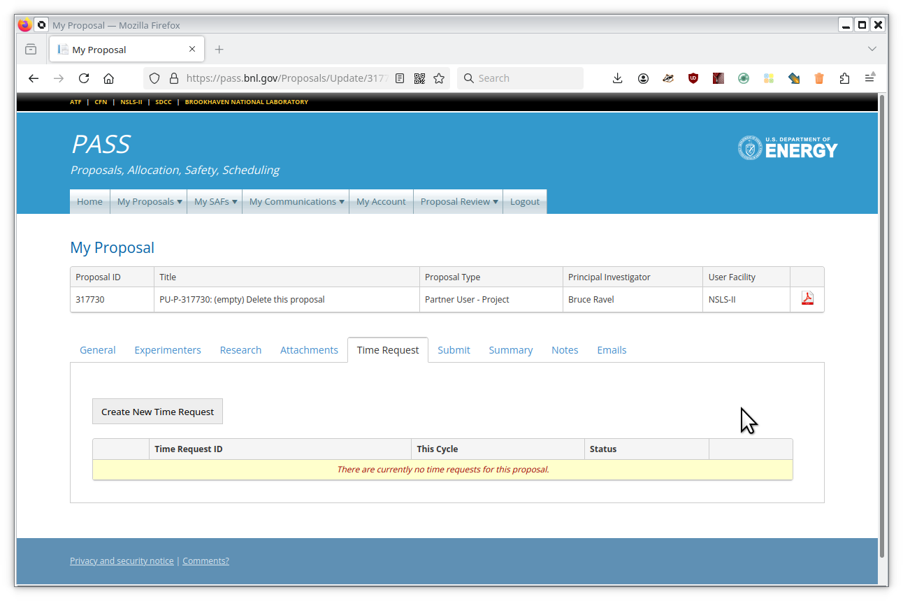
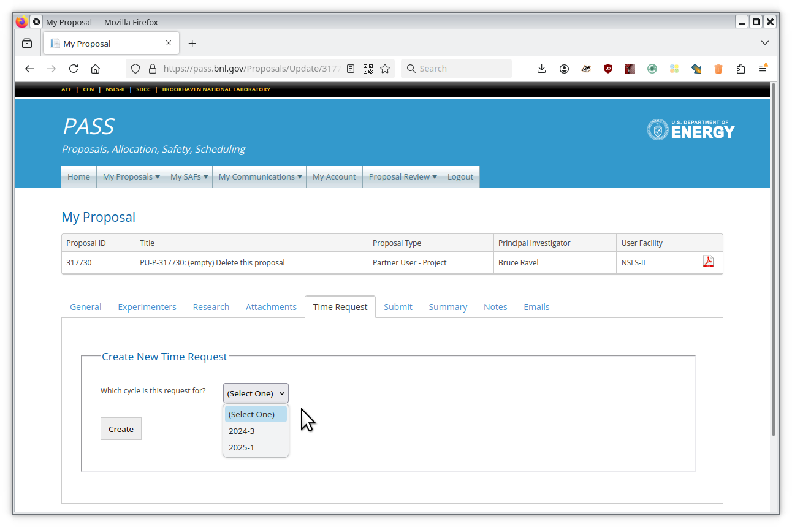

..
   This document was developed primarily by a NIST employee. Pursuant
   to title 17 United States Code Section 105, works of NIST employees
   are not subject to copyright protection in the United States. Thus
   this repository may not be licensed under the same terms as Bluesky
   itself.

   See the LICENSE file for details.

.. _proposal:

Proposal Writing for BMM
========================

XAS Experiments
---------------

Bruce Ravel (bravel@bnl.gov) supports XAS experiments at
BMM.  If you have any questions about the capabilities of the beamline
for XAS experiments or questions about an XAS proposal, contact him.

When writing a proposal for beamtime, it is important to remember that
you are justifying your *need for beamtime*.  This, then, is of a
different sort than a funding proposal.  While justifying the
importance of your science is certainly a part of the beamtime
proposal, the main purpose is to tell the review panel and the
beamline staff how you intend to use your beamtime effectively.

+ Explicitly state how many samples you intend to bring.
+ Explicitly state what the differences are between the samples.
+ If you will be measuring under *in situ* conditions |nd|
  temperature, electrochemical potential, gas flow, or anything else
  |nd| state what those conditions are.
+ If you are measuring a dopant, state the concentration of the dopant.
+ If you are measuring a low concentration sample |nd| for example the
  amount of arsenic in a natural sample |nd| provide an estimate of
  the concentration.  Even better, do elemental analysis of an aliquot
  in the electron microscope or with ICP.
+ If you are measuring a thin film sample, state the substrate
  material, the thickness of the sample, and the areal dimensions of
  the sample.
+ If you have a matrix of sample conditions |nd| for example a range
  of dopants, a range of absorption edges, and a range of annealing
  conditions |nd| do the math.  Tell the reader how many XAS
  measurements are required.
+ Make sensible estimates about your time requirements.  Be prepared
  to prioritize your samples if you are unable to get the full time
  you request.

.. admonition:: Ask questions early!
   :class: note

   If you have any questions about beamline capabilities, measurement
   times, experimental feasibility, or any other issue pertinent to
   your beamtime proposal, contact the beamline staff well before the
   proposal deadline.

XRD Experiments
---------------

Vesna Stanic (vstanic@bnl.gov) and Jean Jordan-Sweet (jlj@bnl.gov)
support scattering experiments at BMM.  If you have any questions
about the capabilities of the beamline for scattering experiments or
questions about a scattering proposal, contact them.

BMM is equipped with a 6-circle psi goniometer, a strip detector, a
small area detector, and point detectors.  This installation supports
diffraction in the Bragg geometry and is optimized for reflectivity,
pole figures, truncation rods, and other surface scattering
measurements. 

If you are looking for any
scattering experiment in the Laue geometry, consider applying for time
at `QAS <https://www.bnl.gov/nsls2/beamlines/beamline.php?r=7-BM>`__,
`PDF <https://www.bnl.gov/nsls2/beamlines/beamline.php?r=28-ID-1>`__,
or `XPD
<https://www.bnl.gov/nsls2/beamlines/beamline.php?r=28-ID-2>`__.

To be very clear, `pair distribution function analysis
<https://doi.org/10.1098/rsta.2018.0413>`__ is not available at BMM.
Any proposal requesting PDF analysis will be denied at feasibility
review.

.. admonition:: Ask questions early!
   :class: note

   If you have any questions about beamline capabilities, measurement
   times, experimental feasibility, or any other issue pertinent to
   your beamtime proposal, contact the beamline staff well before the
   proposal deadline.

Multi-modal Experiments
-----------------------

From time to time, users want to do both spectroscopy and scattering
at BMM.  NSLS-II allows a user to request multiple measurement types
in a single proposal.  This is called a "multi-modal" experiment.

However, asking for XAS and XRD in a single proposal at BMM is an
edge-case for the NSLS-II multi-modal program.

It turns out that there is no way to request a multi-modal proposal
where :maroon:`different` measurement techniques are performed at the
:maroon:`same` beamline.  Thus, there is no way to send both parts of the
multi-modal proposal to the relevant proposal review panels.

As a result, if you wish to request both spectroscopy and scattering
at BMM, you must write **two proposals**.  That is the only way to
route your work through the review system correctly.

.. admonition:: Note
   :class: caution

   A proposal requesting both XAS and XRD at BMM will be denied at
   feasibility and a link to this web page with be given as the
   reason.

NIST Partner User Proposals
---------------------------

.. admonition:: Note
   :class: caution

   This section only applies to NIST employees visiting BMM.  

   If you are not a NIST employee registered in PASS with a nist.gov
   email address or a member of the Synchrotron Science Group with a
   duty station at BNL, **do not** submit a PU-P proposal.  It will
   be deleted without further communication.

As of the 2024-2 cycle, NIST staff must use the new **Partner User -
Project** proposal type.  This new proposal type is necessary to
accommodate :numref:`the new data access and security policies
(Section %s) <data>`.  Writing this proposal is a :red:`requirement`.  It
is no longer possible to access the beamline via the main partner user
proposal.

Happily, this proposal is mostly an administrative exercise.  It will
not be evaluated by the normal proposal review panel nor by anyone
else.  While it is necessary to document what you plan to do with your
beamtime, the text fields do not have to be as complete as they would
for a normally evaluated proposal.

When filling out your PU-P proposal, be sure to

#. List all experimenters on the "Experimenters" tab.  *This is required
   so that all the people that will need access to the data will get
   access.*
#. Answer all the research screening questions on the "Research" tab.
   *This is required to comply with DOE export control regulations.*
#. Make a time request for the appropriate cycle on the "Time Request"
   tab.  *This is required so that the beamtime can be allocated.*

As for the text fields on the "Research" tab, you cannot leave them
blank.  Briefly describing your experiment |nd| a sentence or two |nd|
is adequate.

To start, go to https://pass.bnl.gov and
authenticate yourself using your BNL password and DUO two-factor
authentication.  Once on the landing page, start a new proposal as
shown in :numref:`Figure %s <fig-pup-start>`.

.. _fig-pup-start:
.. figure:: _images/PUP/pup-start.png
   :target: _images/pup-start.png
   :width: 50%
   :align: center

   Getting started on a new proposal.

When asked for the proposal type, select "Partner User - Project", as
shown in :numref:`Figure %s <fig-pup-select>`.

.. _fig-pup-select:

   Getting started on a new proposal.

To make a time request |nd| either against your new proposal or
against an existing PU-P proposal |nd| go to the "Time Request" tab
and click the "Create New Time Request" button, as
shown in :numref:`Figure %s <fig-pup-btr>`.

.. _fig-pup-btr:

   Making a beam time request.

Next, select the cycle in which you will do the experiment, as shown
in :numref:`Figure %s <fig-pup-cycle>`.  Then fill in the text fields
with a sentence or two.

.. _fig-pup-cycle:

   Selecting the cycle for the beam time request.

Any questions?  Contact Bruce (bravel@bnl.gov).
