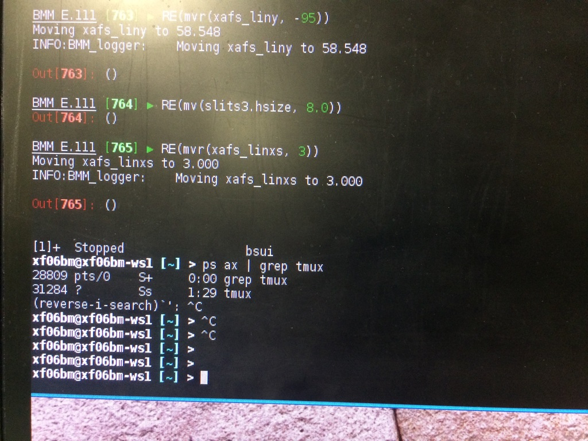
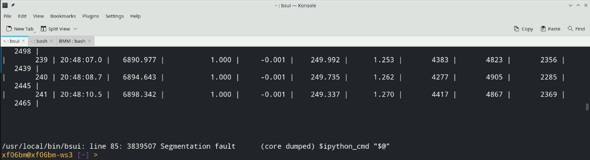
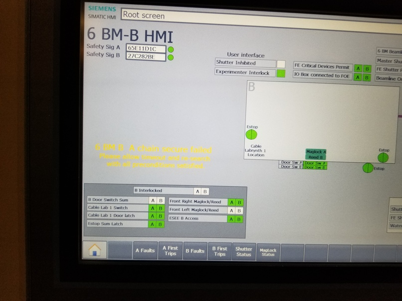

..
   This document was developed primarily by a NIST employee. Pursuant
   to title 17 United States Code Section 105, works of NIST employees
   are not subject to copyright protection in the United States. Thus
   this repository may not be licensed under the same terms as Bluesky
   itself.

   See the LICENSE file for details.

Troubleshooting
===============

In this section, solutions are given for problems that BMM's visitors
occasionally encounter.

Pausing BlueSky
---------------

There are a small number of ways that you can unintentionally find
yourself outside of BlueSky.  One of them is to accidentally hit
``Ctrl-z``, which is unfortunately located close
to ``Ctrl-c``.  

``Ctrl-z`` serves to suspend BlueSky, temporarily
returning you to the Unix command line.  It looks like this:

.. _fig-ctrlz:

   Accidentally exiting BlueSky and returning to the Unix command line.

Note that BlueSky said ``Stopped``, then the yellow and magenta
prompt is presented.  This indicates that BlueSky is paused rather
than exited.

To resume BlueSky, type the command ``fg`` and hit ``Enter``.
You will find yourself back at the BlueSky prompt and can carry on
normally.

Exiting or crashing |bsui|
--------------------------

Another possibility is that BlueSky has exited entirely |nd| possibly
because something has happened to put the program into an unworkable
state.  This will often be accompanied by a lengthy `stack trace`,
i.e. a bunch of weird code and error messages printed to the terminal
window, followed by the yellow and magenta prompt seen in the picture
above.  Other times, there may simply be a message about a
"Segmentation fault" and a "core dump".  An example of a segmentation
fault is shown here:

.. _fig-segfault:

   An example of |bsui| crashing with a segfault

The previous |bsui| session cannot be recovered at this point.  You will
have to restart |bsui| and restart your data collection.

In this case, at the command line,  type ``bsui`` and hit ``Enter``.

This will start a new BlueSky session and should restore the state of
your experiment from before the crash.

Amplifier fault
---------------

From time to time, a fault is triggered on one of the motor
amplifiers.  The most common examples involve the jacks controlling
the height and pitch of the focusing and harmonic rejection mirrors,
M2 and M3.  This is usually observed when trying to use the
``change_edge()`` command (which, among other things, moves the
mirrors to the correct positions).

The error message on screen will look something like this

.. todo:: Capture an example of this

This problem is usually resolved by cycling the kill switch to the amplifiers.

.. code-block:: python

   ks.cycle('m2')

where the possible arguments (one for each FMB Oxford motor
controller) are ``m2``, ``m3``, ``slits2``, ``dcm``, or ``dm3``.

Once that finishes, try doing the thing that triggered the fault
message.  Should work....

..
  The first solution is to try killing the power to the amplifiers on
  the correct MCS8.  Switch the corresponding switch to the off 
  |circle|  position, wait at least 10 seconds, then flip the
  switch back to the on  |verbar|  position.  Try moving
  the motors again.

  .. _fig-killswitch:
  .. figure::  _images/infrastructure/Kill_switches.jpg
     :target: _images/Kill_switches.jpg
     :width: 70%
     :align: center

     The MCS8 kill switches on rack D.

  If toggling the switch does not clear the problem, the next solution
  to try is to power cycle the appropriate MCS8.  You should stop the
  corresponding IOC before cycling the power, then restart the IOC
  afterwards.  Contact Bruce or other beamline staff before doing this.

Failed hutch search
-------------------

Sometimes the hutch search fails for mysterious reasons.  A likely
cause is that the door `bounced` a bit as it closed.  This
confuses the circuit that checks to see that the magnetic latch
holding the door closed is engaged.

When that (or some other thing out of your control) happens to confuse
the personnel protection system, the search fails and reports the
failure by printing a message in yellow text on the HDMI screen.  Here
is what that looks like:

.. _fig-hdmi:

   The hutch HDMI display showing the yellow text of a failed search.

When this happens, it is usually sufficient to simply repeat the
search.  If the yellow text failure happens again, call the floor
coordinator at extension 5046.
