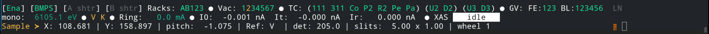

..
   This manual is copyright 2018 Bruce Ravel and released under
   The Creative Commons Attribution-ShareAlike License
   http://creativecommons.org/licenses/by-sa/3.0/

.. _intro:

Introduction to BMM
===================

At the unix command line, type ``bsui`` to start the BlueSky user
interface.  bsui is simply an `Ipython shell <https://ipython.org/>`_
with some customizations specific to BlueSky.  On top of that, there
are a number of customizations specific to BMM.

In this user manual, there are chapters covering most of the chores
one will need to do at the beamline, including:

#. moving motors
#. changing the state of the photon delivery system
#. making motor scans
#. making energy scans
#. interacting with the beamline's electronic log book
#. troubleshooting common problems

TL;DR
-----

**Change energy**
   Use the ``RE(change_edge())`` command, see :numref:`{name}, Section {number} <pds>`

**Sample alignment scans**
   Use the ``RE(linescan())`` command, see :numref:`{name}, Section {number} <linescan>`

**XAFS scan**
   Use the ``RE(xafs())`` command, see :numref:`{name}, Section {number} <xafsscan>`

**Macro for moving motors and measuring XAFS**
   Edit the ``macro.py`` example in your data directory, see :numref:`{name}, Section {number} <macro>`

The user experience
-------------------

The Ipython/bsui prompt at BMM is modified to provide at-a-glance
information about the state of the beamline.

.. _fig-prompt:

   The BlueSky user prompt at BMM

* The green ``BMM`` indicates that the beamline is :numref:`set up and
  ready for the user (see Section %s) <start_end>`.  When the beamline
  is not ready for users, the ``BMM`` string is red.

* The string ``D.111`` indicates that the photon delivery system is in
  :numref:`mode D (see Table %s) <pds-modes>` and that :numref:`the
  Si(111) monochromator (Section %s) <change-crystals>` is in use.

* The green number in square brackets is an incremented count of how
  many commands have been issued since ``bsui`` was started.

.. _cadashboard:

CA Dashboard
~~~~~~~~~~~~

At the top of the big screen, you see a crude-but-handy beamline
monitor.  It looks like this:

.. _fig-cadashboard:

   The CA dashboard beamline monitor

This provides a (very) concise overview of the state of the beamline.

**Line 1**
   In short, if the top line has no red text, the beamline is all ready to go.

   + BMM is enabled (green) or disable (red)
   + The BM, FE, & user photon shutters are open (green) or closed (red)
   + The ring current
   + The state of vacuum sections 1 through 7 -- green means vacuum
     level is OK, red means vacuum level is high
   + The state of the in-vacuum motors, 4 on the DCM, 2 on the
     focusing mirror, 2 on the harmonic rejection mirror -- green
     means temperature is cool, red means temperature is high
   + The open (green) or closed (red) state of the 3 front end gate
     valves and the 6 beamline gate valves

**Line 2**
   + The energy position of the monochromator
   + The signals on the I0 and It ion chambers, measured in nanoamps
   + The current operation at the beamline, options are: idle (white),
     XAFS scan (pink), line scan (cyan), area scan (yellow), or time
     scan (blue)

**Line 3**
   + Positions of common sample motors and size of sample slits

For more information about this tool, `follow this link
<https://wiki-nsls2.bnl.gov/beamline6BM/index.php/Cadashboard>`_,
which explains how to run the tool and position it on the screen.  It
also explains how to launch the tool when the beamline is set up for
XRD measurements.

.. _start_end:

Starting and ending an experiment
~~~~~~~~~~~~~~~~~~~~~~~~~~~~~~~~~

When a new experiment begins, run the command::

  BMMuser.start_experiment(name='Betty Cooper', date='2019-02-29', gup=123456, saf=654321)

This will create that data folder and populate it with an
:numref:`experimental log (Section %s) <log>`, define the ``DATA``
variable for use in simplifying certain commands, write a template for
a :numref:`scan.ini file (Section %s) <xafs>`, write a template for a
:numref:`macro file (Section %s) <macro>`, configure the logger to
write a :numref:`user log file (Section %s) <logfile>` for this
experiment, set the GUP and SAF numbers as metadata for output files,
and set up :numref:`snapshot (Section %s) <snap>` and :numref:`dossier
(Section %s) <dossier>` folders.

The ``name`` should be the PI's full name, preferably transliterated
into normal ASCII.  The ``date`` should be the starting day of the
experiment in the ``YYYY-MM-DD`` format.

Once the experiment is finished, run this command::

  BMMuser.end_experiment()

This will reset the logger and the ``DATA`` variable and unset the GUP
and SAF numbers.

Getting help at the command line
~~~~~~~~~~~~~~~~~~~~~~~~~~~~~~~~

To see a summary of common commands, use ``%h``:

.. code-block:: text

   Open the shutter:                 shb.open()
   Close the shutter:                shb.close()

   Change energy:                    RE(mv(dcm.energy, <energy>))
   Move a motor, absolute:           RE(mv(<motor>, <position>))
   Move a motor, relative:           RE(mvr(<motor>, <delta>))
   Where is a motor?                 %w <motor>

   Where is the DCM?                 %w dcm
   Where is M2?                      %w m2
   Where is M3?                      %w m3
   Where are the slits?              %w slits3
   Where is the XAFS table?          %w xafs_table

   Summarize all motor positions:    %m
   Summarize utilities:              %ut

   How long will a scan seq. be?     howlong('scan.ini')
   Run a scan sequence:              RE(xafs('scan.ini'))
   Scan a motor, plot a detector:    RE(linescan(<det>, <motor>, <start>, <stop>, <nsteps>))
   Scan 2 motors, plot a detector:   RE(areascan(<det>, <slow motor>, <start>, <stop>, <nsteps>, <fast motor>, <start>, <stop>, <nsteps>))
   Make a log entry:                 BMM_log_info("blah blah blah")

   DATA = /home/bravel/BMM_Data/bucket

   All the details: https://nsls-ii-bmm.github.io/BeamlineManual/index.html

and to see a summary of some useful command line hotkeys, ``%k``:

.. code-block:: text

   Abort scan:             Ctrl-c twice!
   Search backwards:       Ctrl-r
   Quit search:            Ctrl-g
   Beginning of line:      Ctrl-a
   End of line:            Ctrl-e
   Delete character        Ctrl-d
   Cut text to eol         Ctrl-k
   Cut text from bol       Ctrl-u
   Paste text              Ctrl-y

   More details: http://readline.kablamo.org/emacs.html

The day will come that we have a GUI for running XAFS experiments at
BMM.  For now, we have the command line.  Read on |nd| it's not too
difficult!

BMM and LOB3
------------

.. _fig-lob3:
.. figure::  _images/LOB-3.png
   :target: _images/LOB-3.png
   :width: 90%
   :align: center

   Bruce's and Jean's offices in LOB 3

A Bit about BMM
---------------

BMM is an XAS beamline.  As such it is on the simpler end of things at
NSLS-II.  We use an NSLS-II `three-pole wiggler (3PW)
<https://www.bnl.gov/nsls2/project/source_properties.asp>`_ as our
photon source.  This provides broadband radiation throughout the hard
X-ray range, up to about 30 keV.  It is a small device |nd| only about
40 cm long and with a magnetic path length of about 12 cm |nd| which
is inserted in a short section between the two bend magnets in the
dual-bend achromat lattice at NSLS-II.  The flux is certainly not the
equal of any of the many-pole insertion devices in the straight, but
it is highly performant for many XAS experiment.

About 13 meters from the source, we have a paraboloid collimating
mirror.  This position is well within the storage ring tunnel and
about 12 meters from the entrance to the BMM first optical enclosure.
We placed a mirror at that location to capture the largest possible
swath of the divergent light coming from the 3PW source.  A paraboloid
is the correct shape for focusing light in both the horizontal and
vertical directions.  However, a paraboloid must be a fixed figure,
fixed angle device in order to optimally collimate the light.  Because
the mirror is in the front end, thus inaccessible during operations,
we found the paraboloid to be an attractive solution.  Once aligned in
the beam, it should never need adjustment.

The collimated light is delivered to a double crystal monochromator
(DCM).  The DCM has pairs of Si(111) and Si(311) crystals which are
accessed by :numref:`translating the DCM vacuum vessel laterally
(Section %s) <change-crystals>` .  A transition between the two
crystal sets takes about 2 minutes.

After the DCM, we have a toroidal focusing mirror followed by a flat
harmonic rejection mirror.  One or both of these mirrors is in the
beam depending on :numref:`the configuration of the XAS experiment
(Section %s) <change-mode>` in the end station.  Because the beam is
deflected upward after the collimating mirror, at least one of the
mirrors after the DCM must be used in order to deflect the beam
through the lengthy transport pipe and into the end station.

Because the collimating mirror is at a fixed angle, it only serves as
a harmonic rejection mirror above an energy determined by its
operating angle.  That turns out to be about 23.5 keV.  For XAS
experiments conducted above 8 keV, then, the harmonic rejection
provided by the collimating mirror is adequate.  At lower energies,
the flat harmonic rejection mirror is used to provide clean beam.

With just the harmonic rejection mirror in place, a beam of size 8 mm
by 1.4 mm is delivered to the end station.  For many XAS experiments,
this rather large beam is desirable.  Indeed, many of the visitors to
BMM specifically request the large beam for their experiments.  With
the focusing mirror in place, that large swath is reduced to a spot of
about 300 |mu| m by 200 |mu| m.
