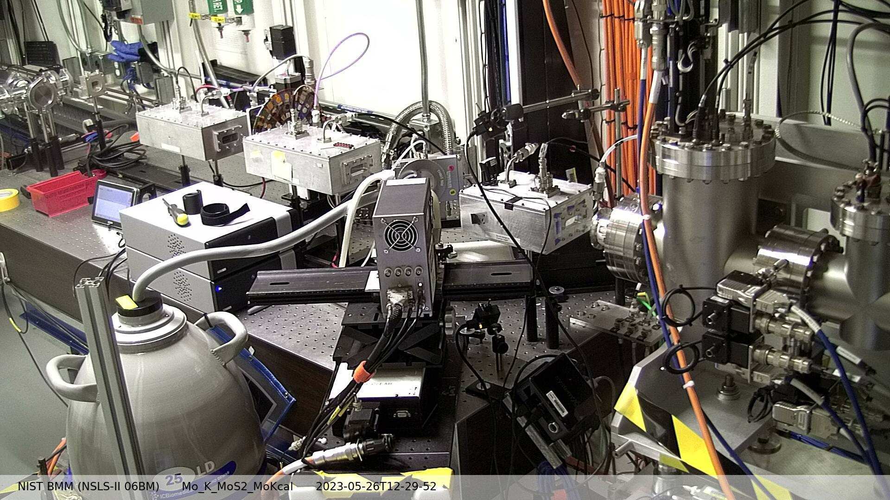

..
   This manual is copyright 2018 Bruce Ravel and released under
   The Creative Commons Attribution-ShareAlike License
   http://creativecommons.org/licenses/by-sa/3.0/

.. _log:

Experimental Log
================

At BMM, we are trying to run the system in a way that automatically
generates a useful electronic log book.  This is meant to supplement,
not replace, a paper log book or a fancy online service like `Olog
<http://olog.github.io/2.2.7-SNAPSHOT/>`_. 

The point of the BMM experimental log is to capture with time stamps
all the significant actions at the beamline.  In part, this provides a
record of the actions in an experimental campaign.  It also is an
attempt to provide enough information to recover from mistakes and
confusions about sample positions and other experimental issues.

.. _snap:

Snapshots
---------

The XAFS scan plan described in :numref:`Section %s <xafs>` includes a
step where snapshots are taken from the XAS webcam and the small
analog camera.  These photos are written to JPG files with names
related to the XAS data file written as part of the call to the
``xafs()`` plan.  This provides automated photographic documentation
of the state of the measurement as it is being made.

Snapshots can be taken at any time using this command::

  snap('<camera>', filename='/path/to/image.jpg')

The choices for ``<camera>`` are

``XAS``
  Take a snapshot from the XAS webcam

``XRD``
  Take a snapshot from the XRD webcam

``analog``
  Take a snapshot of the image currently displayed on the monitor to
  the left of the control station.

The image will then be written to the file specified by the
``filename=`` argument.

The ``xafs()`` plan calls this function twice, once for the XAS webcam
and once for the analog camera.

Note that this function is `not` run through the Run Engine.

The name of the snapshot file and the camera used are written to the
experimental log.

.. subfigstart::

.. _fig-anacam:
.. figure::  _images/analog.jpg
   :target: _images/analog.jpg
   :width: 75%

   Snapshot taken with the analog camera

.. _fig-xascam:

   Snapshot taken with the XAS web camera

.. subfigend::
   :width: 0.45
   :label: _fig-snapshots

.. todo:: Have database consume snapshots with pointers from each scan
          connected with the snapshot

.. _logfile:

Log file
--------

At the beginning of a user experiment, run something like this command::

  new_experiment('/home/xf06bm/Data/Visitors/Henrietta User/2019-02-28', gup=333123, saf=343123)

Among other things, this instruments the logger to maintain a log file
specifically for the current experiment.  The logger also maintains a
master log file which is, effectively, a concatenation of all the
individual experimental logs.

The log is an attempt to capture a record of all significant actions
taken during an experimental campaign.  It errs of the conservative
side in that it likely captures way too much information.

Experimental events are captures with a time stamp and a brief
explanation of what happened.  For example, when a motor is moved, the
motor name and target position are written to the log with a time
stamp.

Similarly, a line scan or an XAFS scan is captured with enough
information to understand what the scan accomplished.  For a line
scan, the motor name, scan range, and starting position are captured.
For an XAFS scan, the contents of the :numref:`INI file (See Section
%s) <xafs>` are written to the log along with the motor positions as
reported by the ``ms()`` command :numref:`(see Section %s) <motors>`.
The names of the output data files are recorded with timestamps
indicating when they were written.

Several other activities specific to BMM also recorded to the log file.
The snapshot tool described above is an example.

Writing to the log file is accomplished in two ways.  This function::

  BMM_log_info('text of message')

is used to insert most messages into the log.  ``BMM_log_info()`` can
be called at any time from the command line to insert any message into
the log.

BMM also uses `Bluesky's msg_hook
<https://nsls-ii.github.io/bluesky/debugging.html#message-hook>`_.
This is how ``mv()`` and ``mvr()`` commands are captured in the log.
This bespoke message hook parses the document returned by BlueSky for
specific kinds of events and captures a log message when appropriate.

