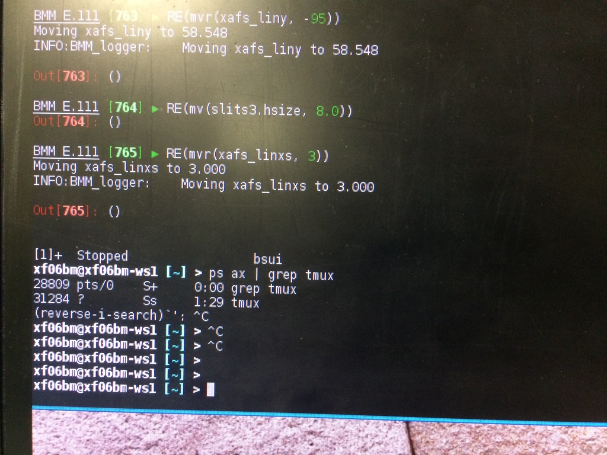
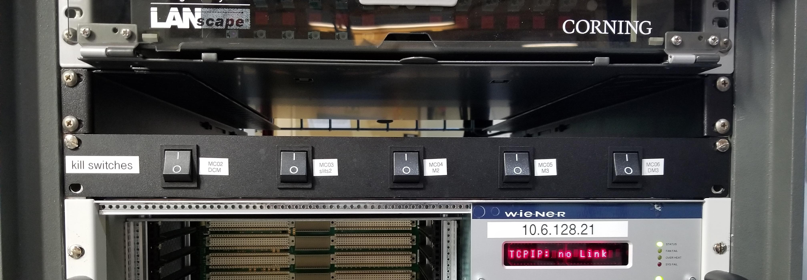

..
   This manual is copyright 2018 Bruce Ravel and released under
   The Creative Commons Attribution-ShareAlike License
   http://creativecommons.org/licenses/by-sa/3.0/

Troubleshooting
===============

In this section, solutions are given for problems that BMM's visitors
occasionally encounter.

Pausing BlueSky
---------------

There are a small number of ways that you can unintentionally find
yourself outside of BlueSky.  One of them is to accidentally hit
:button:`Ctrl`-:button:`z`, which is unfortunately located close
to :button:`Ctrl`-:button:`c`.  

:button:`Ctrl`-:button:`z` serves to suspend BlueSky, temporarily
returning you to the Unix command line.  It looks like this:

.. _fig-ctrlz:

   Accidentally exiting BlueSky and returning to the Unix command line.

Note that BlueSky said :quoted:`Stopped`, then the white and blue
prompt is presented.  This indicates that BlueSky is paused rather
than exited.

To resume BlueSky, type the command ``fg`` and hit :button:`Enter`.
You will find yourself back at the BlueSky prompt and can carry on
normally.

Exiting BlueSky
---------------

Another possibility is that BlueSky has exited entirely |nd| possibly
because something has happened to put the program into an unworkable
state.  This will usually be accompanied by a lengthy :quoted:`stack
trace`, i.e. a bunch of weird code and error messages printed to the
terminal window, followed by the white and blue prompt seen in the
picture above.

In this case, try typing ``bsui`` at the command line with the white
and blue prompt, then hit :button:`Enter`.  This will start a new
BlueSky session and should remember all the metadata from the 
:quoted:`start_experiment` command that began your experiment.

.. You will then need to :numref:`restart your user session (Section %s)
   <start_end>` by issuing the ``BMMuser.start_experiment()`` command with the
   appropriate arguments.  You should be able to do so by hitting
   :button:`Ctrl`-:button:`r` and searching for :quoted:`start_experiment`.
   Once found, hit :button:`Enter`, then continue with your experiment.

Amplifier fault
---------------

From time to time, a fault is triggered on one of the motor
amplifiers.  The most common examples involve the jacks controlling
the height and pitch of the focusing and harmonic rejection mirrors,
M2 and M3.  This is usually observed when trying to use the
``change_edge()`` command (which, among other things, moves the
mirrors to the correct positions).

The error message on screen will look something like this

.. todo:: Capture an example of this

The first solution is to try killing the power to the amplifiers on
the correct MCS8.  Switch the corresponding switch to the off 
|circle|  position, wait at least 10 seconds, then flip the
switch back to the on  |verbar|  position.  Try moving
the motors again.

.. _fig-killswitch:

   The MCS8 kill switches on rack D.

If toggling the switch does not clear the problem, the next solution
to try is to power cycle the appropriate MCS8.  You should stop the
corresponding IOC before cycling the power, then restart the IOC
afterwards.  Contact Bruce or other beamline staff before doing this.

Failed hutch search
-------------------

Sometimes the hutch search fails for mysterious reasons.  A likely
cause is that the door :quoted:`bounced` a bit as it closed.  This
confuses the circuit that checks to see that the magnetic latch
holding the door closed is engaged.

When that (or some other thing out of your control) happens to confuse
the personnel protection system, the search fails and reports the
failure by printing a message in yellow text on the HDMI screen.  Here
is what that looks like:

.. _fig-hdmi:
.. figure::  _images/hdmi.jpg
   :target: _images/hdmi.jpg
   :width: 70%
   :align: center

   The hutch HDMI display showing the yellow text of a failed search.

When this happens, it is usually sufficient to simply repeat the
search.  If the yellow text failure happens again, call the floor
coordinator at extension 5046.
