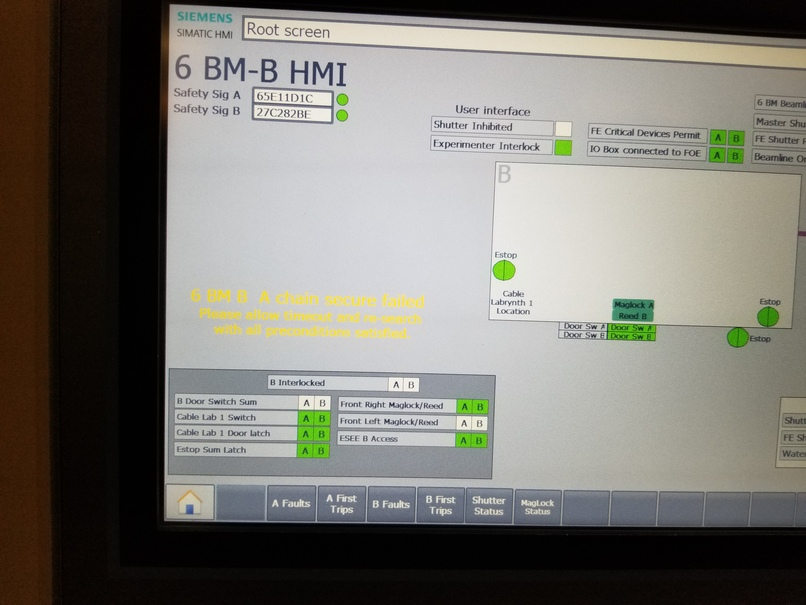

..
   This manual is copyright 2018 Bruce Ravel and released under
   The Creative Commons Attribution-ShareAlike License
   http://creativecommons.org/licenses/by-sa/3.0/

Troubleshooting
===============

In this section, solutions are given for problems that BMM's visitors
occasionally encounter.

Exiting BlueSky
---------------

There are a small number of ways that you can unintentionally find
yourself outside of BlueSky.  One of them is to accidentally hit
:button:`Ctrl`-:button:`z`, which is unfortunately located right next
to :button:`Ctrl`-:button:`c`.  

:button:`Ctrl`-:button:`z` serves to suspend BlueSky, temporarily
returning you to the Unix command line.  It looks like this:

.. _fig-ctrlz:
.. figure::  _images/ctrl-z.jpg
   :target: _images/ctrl-z.jpg
   :width: 70%
   :align: center

   Accidentally exiting BlueSky and returning to the Unix command line.

To resume BlueSky, type the command `fg` and hit enter.  You will find
yourself back at the BlueSky prompt and can carry on normally.

Failed search
-------------

Sometimes the hutch search fails for mysterious reasons.  A likely
cause is that the door :quoted:`bounced` a bit as it closed.  This
confuses the circuit that checks to see that the magnetic latch
holding the door closed in engaged.

When that (or some other thing out of your control) happens to confuse
the personnel protection system, the search fails and reports the
failure by printing a message in yellow text on the HDMI screen.  Here
is what that looks like:

.. _fig-hdmi:

   The hutch HDMI display showing the yellow text of a failed search.

When this happens, it is usually sufficient to simply repeat the
search.  If the yellow text failure happens again, call the floor
coordinator at extension 5046.
